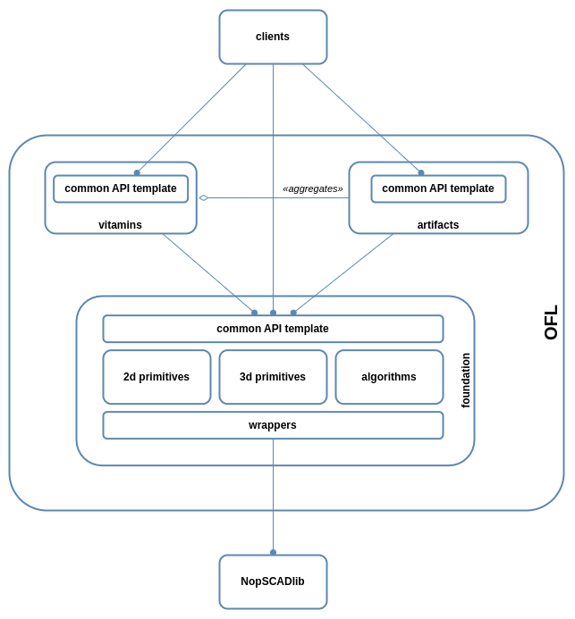

# OpenSCAD Foundation Library

**O**penSCAD **F**oundation **L**ibrary (OFL) is a foundation library for OpenSCAD integrating concepts not included natively in the OpenSCAD language and providing an extendible standardized API base.

## Pre-reqs

The following libraries are used and must be installed for using all the OFL features:

* [NopSCADlib Release v21.8.0](https://github.com/nophead/NopSCADlib/releases/tag/v21.8.0)
* [scad-utils](https://github.com/openscad/scad-utils)
* [TOUL: The OpenScad Useful Library](https://www.thingiverse.com/thing:1237203)

## Usage

1. download and expand the library
2. modify the OPENSCADPATH Environment Variable to point lib/ directory of this repo as described in [OpenSCAD Library Folder](https://en.wikibooks.org/wiki/OpenSCAD_User_Manual/Libraries#Library_Locations)
3. include the needed library file(s) in your OpenSCAD code like in the following example:

    include \<OFL/foundation/2d.scad\>

## Library documentation

OFL comes with three major components:

* [foundation](docs/foundation/README.md) - the core part re-implementing some of the OpenSCAD native 2d/3d modules while adding new ones;
* [vitamins](docs/vitamins/README.md) - client vitamin modules leveraging the foundation.
* [artifacts](docs/artifacts/README.md) - printable artifacts built on top of [foundation components](docs/foundation/README.md) and [vitamins parts](docs/vitamins/README.md);

## Architecture

Every library component is accessed through a set of verb-based APIs (Common API Template), even third part libraries eventually used internally.

