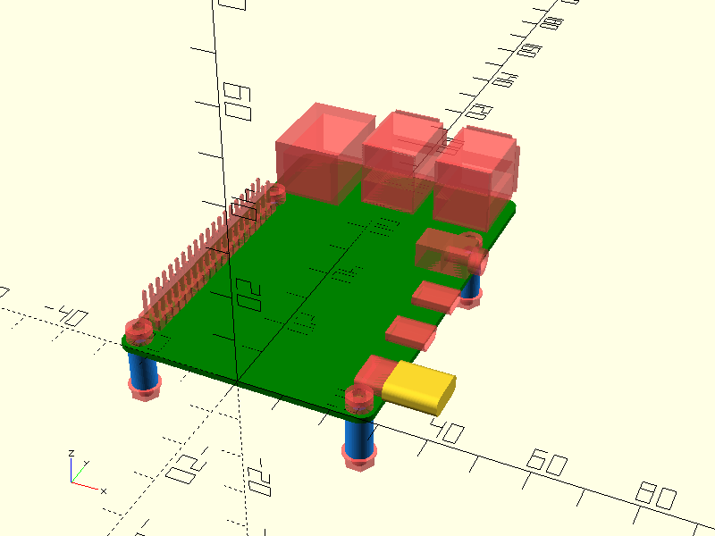

# OpenSCAD Foundation Library

**O**penSCAD **F**oundation **L**ibrary (OFL) is a foundation library for OpenSCAD integrating concepts not included natively in the OpenSCAD language and providing an extendible standardized API base.

## Pre-reqs

The following libraries are used and must be installed for using all the OFL features:

* [NopSCADlib](https://github.com/nophead/NopSCADlib)
* [scad-utils](https://github.com/openscad/scad-utils)
* [TOUL: The OpenScad Useful Library](https://www.thingiverse.com/thing:1237203)

## Usage

1. download and expand the library in the [OpenSCAD Library Folder](https://en.wikibooks.org/wiki/OpenSCAD_User_Manual/Libraries#Library_Locations)
2. include the following statement in your OpenSCAD code:

    include \<OFL/foundation/incs.scad\>

## Library documentation

See [foundation/README.md](foundation/README.md) for further documentation.