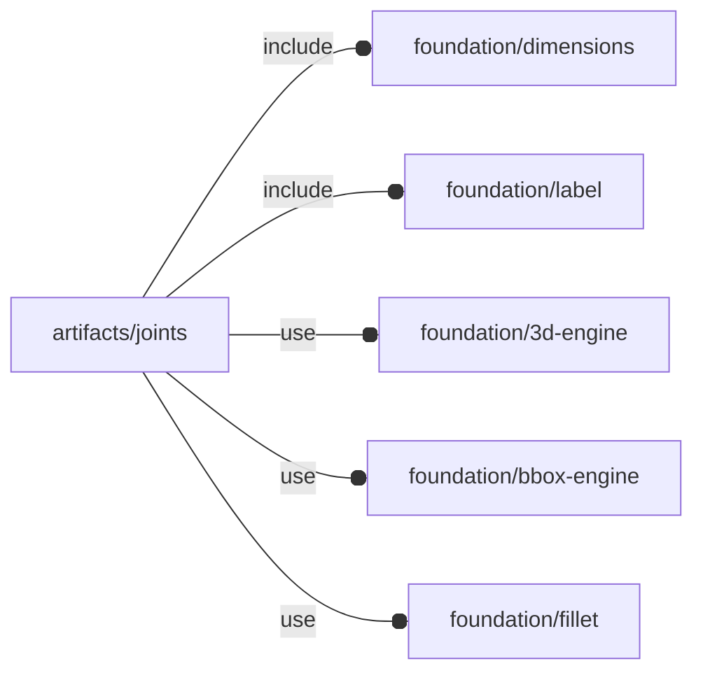
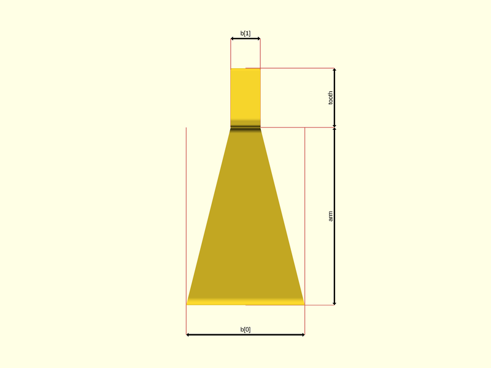
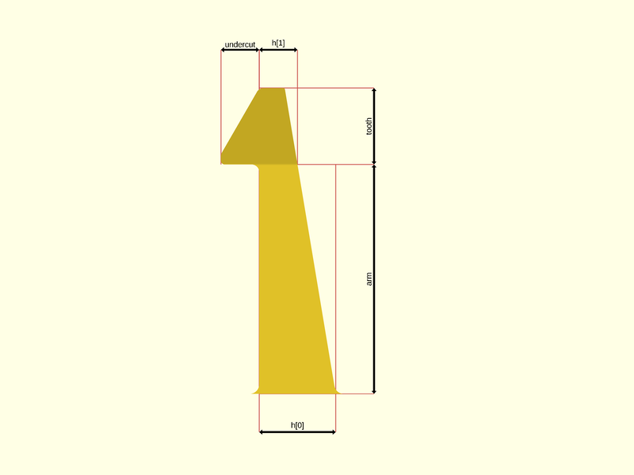
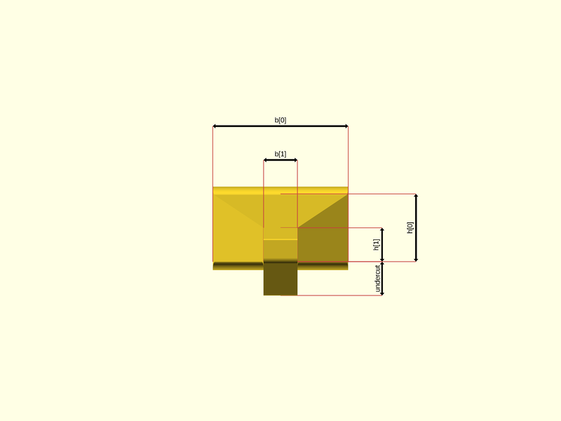

# package artifacts/joints

## Dependencies



Snap-fit joints, for 'how to' about snap-fit joint 3d printing, see also [How
do you design snap-fit joints for 3D printing?](https://www.hubs.com/knowledge-base/how-design-snap-fit-joints-3d-printing/)

This file is part of the 'OpenSCAD Foundation Library' (OFL) project.

Copyright © 2021, Giampiero Gabbiani <giampiero@gabbiani.org>

SPDX-License-Identifier: [GPL-3.0-or-later](https://spdx.org/licenses/GPL-3.0-or-later.html)


## Variables

---

### variable FL_JNT_CANTILEVER_NS

__Default:__

    str(FL_JNT_NS,"/cantilever")

namespace for cantilever attributes: jnt/cantilever

---

### variable FL_JNT_INVENTORY

__Default:__

    []

package inventory as a list of pre-defined and ready-to-use 'objects'

---

### variable FL_JNT_NS

__Default:__

    "jnt"

prefix used for namespacing

---

### variable FL_JNT_RECT_NS

__Default:__

    str(FL_JNT_CANTILEVER_NS,"/rect")

namespace for rectangular cantilever attributes: jnt/cantilever/rect

---

### variable FL_JNT_RING_NS

__Default:__

    str(FL_JNT_CANTILEVER_NS,"/ring")

namespace for ring cantilever attributes: jnt/cantilever/ring

---

### variable FL_JNT_SECTION_NS

__Default:__

    str(FL_JNT_CANTILEVER_NS,"/section")

namespace for cantilever section attributes: jnt/cantilever/section

## Functions

---

### function RadiusPoint

__Syntax:__

```text
RadiusPoint(point,radius=0)
```

---

### function fl_jnt_RectCantilever

__Syntax:__

```text
fl_jnt_RectCantilever(description,arm,tooth,h,b,undercut,alpha=30)
```

Creates a cantilever snap-fit joint with rectangle cross-section.

The following pictures show the relations between the passed parameters and
the object geometry:

__FRONT VIEW__:



__RIGHT VIEW__:



__TOP VIEW__




__Parameters:__

__description__  
optional description

__arm__  
arm length

__tooth__  
tooth length

__h__  
thickness in scalar or [root,end] form. Scalar value means constant thickness.

__b__  
width in scalar or [root,end] form. Scalar value means constant width.

__alpha__  
angle of inclination for the tooth


---

### function fl_jnt_RingCantilever

__Syntax:__

```text
fl_jnt_RingCantilever(description,arm_l,tooth_l,h,theta,undercut,alpha=30,r)
```

__Parameters:__

__description__  
optional description

__arm_l__  
arm length

__tooth_l__  
tooth length: automatically calculated according to «alpha» angle if undef


__h__  
thickness in scalar or [root,end] form. Scalar value means constant thickness.

__theta__  
angular width in scalar or [root,end] form. Scalar value means constant
angular width.


__alpha__  
angle of inclination for the tooth

__r__  
arm radius


---

### function roundness

__Syntax:__

```text
roundness(undercut)
```

## Modules

---

### module fl_jnt_joint

__Syntax:__

    fl_jnt_joint(verbs=FL_ADD,this,fillet,cut_drift=0,cut_dirs,cut_clearance=0,octant,direction)

Add a snap-fit joint.

Context variables:

| Name             | Context   | Description                                           |
| ---------------- | --------- | ----------------------------------------------------- |
| $fl_thickness    | Parameter | Used during FL_CUTOUT (see also [fl_parm_thickness()](../foundation/core.md#function-fl_parm_thickness))  |
| $fl_tolerance    | Parameter | Used during FL_FOOTPRINT (see [fl_parm_tolerance()](../foundation/core.md#function-fl_parm_tolerance))    |


__Parameters:__

__verbs__  
supported verbs: FL_ADD, FL_ASSEMBLY, FL_BBOX, FL_DRILL, FL_FOOTPRINT, FL_LAYOUT

__fillet__  
optional fillet radius.

- undef  ⇒ auto calculated radius respecting build constrains
- 0      ⇒ no fillet
- scalar ⇒ client defined radius value

TODO: to be moved among [fl_jnt_joint{}](#module-fl_jnt_joint) parameters since this parameter
doesn't modify the object bounding box.


__cut_drift__  
translation applied to cutout

__cut_dirs__  
FL_CUTOUT direction list, if undef then the preferred cutout direction
attribute is used.


__cut_clearance__  
clearance used by FL_CUTOUT

__octant__  
when undef native positioning is used

__direction__  
desired direction [director,rotation], native direction when undef ([+X+Y+Z])


