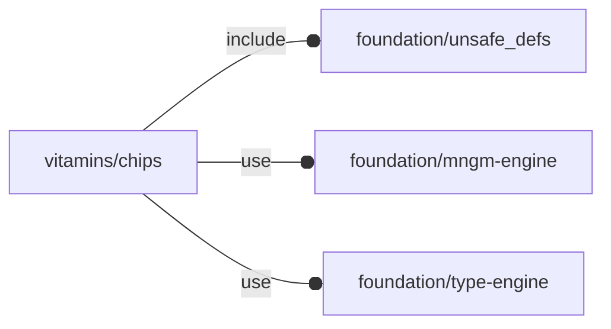

# package vitamins/chips

## Dependencies



Vitamin template for OpenSCAD Foundation Library.

This file is part of the 'OpenSCAD Foundation Library' (OFL) project.

Copyright © 2021, Giampiero Gabbiani <giampiero@gabbiani.org>

SPDX-License-Identifier: [GPL-3.0-or-later](https://spdx.org/licenses/GPL-3.0-or-later.html)


## Variables

---

### variable FL_CHIP_INVENTORY

__Default:__

    []

package inventory as a list of pre-defined and ready-to-use 'objects'

---

### variable FL_CHIP_NS

__Default:__

    "chip"

prefix used for namespacing

## Functions

---

### function fl_Chip

__Syntax:__

```text
fl_Chip(bbox,name,description,colour="darkslategrey",others)
```

Chip constructor.


__Parameters:__

__description__  
optional description


## Modules

---

### module fl_chip

__Syntax:__

    fl_chip(verbs=FL_ADD,type,octant,direction)

__Parameters:__

__verbs__  
supported verbs: FL_ADD, FL_ASSEMBLY, FL_BBOX, FL_DRILL, FL_FOOTPRINT, FL_LAYOUT

__octant__  
when undef native positioning is used

__direction__  
desired direction [director,rotation], native direction when undef ([+X+Y+Z])


