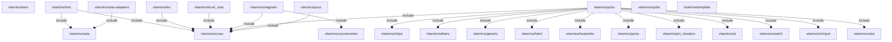

# Dependencies

```mermaid
graph TD
    A1[vitamins/chips]
    A2[vitamins/countersinks]
    A3[vitamins/ethers]
    A4[vitamins/fans]
    A5[vitamins/generic]
    A6[vitamins/hdmi]
    A7[vitamins/hds] --o|include| A8[vitamins/sata]
    A7 --o|include| A9[vitamins/screw]
    A10[vitamins/heatsinks]
    A11[vitamins/iec] --o|include| A9
    A12[vitamins/jacks]
    A13[vitamins/knurl_nuts] --o|include| A9
    A14[vitamins/magnets] --o|include| A2
    A14 --o|include| A9
    A15[vitamins/pcbs] --o|include| A1
    A15 --o|include| A3
    A15 --o|include| A5
    A15 --o|include| A6
    A15 --o|include| A10
    A15 --o|include| A12
    A15 --o|include| A16[vitamins/pin_headers]
    A15 --o|include| A9
    A15 --o|include| A17[vitamins/sd]
    A15 --o|include| A18[vitamins/switch]
    A15 --o|include| A19[vitamins/trimpot]
    A15 --o|include| A20[vitamins/usbs]
    A16
    A21[vitamins/psus] --o|include| A9
    A8
    A22[vitamins/sata-adapters] --o|include| A8
    A9
    A17
    A23[vitamins/spdts]
    A18
    A24[vitamins/template]
    A19
    A20
```

