# OFL Foundation

## Overview

The OFL foundation provides a uniform API set for base library tasks used by vitamins, replacing part of the OpenSCAD 2d/3d primitives.

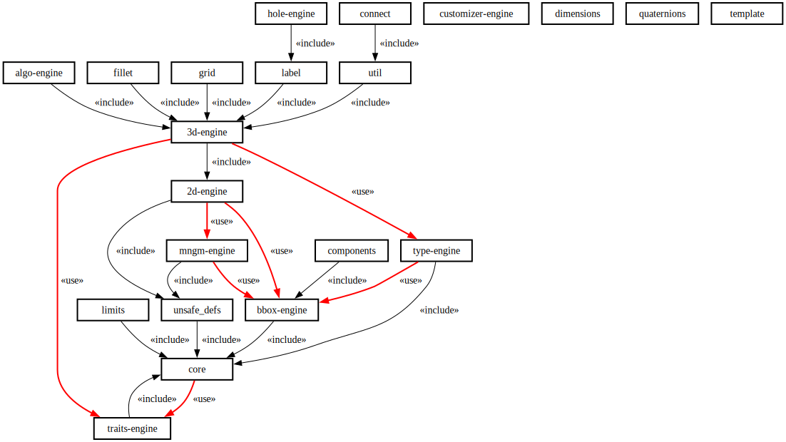

## 'Objects'

An Object is a key/value list like the following:

    type = [
      ["first property name", "this is a string"],  // a string property
      ["second property name", -3.5],               // a number propery
      ["a flag name"],                              // a flag
    ];

## APIs

In order to minimize the risk of overlap with other APIs or global constant from other client libraries, every library item has been prefixed in the following way:

* **FL_** for constants
* **fl_** for APIs

APIs belongs to one of the following categories:

* **contructor** - function returning an *Object*;
* **getter** - function retrieving a value from an *Object*;
* **engine** - module responding to a set of predefined *Verbs* applied to an *Object*;
* **primitive** - function or module not leveraging an *Object*.

## Verbs

Any action that modifies the rendering of the scene is called 'Verb'.

A number of predefined verbs are available:

### Shape verbs

* **FL_ADD** - add base shape (no components nor screws);
* **FL_ASSEMBLY** - add predefined component shape(s);
* **FL_DRAW** - composite verb, add base and components shapes;
* **FL_MOUNT** - add mounting accessories shapes;
* **FL_FOOTPRINT** - adds an *Object* footprint to scene (usually a simplified FL_ADD);

### Bounding block verbs

* **FL_PAYLOAD** - components payload bounding box;
* **FL_BBOX** - assembled shape bounding box;

### Other verbs

* **FL_AXES** - draw local reference axes;
* **FL_CUTOUT** - layout of predefined cutout shapes (±X,±Y,±Z);
* **FL_DRILL** - layout of predefined drill shapes;
* **FL_LAYOUT** - layout of custom children shapes;
* **FL_SYMBOLS** - adds symbols and labels usually for debugging

Relations between draw and bounding box verbs:

| Draw verbs  | BB verbs   |
| ----------- | ---------- |
| FL_ASSEMBLY | FL_PAYLOAD |
| FL_DRAW     | FL_BBOX    |

All *engine* and *primitive* API signatures are standardized in order to respond to the same verbs with the same behavior/semantic.

Every *engine* or *primitive* is implemented to respond to single or multiple *Verbs* in whatever order, reducing the problem of 'perfect' argument forwarding in case of multiple calls.

### Single verb invocation

When a verb is passed as a single value the verb will be trivially executed.

    include <OFL/foundation/3d-engine.scad>

    // single verb primitive invocation
    fl_torus(FL_ADD,a=2,b=3,R=5,$fn=50);
    ^         ^     ^   ^   ^
    |         |     |   |   |
    |         |     +---+---+--< other primitive dependent parameters
    |         |
    |         +---< verb
    |
    +---< primitive

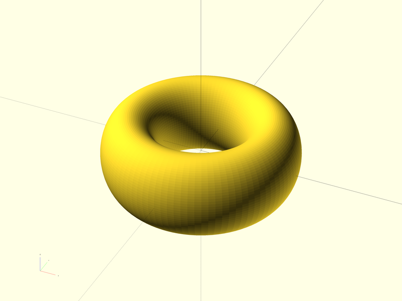

    include <OFL/vitamins/magnets.scad>

    // single verb engine invocation
    fl_magnet(FL_ADD,FL_MAG_M4_CS_D32x6,...);
    ^         ^      ^
    |         |      |
    |         |      +---< object
    |         |
    |         +---< verb
    |
    +---< engine

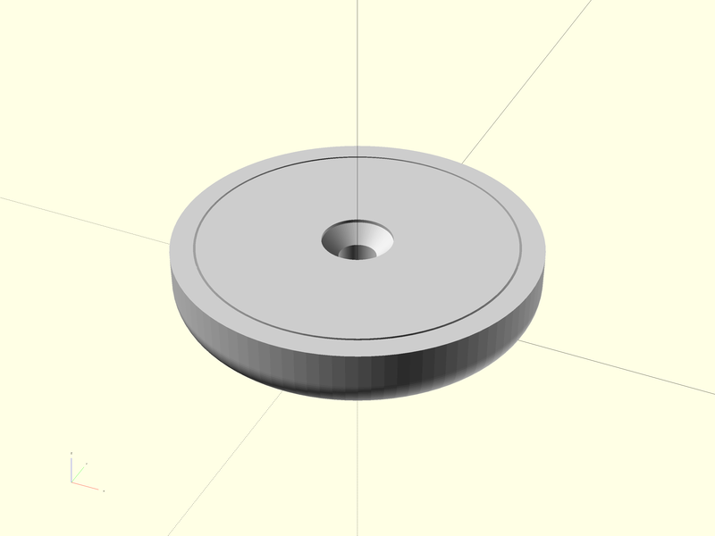

### Multiple verb invocation

 When a list of *verbs* is passed, it wil be executed sequentially, as in the following example

    include <OFL/vitamins/magnets.scad>

    // multiple verb engine invocation
    fl_magnet([FL_ADD,FL_MOUNT,FL_AXES,FL_BBOX],FL_MAG_M4_CS_D32x6);
    ^         ^                                    ^
    |         |                                    |
    |         |                                    +---> object
    |         |
    |         +---> verb list executed sequentially
    |
    +---> engine

so that same invocation of the same primitive will actually perform the following actions:

 1. add of a magnet shape to the scene (FL_ADD);
 2. mount shape through predefined screws (FL_MOUNT);
 3. draw of local reference axes (FL_AXES);
 4. the object bounding box is shown (FL_BBOX).

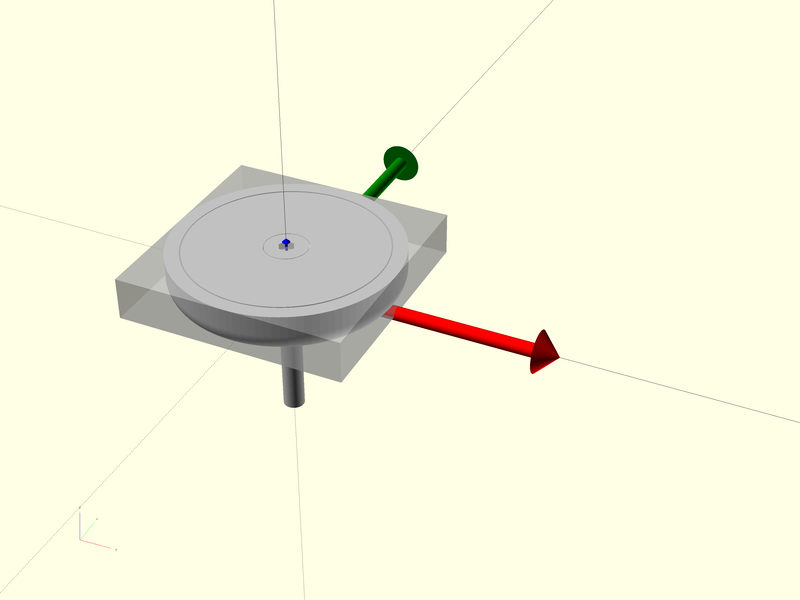

### Verbs rendering

Engine's behavior when rendering verbs can be modified injecting well-known values into runtime variables with the same name of the verb. For modifying the FL_ADD rendering, the runtime variable to be used is $FL_ADD, for FL_PAYLOAD is $FL_PAYLOAD and so on.. .

In the previous example we can modify the rendering of the FL_AXES verb

    include <OFL/vitamins/magnets.scad>

    // multiple verb engine invocation
    fl_magnet([FL_ADD,FL_MOUNT,FL_AXES,FL_BBOX],FL_MAG_M4_CS_D32x6,$FL_AXES="DEBUG");
    ^         ^                                    ^                  ^         ^
    |         |                                    |                  |         |
    |         |                                    |                  |         +---> DEBUG rendering
    |         |                                    |                  |
    |         |                                    |                  +---> runtime modifier for FL_AXES verb
    |         |                                    |
    |         |                                    +---> object
    |         |
    |         +---> verb list executed sequentially
    |
    +---> engine

obtaining the reference axes rendering in 'debug' mode

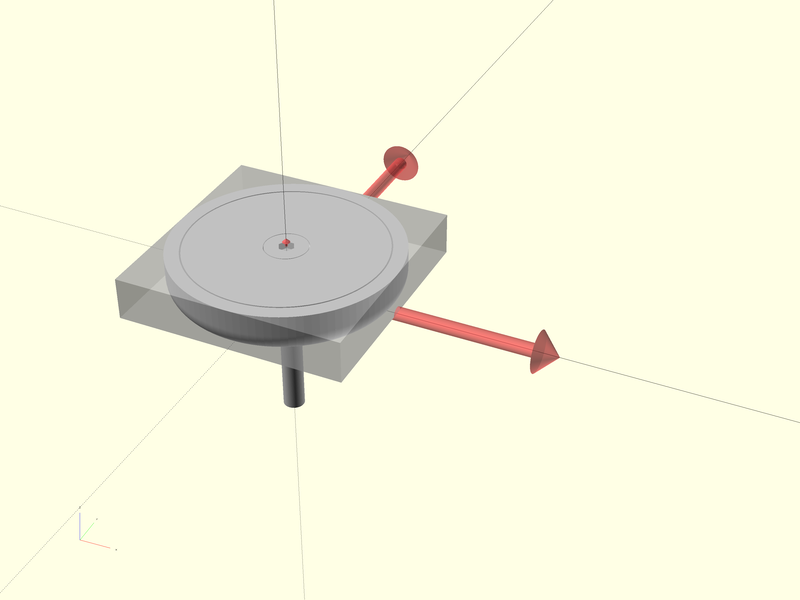

## Execution Contexts

OpenSCAD modules have the possibility to manipulate the rendering of children
modules realizing complex 2d/3d pipelines. Unfortunately the pipelines built
through modules are static, as are the actual parameters passed to children.

The only way by means a parent module can pass dynamic data to children, is by
sharing one - or more - special variables. OFL calls every set of documented
special variables setup by a parent module for its children as an **execution
context**.

In particular OFL uses static actual parameters for defining the action a module
is asked to perform, and the execution contexts for dynamically controlling its
behavior.

Execution contexts have usually a **constructor module** providing special
variable initialization and - where needed - supporting internal correlations.

### Types of execution contexts

OFL has many execution contexts, below a partial list:

| Name                      | Description                               |
| ---                       | ---                                       |
| [Root](root-context.md)   | controls the behavior of each OFL verb    |
| [Debug](../../orthodocs/foundation/core.md#module-fl_dbg_context) | controls the global debug flags           |

## 3D positioning and orientation

Every OFL *engine* manages the following characteristics:

* **placement** - the 3D octant in which the object is displayed.
* **orientation** - passed as a direction axis and rotation angle. Internally the resulting direction is evaluated in two vectors, the direction axis (usually +Z) and one orthogonal axis (usually +X). Each *Object* has a default direction.

### Placement

3D space can be divided in eight octants delimited by the system reference semi-axes. Each engine has a default or native position in the space, eventually not corresponding exactly with octants. In order to assign the object position relative to octants, the **octant** parameter is implemented by all the engines. The value that the octant parameter can assume is a 3d vector whose x,y and z component can be:

| value | semantic                  |
| ----- | ------------------        |
| undef | **native** position used  |
| -1    | negative semi-axis        |
| 0     | centered                  |
| +1    | positive semi-axis        |

so if we want to place an object in the octant defined by the semi-axes +X,+Y,+Z the **octant** must be [1,1,1]. OFL defines three constants:

    X = [1,0,0];
    Y = [0,1,0];
    Z = [0,0,1];
    O = [0,0,0];

so that the value [1,1,1] can be expressed as **+X+Y+Z**.

We can pass this value to our example for placing the object in the desired octant

    include <OFL/vitamins/magnets.scad>

    fl_magnet([FL_ADD,FL_MOUNT,FL_AXES,FL_BBOX],FL_MAG_M4_CS_D32x6,octant=+X+Y+Z);
    ^         ^                                    ^                  ^
    |         |                                    |                  |
    |         |                                    |                  +---> octant expressed as [1,1,1] ⇒ first octant
    |         |                                    |
    |         |                                    +---> object
    |         |
    |         +---> verb list executed sequentially
    |
    +---> engine

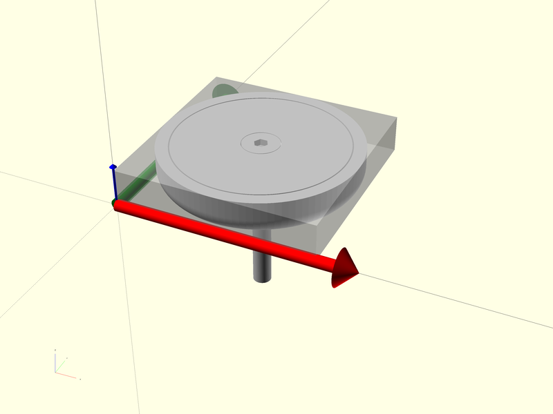

If we want the object centered along the X axis, the octant will be [0,1,1] ⇒ +Y+Z

    include <OFL/vitamins/magnets.scad>

    fl_magnet([FL_ADD,FL_MOUNT,FL_AXES,FL_BBOX],FL_MAG_M4_CS_D32x6,octant=+Y+Z);
    ^         ^                                    ^                  ^
    |         |                                    |                  |
    |         |                                    |                  +---> octant expressed as [0,1,1] ⇒ x==0 means 'centered'
    |         |                                    |
    |         |                                    +---> object
    |         |
    |         +---> verb list executed sequentially
    |
    +---> engine

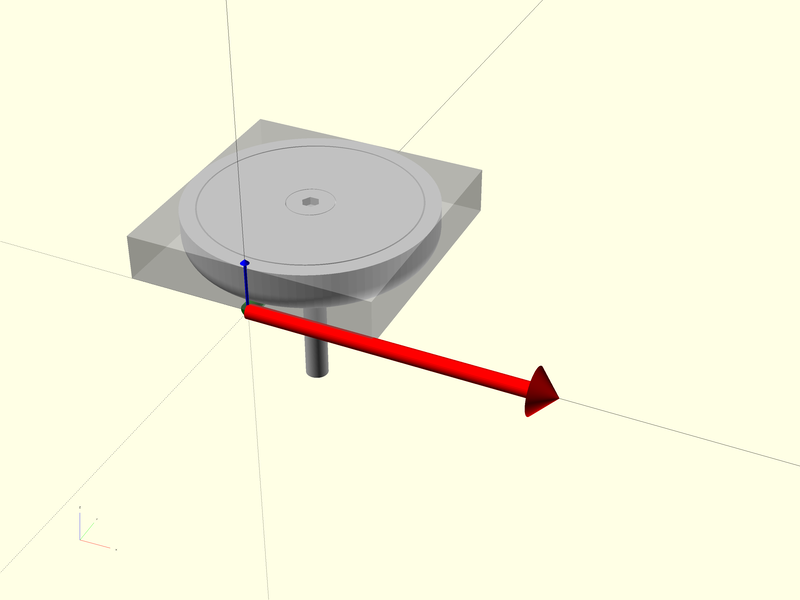

If we want the object centered on the origin the octant will be [0,0,0] ⇒ O (**capital 'o'**)

    include <OFL/vitamins/magnets.scad>

    fl_magnet([FL_ADD,FL_MOUNT,FL_AXES,FL_BBOX],FL_MAG_M4_CS_D32x6,octant=O);

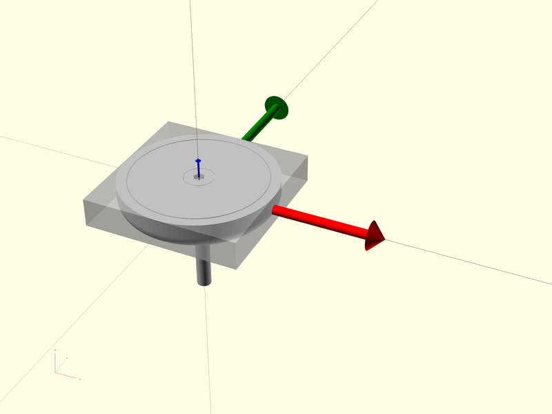

Of course these setting can be mixed with all the possible combination allowed, for example [0,0,-1] ⇒ -Z

    include <OFL/vitamins/magnets.scad>

    fl_magnet([FL_ADD,FL_MOUNT,FL_AXES,FL_BBOX],FL_MAG_M4_CS_D32x6,octant=-Z);

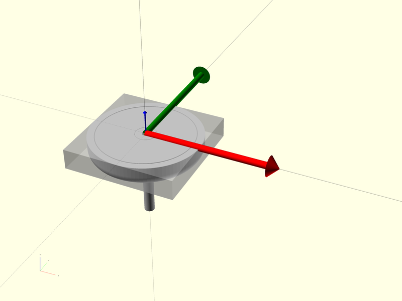

### Orientation

3D orientation is managed by engines through the **direction** parameter actually constituted by a list containing a vector (director) and a rotation angle. When the direction parameter is undef the default value is used (always +Z).

The following code change the orientation from the default +Z to the [-1,-1,1] vector.

    include <OFL/vitamins/spdts.scad>

    // arbitrary direction vector setup
    direction=[-1,-1,+1];
    fl_spdt([FL_ADD,FL_AXES],FL_SODAL_SPDT,direction=[direction,0]);

producing a change in the orientation as shown in the following picture.

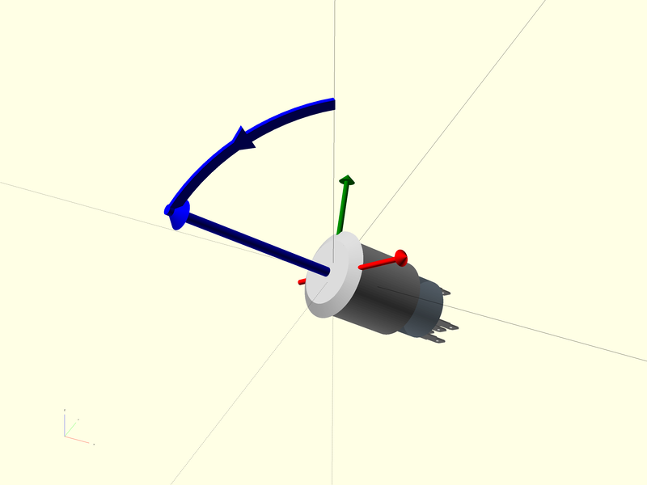

It is possible to combine the change of direction with a rotation around the new axis.

    include <OFL/vitamins/spdts.scad>

    // arbitrary direction vector
    direction = [-1,-1,+1];
    angle     = 30;
    fl_spdt([FL_ADD,FL_AXES],FL_SODAL_SPDT,direction=[direction,angle]);

producing the following result.

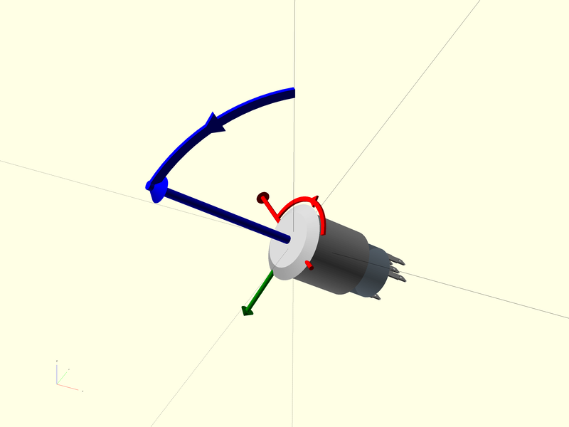

## API naming convention

In an attempt to avoid name collision between OFL and any other library, every client accessible API is prefixed with **'fl_'** while the rest is in **mixed case** (first letter lowercase and first letter of each internal word capitalised). The only exception are constructors that - after the 'fl_' prefix - are in **camel case**.

APIs used internally a file (i.e. not to be used by clients) are prefixed and terminated by **'__'**.

The following example shows some of the APIs for a countersink component, with a sub namespace 'cs' that follows the general 'fl' one for engines, getters and primitives.

    // Constructor
    function fl_Countersink(name,description,d,angle) = ...

    // Engine
    module fl_countersink(verbs,type,direction,octant) { ...

    // Getter
    function fl_cs_angle(type) = ...

    // internal test module NOT to be used by clients
    module __test__() { ...

    // internal function  NOT to be used by clients
    function __point__(alpha) = ...

## Naming convention for constants

For similar reasons all global constants used in OFL are prefixed with **'FL_'** while the rest of the name must be in **UPPER CASE**.

    FL_ADD        = "FL_ADD adds shapes to scene.";
    FL_ASSEMBLY   = "FL_ASSEMBLY layout of predefined auxiliary shapes (like predefined screws).";
    FL_AXES       = "FL_AXES draw of local reference axes.";
    FL_BBOX       = "FL_BBOX adds a bounding box containing the object.";
    FL_CUTOUT     = "FL_CUTOUT layout of predefined cutout shapes (+X,-X,+Y,-Y,+Z,-Z).";
    FL_DRILL      = "FL_DRILL layout of predefined drill shapes (like holes with predefined screw diameter).";
    FL_FOOTPRINT  = "FL_FOOTPRINT adds a footprint to scene, usually a simplified FL_ADD.";
    FL_LAYOUT     = "FL_LAYOUT layout of user passed accessories (like alternative screws).";
    FL_PAYLOAD    = "FL_PAYLOAD adds a box representing the payload of the shape";

## $pecial variables

$pecial variables used in OFL follow the same naming convention used for constants.

| Name       | Default  | Semantic                                                  |
| ---------- | -------  | --------------------------------------------------------- |
| $fl_debug  | false    | May trigger debug statement in client modules / functions |
| $FL_RENDER | false    | When true, disables PREVIEW corrections like FL_NIL       |
| $FL_TRACE  | -2       | Manages [fl_trace()](../../orthodocs/foundation/core.md#module-fl_trace) nesting message setting                |

## OrthoDocs - API documentation

A beta release of the API documentation can be found [here](../../orthodocs/toc.md).
