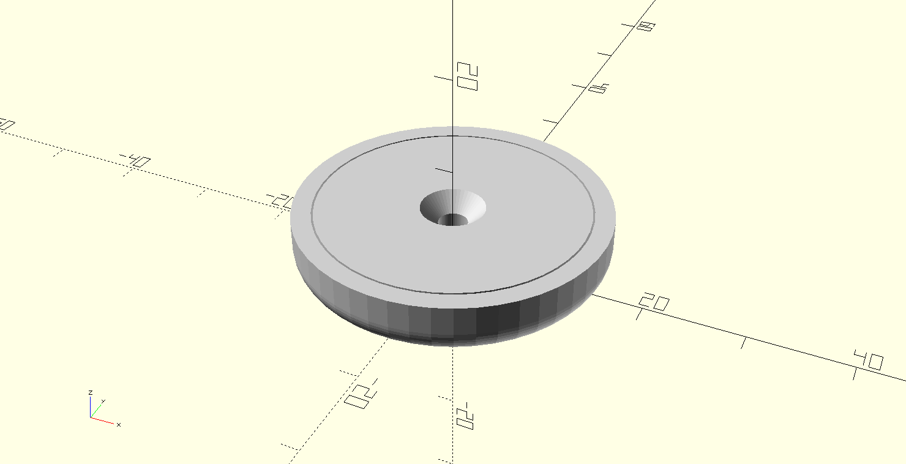
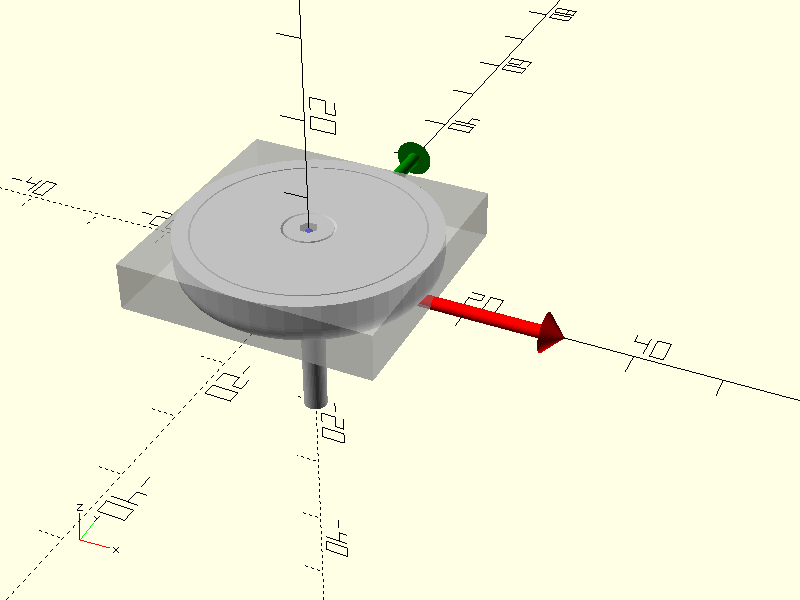
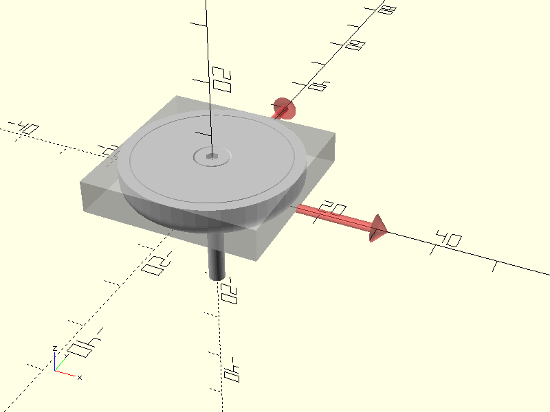
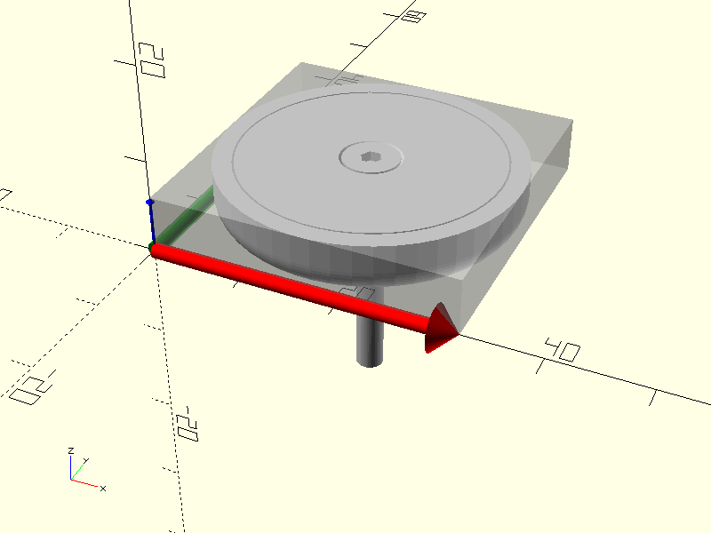
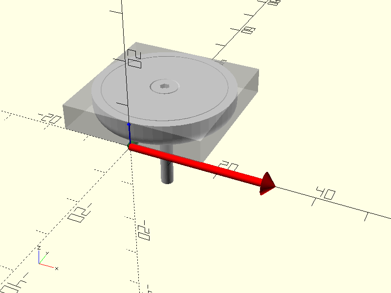
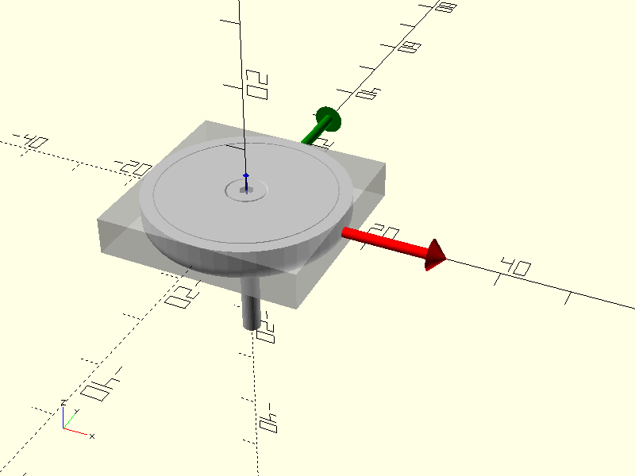
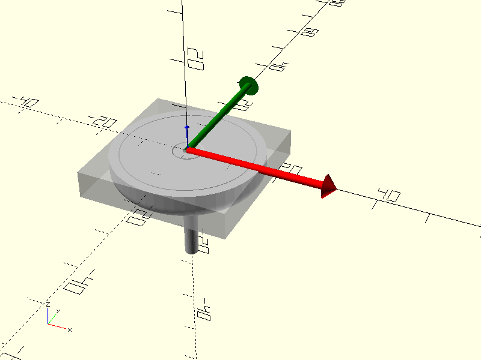
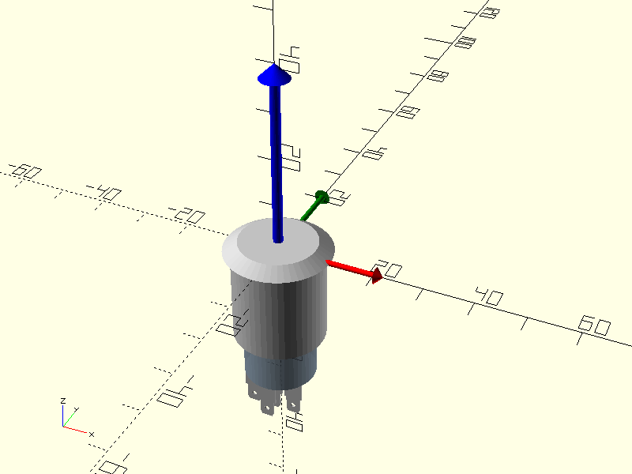
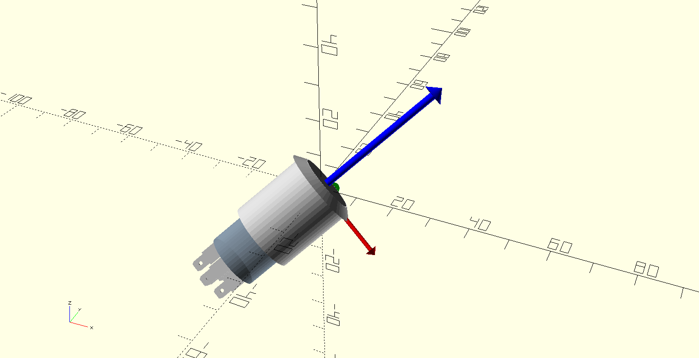
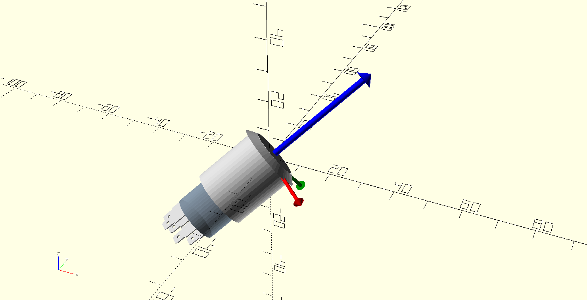

# OpenSCAD Foundation Library

## 'Objects'

An Object is a key/value list like the following:

    type = [
      ["first property name", "this is a string"],  // a string property
      ["second property name", -3.5],               // a number propery
      ["a flag name"],                              // a flag
    ];

## APIs

APIs belongs to one of the following categories:

* **contructor** - function returning an *Object*;
* **getter** - function retrieving a value from an *Object*;
* **engine** - module responding to a set of predefined *Verbs* applied to an *Object*;
* **primitive** - function or module not leveraging an *Object*.

## Verbs

*Engines* and *primitive modules* may implement any of the following verbs:

* **FL_ADD** - add shapes to scene;
* **FL_ASSEMBLY** - layout of predefined auxiliary shapes (like predefined screws);
* **FL_AXES** - draw of local (*Object* relative) reference axes;
* **FL_BBOX** - adds a bounding box containing the *Object*;
* **FL_CUTOUT** - layout of predefined cutout shapes (+X,-X,+Y,-Y,+Z,-Z);
* **FL_DRILL** - layout of predefined drill shapes (like holes with predefined screw diameter);
* **FL_FOOTPRINT** - adds an *Object* footprint to scene, usually a simplified FL_ADD;
* **FL_LAYOUT** - layout of passed children (useful for assembling user defined accessories like screws);
* **FL_PAYLOAD** - adds a box representing the payload of the shape (when supported).

Verbs can be passed either as single value or as a list.

### Single verb invocation

When a verb is passed as a single value the verb will be trivially executed.

    include <OFL/foundation/incs.scad>
    include <OFL/vitamins/magnets.scad>

    // object instance
    obj = FL_MAG_M4_CS_32x6;
    // single verb engine invocation 
    fl_magnet(FL_ADD,obj);

### Multiple verb invocation

 When multiple verbs are passed as a list, they are executed sequentially, as in the following example
 
    include <OFL/foundation/incs.scad>
    include <OFL/vitamins/magnets.scad>
    
    // object instance
    obj = FL_MAG_M4_CS_32x6;
    // multiple verb engine invocation 
    fl_magnet([FL_ADD,FL_ASSEMBLY,FL_AXES,FL_BBOX],obj);

where
 
 1. a magnet is added (FL_ADD);
 2. the default assembly of its accessories is performed (FL_ASSEMBLY);
 3. local reference axes are shown (FL_AXES);
 4. the object bounding box is shown (FL_BBOX).

### Verbs rendering

Engine's behaviour when rendering verbs can be modified injecting well-known values into runtime variables with the same name of the verb. For modifying the FL_ADD rendering, the runtime variable to be used is $FL_ADD, for FL_PAYLOAD is $FL_PAYLOAD and so on.. .

The list of modifier variables with their corresponding defaults are listed below:

| Name          | Modified verb | Default       |
| ------------- | ------------- | ------------- |
| $FL_ADD       | FL_ADD        | "ON"          |
| $FL_ASSEMBLY  | FL_ASSEMBLY   | "ON"          |
| $FL_AXES      | FL_AXES       | "ON"          |
| $FL_BBOX      | FL_BBOX       | "TRANSPARENT" |
| $FL_CUTOUT    | FL_CUTOUT     | "ON"          |
| $FL_DRILL     | FL_DRILL      | "ON"          |
| $FL_FOOTPRINT | FL_FOOTPRINT  | "ON"          |
| $FL_HOLDERS   | FL_HOLDERS    | "ON"          |
| $FL_LAYOUT    | FL_LAYOUT     | "ON"          |
| $FL_PAYLOAD   | FL_PAYLOAD    | "DEBUG"       |

The possible values for these special variables are the following:

| Value       | Description                             |
| ----------- | --------------------------------------- |
| ON\|undef   | shape is added without modifications    |
| OFF         | shape is discarded                      |
| ONLY        | OpenSCAD root modifier is applied       |
| DEBUG       | OpenSCAD debug modifier is applied      |
| TRANSPARENT | OpenSCAD background modifier is applied |

In the previous example we can modify the rendering of the FL_AXES verb

    include <OFL/foundation/incs.scad>
    include <OFL/vitamins/magnets.scad>
    
    // object instance
    obj = FL_MAG_M4_CS_32x6;
    fl_magnet([FL_ADD,FL_ASSEMBLY,FL_AXES,FL_BBOX],obj,$FL_AXES="DEBUG");

obtaining the reference axes rendering in 'debug' mode

## 3D positioning and orientation

Every OFL *engine* manages the following characteristics:

* **placement** - the 3D octant in which the object is displayed.
* **orientation** - passed as a direction axis and rotation angle. Internally the resulting direction is evaluated in two vectors, the direction axis (usually +Z) and one orthogonal axis (usually +X). Each *Object* has a default direction.

### Placement

3D space can be divided in eight octants delimited by the system reference semi-axes. Each engine has a default or native position in the space, eventually not corresponding exactly with octants. In order to assign the object position relative to octants, the **octant** parameter is implemented by all the engines. The value that the octant parameter can assume is a 3d vector whose x,y and z component can be:

| value | semantic           |
| ----- | ------------------ |
| -1    | negative semi-axis |
| 0     | centered           |
| +1    | positive semi-axis |

so if we want to place an object in the octant defined by the semi-axes +X,+Y,+Z the **octant** must be [1,1,1]. OFL defines three constants:

    X = [1,0,0];
    Y = [0,1,0];
    Z = [0,0,1];
    O = [0,0,0];

so that the value [1,1,1] can be expressed as **+X+Y+Z**.

We can pass this value to our example for placing the object in the desired octant

    include <OFL/foundation/unsafe_defs.scad>
    include <OFL/foundation/incs.scad>
    include <OFL/vitamins/magnets.scad>

    // allows unsafe definitions
    $FL_SAFE  = false;

    fl_magnet([FL_ADD,FL_ASSEMBLY,FL_AXES,FL_BBOX],FL_MAG_M4_CS_32x6,octant=+X+Y+Z);

If we want the object centered along the X axis, the octant will be [0,1,1] ⇒ +Y+Z

    include <OFL/foundation/unsafe_defs.scad>
    include <OFL/foundation/incs.scad>
    include <OFL/vitamins/magnets.scad>

    // allows unsafe definitions
    $FL_SAFE  = false;

    fl_magnet([FL_ADD,FL_ASSEMBLY,FL_AXES,FL_BBOX],FL_MAG_M4_CS_32x6,octant=+Y+Z);

If we want the object centered on the origin the octant will be [0,0,0] ⇒ O (**capital 'o'**)

    include <OFL/foundation/unsafe_defs.scad>
    include <OFL/foundation/incs.scad>
    include <OFL/vitamins/magnets.scad>

    // allows unsafe definitions
    $FL_SAFE  = false;

    fl_magnet([FL_ADD,FL_ASSEMBLY,FL_AXES,FL_BBOX],FL_MAG_M4_CS_32x6,octant=O);

Of course these setting can be mixed with all the possible combination allowed, for example [0,0,-1] ⇒ -Z

    include <OFL/foundation/unsafe_defs.scad>
    include <OFL/foundation/incs.scad>
    include <OFL/vitamins/magnets.scad>

    // allows unsafe definitions
    $FL_SAFE  = false;

    fl_magnet([FL_ADD,FL_ASSEMBLY,FL_AXES,FL_BBOX],FL_MAG_M4_CS_32x6,octant=-Z);

### Orientation

3D orientation is managed by engines through the **direction** parameter actually constituted by a list containing a vector (director) and a rotation angle. When the direction parameter is undef the default value is used (usually +Z).

The following code change the orientation from the default +Z to the [1,1,1] vector.

    include <OFL/foundation/incs.scad>
    include <OFL/vitamins/spdts.scad>

    // arbitrary direction vector
    direction=[1,1,1];
    fl_spdt([FL_ADD,FL_AXES],FL_SODAL_SPDT,direction=[direction,0]);

It is possible to combine the change of direction with a rotation around the new axis.

    include <OFL/foundation/incs.scad>
    include <OFL/vitamins/spdts.scad>

    // arbitrary direction vector
    direction = [1,1,1];
    angle     = 30;
    fl_spdt([FL_ADD,FL_AXES],FL_SODAL_SPDT,direction=[direction,angle]);

## API naming convention

In an attempt to avoid name collision between OFL and any other library, every client accessible API is prefixed with **'fl_'** while the rest is in **mixed case** (first letter lowercase and first letter of each internal word capitalised). The only exception are constructors that - after the 'fl_' prefix - are in **camel case**. 

APIs used internally a file (i.e. not to be used by clients) are prefixed and terminated by **'__'**.

The following example shows some of the APIs for a countersink component, with a sub namespace 'cs' that follows the general 'fl' one for engines, getters and primitives.

    // Constructor
    function fl_Countersink(name,description,d,angle) = ...
    
    // Engine
    module fl_countersink(verbs,type,direction,octant) { ...
    
    // Getter
    function fl_cs_angle(type) = ...
    
    // internal test module NOT to be used by clients
    module __test__() { ...
    
    // internal function  NOT to be used by clients
    function __point__(alpha) = ...

## Naming convention for constants

For similar reasons all global constants used in OFL are prefixed with **'FL_'** while the rest of the name must be in **UPPER CASE**.

    FL_ADD        = "FL_ADD adds shapes to scene.";
    FL_ASSEMBLY   = "FL_ASSEMBLY layout of predefined auxiliary shapes (like predefined screws).";
    FL_AXES       = "FL_AXES draw of local reference axes.";
    FL_BBOX       = "FL_BBOX adds a bounding box containing the object.";
    FL_CUTOUT     = "FL_CUTOUT layout of predefined cutout shapes (+X,-X,+Y,-Y,+Z,-Z).";
    FL_DRILL      = "FL_DRILL layout of predefined drill shapes (like holes with predefined screw diameter).";
    FL_FOOTPRINT  = "FL_FOOTPRINT adds a footprint to scene, usually a simplified FL_ADD.";
    FL_HOLDERS    = "FL_HOLDERS adds vitamine holders to the scene. **DEPRECATED**";
    FL_LAYOUT     = "FL_LAYOUT layout of user passed accessories (like alternative screws).";
    FL_PAYLOAD    = "FL_PAYLOAD adds a box representing the payload of the shape";
    FL_DEPRECATED = "FL_DEPRECATED is a test verb. **DEPRECATED**";
    FL_OBSOLETE   = "FL_OBSOLETE is a test verb. **OBSOLETE**";

## File name convention

Basically OFL uses three type of files: (Object) definition files,  (Component) implementation and test files.

### Definition files

Files named in plural form, contain *Object* definitions and must be \<included\> by clients. They *can* contain also function helpers, but essentially they export Objects. Valid examples are:

    include <OFL/foundation/defs.scad>
    include <OFL/vitamins/countersinks.scad>

### Implementation files

Files named in singular form contain the implementation code for components and must be \<used\> by clients. Valid examples are:

    use <OFL/foundation/layout.scad>
    use <OFL/vitamins/countersink.scad>

### Test files

Test files are available in singular form as standalone units (i.e. loadable from OpenSCAD) in order to:

* provide a functional test of the component features;
* facilitate component comprehension;
* act as concrete documentation for the library.
