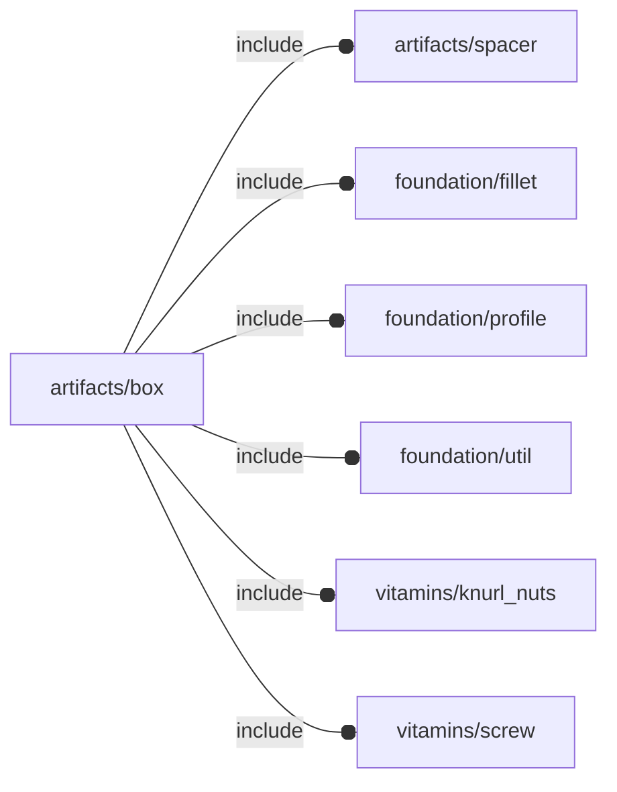

# package artifacts/box

## Dependencies

Box artifact.

*Published under __GNU General Public License v3__*

## Modules

---

### module fl_box

__Syntax:__

    fl_box(verbs=FL_ADD,preset,xsize,isize,pload,thick,radius,parts,tolerance=0.3,material_upper,material_lower,fillet=true,direction,octant)

engine for generating boxes

__Parameters:__

__preset__  
preset profiles (UNUSED)

__xsize__  
external dimensions

__isize__  
internal payload size

__pload__  
internal bounding box

__thick__  
sheet thickness

__radius__  
fold internal radius (square if undef)

__parts__  
"all","upper","lower"

__material_upper__  
upper side color

__material_lower__  
lower side color

__direction__  
desired direction [director,rotation], native direction when undef ([+X+Y+Z])

__octant__  
when undef native positioning is used

