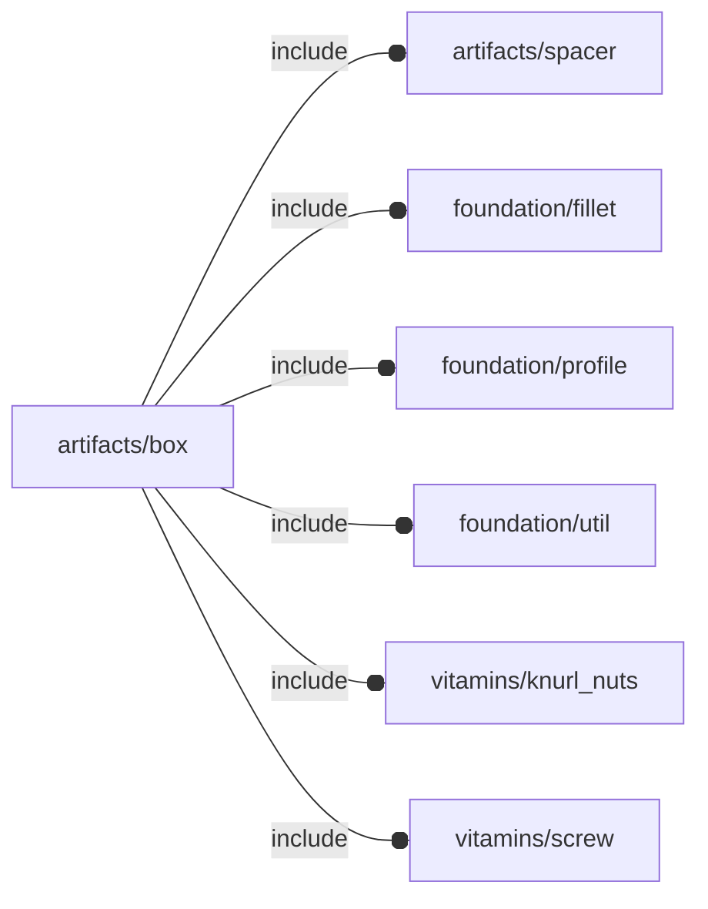

# package artifacts/box

## Dependencies

## Modules

---

### module fl_box

__Syntax:__

    fl_box(verbs=FL_ADD,preset,xsize,isize,pload,thick,radius,parts,tolerance=0.3,material_upper,material_lower,fillet=true,direction,octant)

