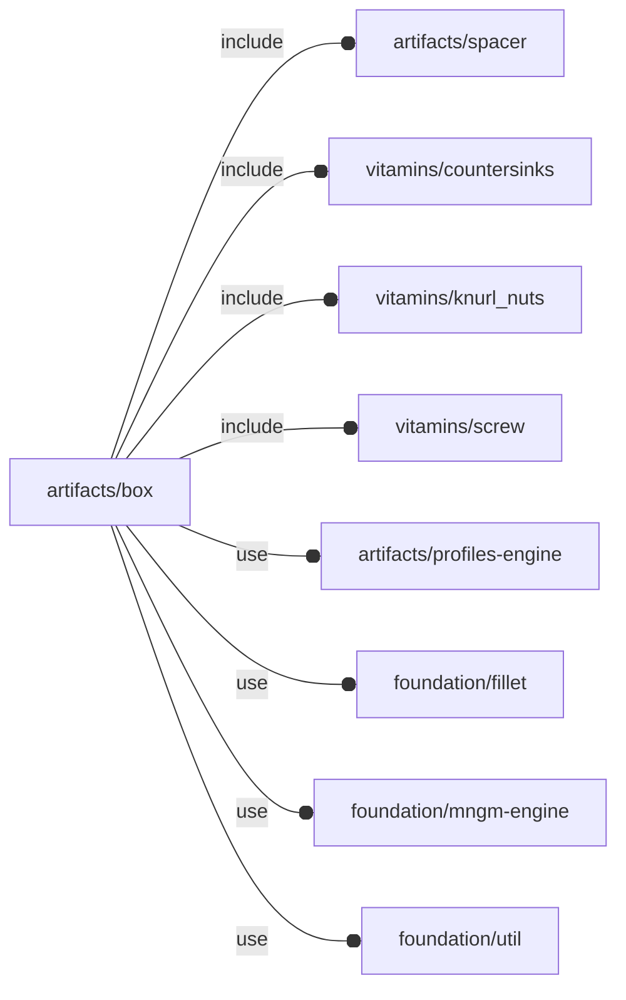

# package artifacts/box

## Dependencies

Box artifact engine.

Copyright © 2021, Giampiero Gabbiani (giampiero@gabbiani.org)

SPDX-License-Identifier: [GPL-3.0-or-later](https://spdx.org/licenses/GPL-3.0-or-later.html)

## Modules

---

### module fl_box

__Syntax:__

    fl_box(verbs=FL_ADD,xsize,isize,pload,thick,radius,parts="all",tolerance=0.3,material_upper,material_lower,fillet=true,lay_octant,fastenings=["linear",3],direction,octant)

engine for generating boxes.

__children context__:

- $box_materials - list of used materials [«material_lower»,
   «material_upper»]

TODO: external function returning the resulting bounding box having the
payload as input (and vice versa?)

__Parameters:__

__verbs__  
supported verbs: FL_ADD, FL_AXES, FL_ASSEMBLY, FL_BBOX, FL_LAYOUT, FL_MOUNT, FL_PAYLOAD

__xsize__  
external dimensions

__isize__  
internal dimensions

__pload__  
payload bounding box

__thick__  
sheet thickness

__radius__  
fold internal radius (square if undef)

__parts__  
"all","upper","lower"

__material_upper__  
upper side color

__material_lower__  
lower side color

__lay_octant__  
payload octant for content positioning

__fastenings__  
Specifications for the fastenings of the upper part to the lower in
[«knurl nut thread type»,«screw nominal size»] format with:

  - «knurl nut thread type»: either "linear" or "spiral".
  - «screw nominal size»   : countersink screw nominal size

__direction__  
desired direction [director,rotation], native direction when undef ([+X+Y+Z])

__octant__  
when undef native positioning is used

