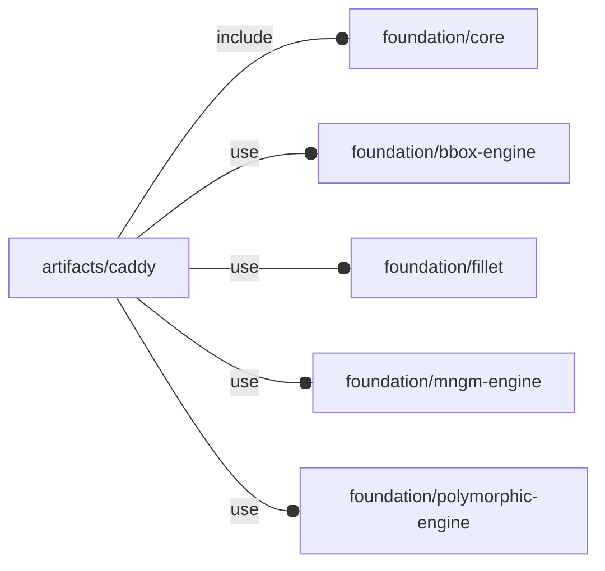

# package artifacts/caddy

## Dependencies



Generic caddy artifact.

Copyright © 2021, Giampiero Gabbiani (giampiero@gabbiani.org)

SPDX-License-Identifier: [GPL-3.0-or-later](https://spdx.org/licenses/GPL-3.0-or-later.html)


## Variables

---

### variable FL_NS_CAD

__Default:__

    "cad"

Caddy's namespace

## Modules

---

### module fl_caddy

__Syntax:__

    fl_caddy(verbs=FL_ADD,type,thick,faces,tolerance=fl_JNgauge,fillet=0,lay_verbs=[],direction,octant)

Builds a caddy around the passed object «type».
Even if not mandatory - when passed - children will be used during
FL_ADD (for drilling), FL_ASSEMBLY (for rendering) and FL_LAYOUT.

Children must implement the following verbs:

- FL_DRILL,FL_CUTOUT (used during FL_ADD)
- FL_ADD,FL_ASSEMBLY (used during FL_ASSEMBLY)

Context passed to children:

- $cad_thick     : see «thick» parameter
- $cad_tolerance : see tolerance
- $cad_verbs     : list of verbs to be executed by children()

TODO: FL_DRILL implementation


__Parameters:__

__verbs__  
supported verbs: FL_ADD, FL_ASSEMBLY, FL_BBOX, FL_FOOTPRINT, FL_LAYOUT

__thick__  
walls thickness in the fixed form: `[[-x,+x],[-y,+y],[-z+z]]`

Passed as scalar means same thickness for all the six walls:
`[[«thick»,«thick»],[«thick»,«thick»],[«thick»«thick»]]`.

examples:

```
thick=[[0,2.5],[0,0],[5,0]]
thick=2.5
```


__faces__  
faces defined by their orthonormal axis in floating semi-axis list format

__tolerance__  
SCALAR added to each internal payload dimension.

__fillet__  
fillet radius, when > 0 a fillet is inserted where needed

__lay_verbs__  
defines the value of $cad_verbs passed to children

__direction__  
desired direction [director,rotation], native direction when undef ([+X+Y+Z])

__octant__  
when undef native positioning is used


