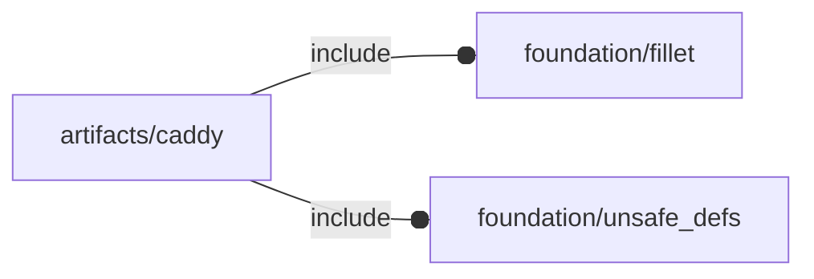

# package artifacts/caddy

## Dependencies

## Variables

---

### variable FL_NS_CAD

__Default:__

    "cad"

## Modules

---

### module fl_caddy

__Syntax:__

    fl_caddy(verbs=FL_ADD,type,thick,faces,tolerance=fl_JNgauge,fillet=0,lay_verbs=[],direction,octant)

