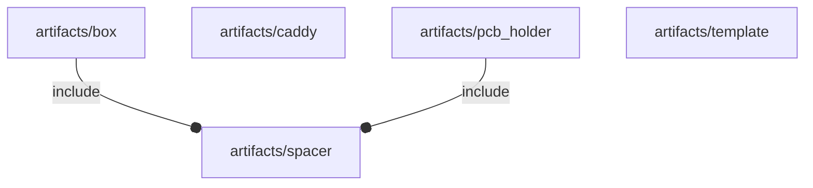

# Dependencies

```mermaid
graph TD
    A1[artifacts/box] --o|include| A2[artifacts/spacer]
    A3[artifacts/caddy]
    A4[artifacts/pcb_holder] --o|include| A2
    A2
    A5[artifacts/template]
    click A1 "artifacts/box.md"
    click A2 "artifacts/spacer.md"
```

