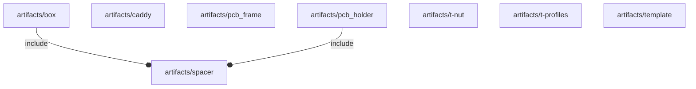

# Dependencies

```mermaid
graph TD
    A1[artifacts/box] --o|include| A2[artifacts/spacer]
    A3[artifacts/caddy]
    A4[artifacts/pcb_frame]
    A5[artifacts/pcb_holder] --o|include| A2
    A2
    A6[artifacts/t-nut]
    A7[artifacts/t-profiles]
    A8[artifacts/template]
```

