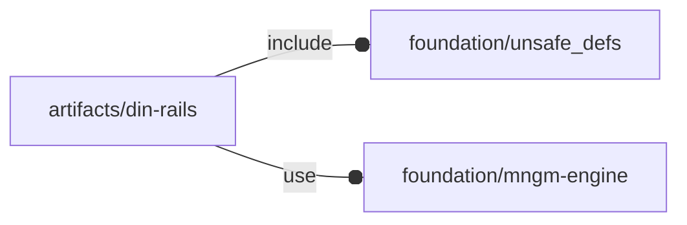

# package artifacts/din-rails

## Dependencies

```mermaid
graph LR
    A1[artifacts/din-rails] --o|include| A2[foundation/unsafe_defs]
    A1 --o|use| A3[foundation/mngm-engine]
```

## Variables

---

### variable FL_DRAIL_DICT

__Default:__

    []

---

### variable FL_DRAIL_NS

__Default:__

    "drail"

