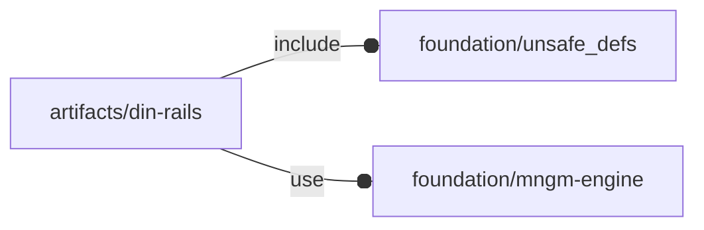

# package artifacts/din-rails

## Dependencies

DIN rails according to EN 60715 and DIN 50045, 50022 and 50035 standards

This file is part of the 'OpenSCAD Foundation Library' (OFL) project.

Copyright © 2021, Giampiero Gabbiani <giampiero@gabbiani.org>

SPDX-License-Identifier: [GPL-3.0-or-later](https://spdx.org/licenses/GPL-3.0-or-later.html)

## Variables

---

### variable FL_DRAIL_DICT

__Default:__

    []

---

### variable FL_DRAIL_NS

__Default:__

    "drail"

