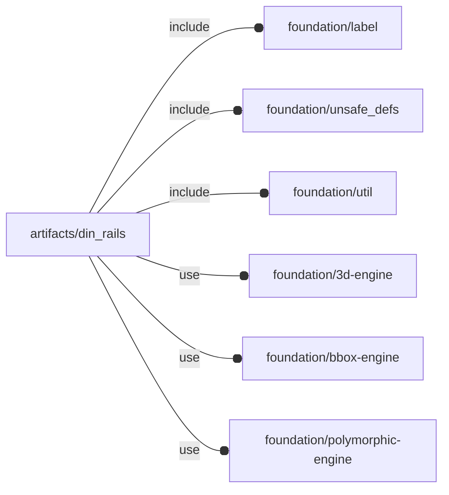

# package artifacts/din_rails

## Dependencies



DIN rails according to EN 60715 and DIN 50045, 50022 and 50035 standards

This file is part of the 'OpenSCAD Foundation Library' (OFL) project.

Copyright © 2021, Giampiero Gabbiani <giampiero@gabbiani.org>

SPDX-License-Identifier: [GPL-3.0-or-later](https://spdx.org/licenses/GPL-3.0-or-later.html)


## Variables

---

### variable FL_DIN_INVENTORY

__Default:__

    [FL_DIN_TS15,FL_DIN_TS35,FL_DIN_TS35D]

rail constructor inventory

---

### variable FL_DIN_NS

__Default:__

    "DIN"

prefix used for namespacing

---

### variable FL_DIN_PUNCH_4p2

__Default:__

    concat(fl_Punch(20),[["DIN/rail/punch_d",4.2],["DIN/rail/punch_len",12.2],])

---

### variable FL_DIN_PUNCH_6p2

__Default:__

    concat(fl_Punch(25),[["DIN/rail/punch_d",6.2],["DIN/rail/punch_len",15],])

---

### variable FL_DIN_RP_INVENTORY

__Default:__

    [FL_DIN_RP_TS15,FL_DIN_RP_TS35,FL_DIN_RP_TS35D]

profile inventory

---

### variable FL_DIN_RP_TS15

__Default:__

    fl_DIN_RailProfile("TS15",size=[[10.5,15],5.5],r=[0.2,0.5])

---

### variable FL_DIN_RP_TS35

__Default:__

    fl_DIN_RailProfile("TS35",size=[[27,35],7.5],r=[.8,.8])

---

### variable FL_DIN_RP_TS35D

__Default:__

    fl_DIN_RailProfile("TS35D",size=[[27,35],15],r=[1.25,1.25],thick=1.5)

---

### variable FL_DIN_TS15

__Default:__

    function(length,punch)fl_DIN_Rail(profile=FL_DIN_RP_TS15,punch=punch,length=length)

---

### variable FL_DIN_TS35

__Default:__

    function(length,punch)fl_DIN_Rail(profile=FL_DIN_RP_TS35,punch=punch,length=length)

---

### variable FL_DIN_TS35D

__Default:__

    function(length,punch)fl_DIN_Rail(profile=FL_DIN_RP_TS35D,punch=punch,length=length)

## Functions

---

### function fl_DIN_Rail

__Syntax:__

```text
fl_DIN_Rail(profile,length,punch)
```

DIN Rails constructor

__Parameters:__

__profile__  
one of the supported profiles (see [variable FL_DIN_RP_INVENTORY](#variable-fl_din_rp_inventory))

__length__  
overall rail length

__punch__  
optional parameter as returned from [fl_Punch()](#function-fl_punch)


---

### function fl_DIN_RailProfile

__Syntax:__

```text
fl_DIN_RailProfile(name,description,size,r,thick=1)
```

helper for new 'object' definition

__Parameters:__

__description__  
optional description

__size__  
Rails size in [[width-min,width-max],height]

__r__  
internal radii [upper radius,lower radius]


---

### function fl_Punch

__Syntax:__

```text
fl_Punch(step)
```

Punch constructor

## Modules

---

### module fl_DIN_puncher

__Syntax:__

    fl_DIN_puncher()

---

### module fl_DIN_rail

__Syntax:__

    fl_DIN_rail(verbs=FL_ADD,this,cut_thick,tolerance=0,cut_drift=0,cut_direction,octant,direction,debug)

__Parameters:__

__verbs__  
supported verbs: FL_ADD, FL_AXES, FL_BBOX, FL_CUTOUT, FL_DRILL, CO_FOOTPRINT, FL_LAYOUT, FL_MOUNT

__cut_thick__  
thickness for FL_CUTOUT

__tolerance__  
tolerance used during FL_CUTOUT and FL_FOOTPRINT

__cut_drift__  
translation applied to cutout (default 0)

__cut_direction__  
Cutout direction list in floating semi-axis list (see also [fl_tt_isAxisList()](../foundation/type_trait.md#function-fl_tt_isaxislist)).

Example:

    cut_direction=[+X,+Z]

in this case the ethernet plug will perform a cutout along +X and +Z.

:memo: **Note:** axes specified must be present in the supported cutout direction
list (retrievable through [fl_cutout()](../foundation/core.md#function-fl_cutout) getter)


__octant__  
when undef native positioning is used

__direction__  
desired direction [director,rotation], native direction when undef ([+X+Y+Z])

__debug__  
see constructor [fl_parm_Debug()](../foundation/core.md#function-fl_parm_debug)


---

### module fl_punch

__Syntax:__

    fl_punch(punch,length,thick)

Performs a punch along the Z axis using children.

Children context:

- $punch: the punch instance containing stepping data
- $punch_thick: thickness of the performed punch to be used by children
- $punch_step: punch stepping

TODO: extend to other generic axes, move source into core library


__Parameters:__

__punch__  
as returned by [fl_Punch()](#function-fl_punch)


