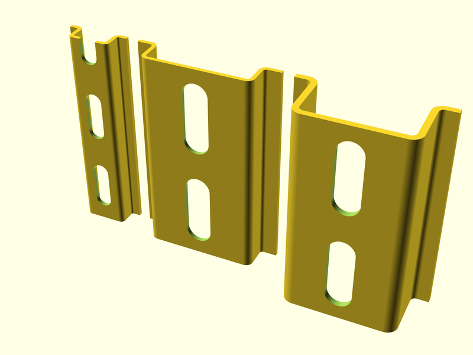
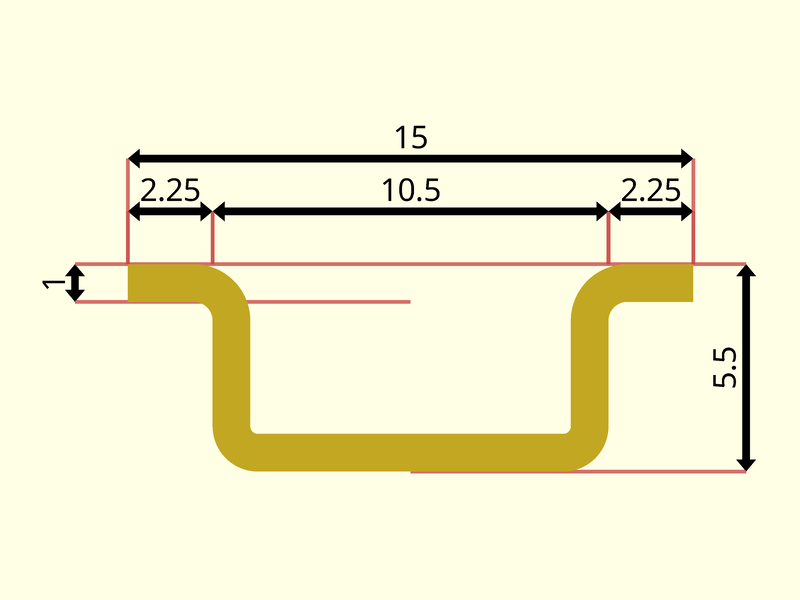
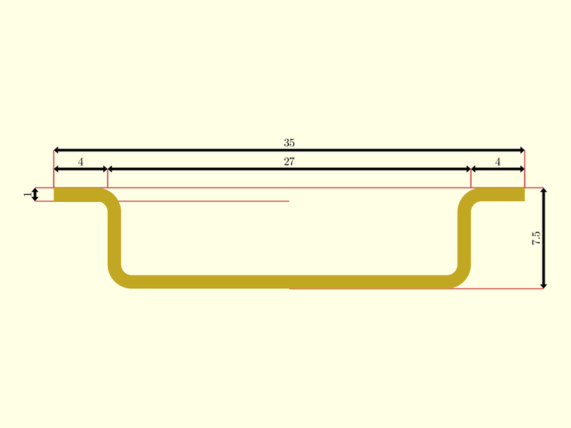
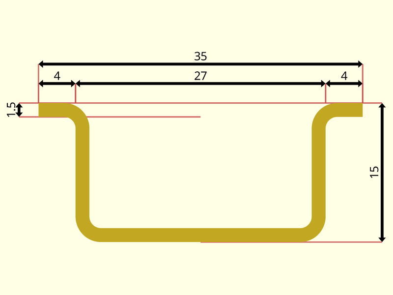

# package artifacts/din_rails

## Dependencies


A DIN rail is a metal rail of a standard type widely used for mounting
circuit breakers and industrial control equipment inside equipment racks.
These products are typically made from cold rolled carbon steel sheet with a
zinc-plated or chromed bright surface finish. Although metallic, they are
meant only for mechanical support and are not used as a busbar to conduct
electric current, though they may provide a chassis grounding connection.

The term derives from the original specifications published by Deutsches
Institut für Normung (DIN) in Germany, which have since been adopted as
European (EN) and international (IEC) standards. The original concept was
developed and implemented in Germany in 1928, and was elaborated into the
present standards in the 1950s.



## Organization

The package manages three type of objects:

- **punches**: ancillary type, eventually moved elsewhere in the future, defining
  the punch type to be performed on a rail.
- **profiles**: representing the different rail sections available. Currently
  supported types are type Ω top head sections.  DIN profile instances are
  all prefixed with **TS**. The list of available profiles is contained in
  [variable FL_DIN_TS_INVENTORY](#variable-fl_din_ts_inventory).
- **DIN rails**: concrete rail instantiations. DIN rail instances are
  prefixed with **TH**. The list of available rails is provided in
  [variable FL_DIN_RAIL_INVENTORY](#variable-fl_din_rail_inventory) .

## Legal

This file is part of the 'OpenSCAD Foundation Library' (OFL) project.

Copyright © 2021, Giampiero Gabbiani <giampiero@gabbiani.org>

SPDX-License-Identifier: [GPL-3.0-or-later](https://spdx.org/licenses/GPL-3.0-or-later.html)


## Variables

---

### variable FL_DIN_NS

__Default:__

    "DIN"

prefix used for namespacing

---

### variable FL_DIN_PUNCH_4p2

__Default:__

    concat(fl_Punch(20),[["DIN/rail/punch_d",4.2],["DIN/rail/punch_len",12.2],])

4.2 mm stepped punch

---

### variable FL_DIN_PUNCH_6p3

__Default:__

    concat(fl_Punch(25),[["DIN/rail/punch_d",6.3],["DIN/rail/punch_len",18],])

6.3 mm stepped punch

---

### variable FL_DIN_RAIL_INVENTORY

__Default:__

    [FL_DIN_RAIL_TH15,FL_DIN_RAIL_TH35,FL_DIN_RAIL_TH35D]

DIN rail constructor inventory.

Every constructor - while instantiating different concrete rail - has the
same signature:

    Constructor(length,punched=true);


---

### variable FL_DIN_RAIL_TH15

__Default:__

    function(length,punched=true)fl_DIN_Rail(profile=FL_DIN_TS15,punch=punched?FL_DIN_PUNCH_4p2:undef,length=length)

Constructor for 15mm DIN rail with eventual 4.2mm punch

---

### variable FL_DIN_RAIL_TH35

__Default:__

    function(length,punched=true)fl_DIN_Rail(profile=FL_DIN_TS35,punch=punched?FL_DIN_PUNCH_6p3:undef,length=length)

Constructor for 35mm DIN rail with eventual 6.3mm punch

---

### variable FL_DIN_RAIL_TH35D

__Default:__

    function(length,punched=true)fl_DIN_Rail(profile=FL_DIN_TS35D,punch=punched?FL_DIN_PUNCH_6p3:undef,length=length)

Constructor for 35mm DIN 'depth' variant rail with eventual 6.3mm punch

---

### variable FL_DIN_TS15

__Default:__

    fl_DIN_TopHatSection("TS15",size=[[10.5,15],5.5],r=[0.2,0.5])

Top hat section profile IEC/EN 60715 – 15×5.5 mm




---

### variable FL_DIN_TS35

__Default:__

    fl_DIN_TopHatSection("TS35",size=[[27,35],7.5],r=[.8,.8])

Top hat section profile IEC/EN 60715 – 35×7.5 mm




---

### variable FL_DIN_TS35D

__Default:__

    fl_DIN_TopHatSection("TS35D",size=[[27,35],15],r=[1.25,1.25],thick=1.5)

Top hat section profile IEC/EN 60715 – 35×15 mm




---

### variable FL_DIN_TS_INVENTORY

__Default:__

    [FL_DIN_TS15,FL_DIN_TS35,FL_DIN_TS35D]

DIN profile inventory

## Functions

---

### function fl_DIN_Rail

__Syntax:__

```text
fl_DIN_Rail(profile,length,punch)
```

DIN Rails constructor

__Parameters:__

__profile__  
one of the supported profiles (see [variable FL_DIN_TS_INVENTORY](#variable-fl_din_ts_inventory))

__length__  
overall rail length

__punch__  
optional parameter as returned from [fl_Punch()](#function-fl_punch)


---

### function fl_DIN_TopHatSection

__Syntax:__

```text
fl_DIN_TopHatSection(name,description,size,r,thick=1)
```

Constructor for Top hat section (TH), type O, or type Ω, with hat-shaped
cross section.


__Parameters:__

__description__  
optional description

__size__  
Rails size in [[width-min,width-max],height]

__r__  
internal radii [upper radius,lower radius]


---

### function fl_DIN_profilePoints

__Syntax:__

```text
fl_DIN_profilePoints(type,value)
```

DIN profile points property

---

### function fl_DIN_profileSize

__Syntax:__

```text
fl_DIN_profileSize(type,value)
```

DIN profile size in [[width-min,width-max],height] format

---

### function fl_DIN_profileThick

__Syntax:__

```text
fl_DIN_profileThick(type,value)
```

DIN profile thickness property

---

### function fl_DIN_railProfile

__Syntax:__

```text
fl_DIN_railProfile(type,value)
```

DIN rail profile property

---

### function fl_Punch

__Syntax:__

```text
fl_Punch(step)
```

Punch constructor: it actually defines only the punch step, while the
concrete punch shape is defined by the children passed to the punch engine.


## Modules

---

### module fl_DIN_puncher

__Syntax:__

    fl_DIN_puncher()

This module defines the punch shape stepped by.


---

### module fl_DIN_rail

__Syntax:__

    fl_DIN_rail(verbs=FL_ADD,this,cut_thick,tolerance=0,cut_drift=0,cut_direction,octant,direction)

DIN rail engine module.


__Parameters:__

__verbs__  
supported verbs: FL_ADD, FL_AXES, FL_BBOX, FL_CUTOUT, FL_DRILL, CO_FOOTPRINT, FL_LAYOUT, FL_MOUNT

__cut_thick__  
thickness for FL_CUTOUT

__tolerance__  
tolerance used during FL_CUTOUT and FL_FOOTPRINT

__cut_drift__  
translation applied to cutout (default 0)

__cut_direction__  
Cutout direction list in floating semi-axis list (see also [fl_tt_isAxisList()](../foundation/type_trait.md#function-fl_tt_isaxislist)).

Example:

    cut_direction=[±Z]

in this case the rail will perform a cutout along +Z and -Z.

:memo: **Note:** axes specified must be present in the supported cutout direction
list (retrievable through the standard [fl_cutout()](../foundation/core.md#function-fl_cutout) getter)


__octant__  
when undef native positioning is used

__direction__  
desired direction [director,rotation], native direction when undef ([+X+Y+Z])


---

### module fl_punch

__Syntax:__

    fl_punch(punch,length,thick)

Performs a punch along the Z axis using children.

Children context:

- $punch: the punch instance containing stepping data
- $punch_thick: thickness of the performed punch to be used by children
- $punch_step: punch stepping

TODO: extend to other generic axes, move source into core library


__Parameters:__

__punch__  
as returned by [fl_Punch()](#function-fl_punch)


