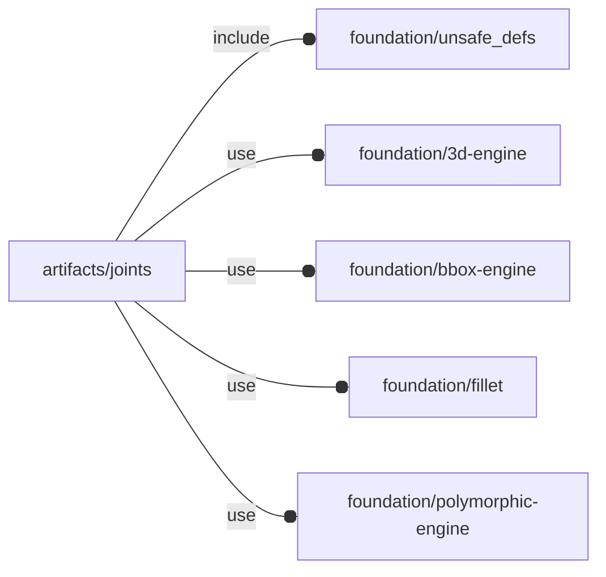

# package artifacts/joints

## Dependencies



Snap-fit joints, for 'how to' about snap-fit joint 3d printing, see also [How
do you design snap-fit joints for 3D printing? | Protolabs
Network](https://www.hubs.com/knowledge-base/how-design-snap-fit-joints-3d-printing/)

This file is part of the 'OpenSCAD Foundation Library' (OFL) project.

Copyright © 2021, Giampiero Gabbiani <giampiero@gabbiani.org>

SPDX-License-Identifier: [GPL-3.0-or-later](https://spdx.org/licenses/GPL-3.0-or-later.html)


## Variables

---

### variable FL_JNT_INVENTORY

__Default:__

    []

package inventory as a list of pre-defined and ready-to-use 'objects'

---

### variable FL_JNT_NS

__Default:__

    "jnt"

prefix used for namespacing

## Functions

---

### function fl_jnt_RectCantilever

__Syntax:__

```text
fl_jnt_RectCantilever(description,length,h,b,undercut,alpha=30,orientation=+Z,fillet=0)
```

creates a cantilever joint with rectangle cross-section

__Parameters:__

__description__  
optional description

__length__  
total cantilever length (i.e. arm + tooth)

__h__  
thickness in scalar or [root,end] form. Scalar value means constant thickness.

__b__  
width in scalar or [root,end] form. Scalar value means constant width.

__orientation__  
move direction: +Z or -Z

__fillet__  
optional fillet radius.

- 0 ⇒ no fillet
- "auto" ⇒ auto calculated radius
- scalar ⇒ client defined radius value


---

### function fl_jnt_RectCantileverConst

__Syntax:__

```text
fl_jnt_RectCantileverConst(description,length,h,b,undercut,alpha=30,orientation=+Z,fillet=0)
```

creates a cantilever joint with constant rectangle cross-section

__Parameters:__

__description__  
optional description

__length__  
total cantilever length (i.e. arm + tooth)

__h__  
thickness in scalar.

__b__  
width in scalar.

__orientation__  
move direction: +Z or -Z

__fillet__  
optional fillet radius.

- 0 ⇒ no fillet
- "auto" ⇒ auto calculated radius
- scalar ⇒ client defined radius value


---

### function fl_jnt_RectCantileverFullScaled

__Syntax:__

```text
fl_jnt_RectCantileverFullScaled(description,length,h,b,undercut,alpha=30,orientation=+Z,fillet=0)
```

Creates a cantilever joint with a scaled section thickness from «h» to «h»/2
and a scaled section width from «b» to «b»/4


__Parameters:__

__description__  
optional description

__length__  
total cantilever length (i.e. arm + tooth)

__h__  
thickness in scalar.

__b__  
width in scalar.

__orientation__  
move direction: +Z or -Z

__fillet__  
optional fillet radius.

- 0 ⇒ no fillet
- "auto" ⇒ auto calculated radius
- scalar ⇒ client defined radius value


---

### function fl_jnt_RectCantileverScaledThickness

__Syntax:__

```text
fl_jnt_RectCantileverScaledThickness(description,length,h,b,undercut,alpha=30,orientation=+Z,fillet=0)
```

Creates a cantilever joint with a scaled section thickness from «h» to «h»/2


__Parameters:__

__description__  
optional description

__length__  
total cantilever length (i.e. arm + tooth)

__h__  
thickness in scalar.

__b__  
width in scalar.

__orientation__  
move direction: +Z or -Z

__fillet__  
optional fillet radius.

- 0 ⇒ no fillet
- "auto" ⇒ auto calculated radius
- scalar ⇒ client defined radius value


---

### function fl_jnt_RectCantileverScaledWidth

__Syntax:__

```text
fl_jnt_RectCantileverScaledWidth(description,length,h,b,undercut,alpha=30,orientation=+Z,fillet=0)
```

Creates a cantilever joint with a scaled section width from «b» to «b»/4


__Parameters:__

__description__  
optional description

__length__  
total cantilever length (i.e. arm + tooth)

__h__  
thickness in scalar.

__b__  
width in scalar.

__orientation__  
move direction: +Z or -Z

__fillet__  
optional fillet radius.

- 0 ⇒ no fillet
- "auto" ⇒ auto calculated radius
- scalar ⇒ client defined radius value


---

### function fl_jnt_points

__Syntax:__

```text
fl_jnt_points(type,value)
```

PolyRound points

## Modules

---

### module fl_jnt_joint

__Syntax:__

    fl_jnt_joint(verbs=FL_ADD,this,parameter,octant,direction,debug)

__Parameters:__

__verbs__  
supported verbs: FL_ADD, FL_ASSEMBLY, FL_BBOX, FL_DRILL, FL_FOOTPRINT, FL_LAYOUT

__octant__  
when undef native positioning is used

__direction__  
desired direction [director,rotation], native direction when undef ([+X+Y+Z])

__debug__  
see constructor [fl_parm_Debug()](../foundation/core.md#function-fl_parm_debug)


