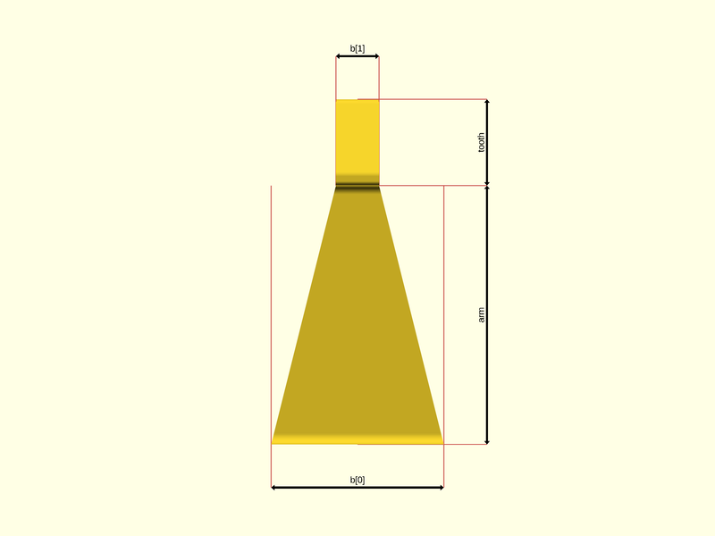
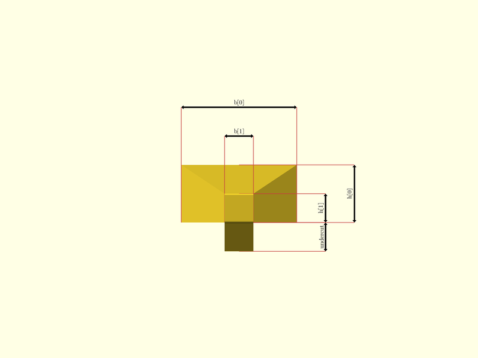

# package artifacts/new-joints-test

## Dependencies


Snap-fit joints, for 'how to' about snap-fit joint 3d printing, see also [How
do you design snap-fit joints for 3D printing?](https://www.hubs.com/knowledge-base/how-design-snap-fit-joints-3d-printing/)

This file is part of the 'OpenSCAD Foundation Library' (OFL) project.

Copyright © 2021, Giampiero Gabbiani <giampiero@gabbiani.org>

SPDX-License-Identifier: [GPL-3.0-or-later](https://spdx.org/licenses/GPL-3.0-or-later.html)


## Variables

---

### variable $FL_ADD

__Default:__

    "ON"

---

### variable $FL_AXES

__Default:__

    "OFF"

---

### variable $FL_BBOX

__Default:__

    "OFF"

---

### variable $FL_CUTOUT

__Default:__

    "OFF"

---

### variable $FL_FOOTPRINT

__Default:__

    "OFF"

---

### variable $FL_RENDER

__Default:__

    false

---

### variable $FL_TRACES

__Default:__

    -2

---

### variable $dbg_Assert

__Default:__

    DEBUG_ASSERTIONS

---

### variable $dbg_Color

__Default:__

    DEBUG_COLOR

---

### variable $dbg_Components

__Default:__

    DEBUG_COMPONENTS[0]=="none"?undef:DEBUG_COMPONENTS

---

### variable $dbg_Dimensions

__Default:__

    DEBUG_DIMENSIONS

---

### variable $dbg_Labels

__Default:__

    DEBUG_LABELS

---

### variable $dbg_Symbols

__Default:__

    DEBUG_SYMBOLS

---

### variable $dim_mode

__Default:__

    DIM_MODE

---

### variable $dim_width

__Default:__

    DIM_W

---

### variable $fl_filament

__Default:__

    "DodgerBlue"

---

### variable $fl_polyround

__Default:__

    true

---

### variable $fn

__Default:__

    50

---

### variable $vpr

__Default:__

    fl_view(VIEW_TYPE)

---

### variable ARM

__Default:__

    6

---

### variable ARM_R

__Default:__

    4

---

### variable ARM_THETA

__Default:__

    90

---

### variable B0

__Default:__

    4

---

### variable CANTILEVER_ANGLE

__Default:__

    30

---

### variable CLIPPING_SECTION

__Default:__

    false

---

### variable CUT_CLEARANCE

__Default:__

    0

---

### variable CUT_DRIFT

__Default:__

    0

---

### variable DEBUG_ASSERTIONS

__Default:__

    false

---

### variable DEBUG_COLOR

__Default:__

    false

---

### variable DEBUG_COMPONENTS

__Default:__

    ["none"]

---

### variable DEBUG_DIMENSIONS

__Default:__

    false

---

### variable DEBUG_LABELS

__Default:__

    false

---

### variable DEBUG_SYMBOLS

__Default:__

    false

---

### variable DIM_GAP

__Default:__

    1

---

### variable DIM_MODE

__Default:__

    "full"

---

### variable DIM_W

__Default:__

    0.05

---

### variable DIR_NATIVE

__Default:__

    true

---

### variable DIR_R

__Default:__

    0

---

### variable DIR_Z

__Default:__

    [0,0,1]

---

### variable FL_JNT_CANTILEVER_NS

__Default:__

    str(FL_JNT_NS,"/cantilever")

namespace for cantilever attributes: jnt/cantilever

---

### variable FL_JNT_INVENTORY

__Default:__

    []

package inventory as a list of pre-defined and ready-to-use 'objects'

---

### variable FL_JNT_NS

__Default:__

    "jnt"

prefix used for namespacing

---

### variable FL_JNT_RECT_NS

__Default:__

    str(FL_JNT_CANTILEVER_NS,"/rect")

namespace for rectangular cantilever attributes: jnt/cantilever/rect

---

### variable FL_JNT_RING_NS

__Default:__

    str(FL_JNT_CANTILEVER_NS,"/ring")

namespace for ring cantilever attributes: jnt/cantilever/ring

---

### variable FL_JNT_SECTION_NS

__Default:__

    str(FL_JNT_CANTILEVER_NS,"/section")

namespace for cantilever section attributes: jnt/cantilever/section

---

### variable H0

__Default:__

    2

---

### variable JOINT_FILLET

__Default:__

    "undef"

---

### variable JOINT_SHAPE

__Default:__

    "rect"

---

### variable JOINT_TYPE

__Default:__

    "full scaled"

---

### variable THICKNESS

__Default:__

    2.5

---

### variable TOLERANCE

__Default:__

    0.1

---

### variable TOOTH

__Default:__

    2

---

### variable UNDERCUT

__Default:__

    1

---

### variable VIEW_TYPE

__Default:__

    "other"

---

### variable X_PLACE

__Default:__

    "undef"

---

### variable Y_PLACE

__Default:__

    "undef"

---

### variable Z_PLACE

__Default:__

    "undef"

---

### variable bbox

__Default:__

    fl_bb_corners(joint)

---

### variable direction

__Default:__

    DIR_NATIVE?undef:[DIR_Z,DIR_R]

---

### variable fillet

__Default:__

    fl_custom_num(JOINT_FILLET)

---

### variable joint

__Default:__

    JOINT_SHAPE=="rect"?fl_jnt_RectCantilever(alpha=CANTILEVER_ANGLE,arm=ARM,tooth=TOOTH,h=JOINT_TYPE=="scaled thickness"||JOINT_TYPE=="full scaled"?[H0,H0/2]:H0,b=JOINT_TYPE=="scaled width"||JOINT_TYPE=="full scaled"?[B0,B0/4]:B0,undercut=UNDERCUT):JOINT_SHAPE=="ring"?fl_jnt_RingCantilever(arm_l=ARM,tooth_l=TOOTH,h=JOINT_TYPE=="scaled thickness"||JOINT_TYPE=="full scaled"?[H0,H0/2]:H0,theta=ARM_THETA,undercut=UNDERCUT,alpha=CANTILEVER_ANGLE,r=ARM_R):undef

---

### variable octant

__Default:__

    fl_parm_Octant(X_PLACE,Y_PLACE,Z_PLACE)

---

### variable verbs

__Default:__

    fl_verbList([FL_ADD,FL_AXES,FL_BBOX,FL_CUTOUT,FL_FOOTPRINT,])

## Functions

---

### function RadiusPoint

__Syntax:__

```text
RadiusPoint(point,radius=0)
```

---

### function fl_custom_num

__Syntax:__

```text
fl_custom_num(value)
```

---

### function fl_jnt_RectCantilever

__Syntax:__

```text
fl_jnt_RectCantilever(description,arm,tooth,h,b,undercut,alpha=30)
```

Creates a cantilever snap-fit joint with rectangle cross-section.

The following pictures show the relations between the passed parameters and
the object geometry:

__FRONT VIEW__:



__RIGHT VIEW__:


__TOP VIEW__




__Parameters:__

__description__  
optional description

__arm__  
arm length

__tooth__  
tooth length

__h__  
thickness in scalar or [root,end] form. Scalar value means constant thickness.

__b__  
width in scalar or [root,end] form. Scalar value means constant width.

__alpha__  
angle of inclination for the tooth


---

### function fl_jnt_RingCantilever

__Syntax:__

```text
fl_jnt_RingCantilever(description,arm_l,tooth_l,h,theta,undercut,alpha=30,r)
```

__Parameters:__

__description__  
optional description

__arm_l__  
arm length

__tooth_l__  
tooth length: automatically calculated according to «alpha» angle if undef


__h__  
thickness in scalar or [root,end] form. Scalar value means constant thickness.

__theta__  
angular width in scalar or [root,end] form. Scalar value means constant
angular width.


__alpha__  
angle of inclination for the tooth

__r__  
arm radius


---

### function roundness

__Syntax:__

```text
roundness(undercut)
```

## Modules

---

### module fl_jnt_joint

__Syntax:__

    fl_jnt_joint(verbs=FL_ADD,this,fillet,cut_drift=0,cut_dirs,cut_clearance=0,octant,direction)

Add a snap-fit joint.

Context variables:

| Name             | Context   | Description                                           |
| ---------------- | --------- | ----------------------------------------------------- |
| $fl_thickness    | Parameter | Used during FL_CUTOUT (see also [fl_parm_thickness()](../foundation/core.md#function-fl_parm_thickness))  |
| $fl_tolerance    | Parameter | Used during FL_FOOTPRINT (see [fl_parm_tolerance()](../foundation/core.md#function-fl_parm_tolerance))    |


__Parameters:__

__verbs__  
supported verbs: FL_ADD, FL_ASSEMBLY, FL_BBOX, FL_DRILL, FL_FOOTPRINT, FL_LAYOUT

__fillet__  
optional fillet radius.

- undef  ⇒ auto calculated radius respecting build constrains
- 0      ⇒ no fillet
- scalar ⇒ client defined radius value

TODO: to be moved among [fl_jnt_joint{}](joints.md#module-fl_jnt_joint) parameters since this parameter
doesn't modify the object bounding box.


__cut_drift__  
translation applied to cutout

__cut_dirs__  
FL_CUTOUT direction list, if undef then the preferred cutout direction
attribute is used.


__cut_clearance__  
clearance used by FL_CUTOUT

__octant__  
when undef native positioning is used

__direction__  
desired direction [director,rotation], native direction when undef ([+X+Y+Z])


