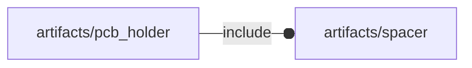

# package artifacts/pcb_holder

## Dependencies



## Functions

---

### function fl_bb_holderByHoles

__Syntax:__

```text
fl_bb_holderByHoles(pcb,h)
```

---

### function fl_bb_holderBySize

__Syntax:__

```text
fl_bb_holderBySize(pcb,h,tolerance=0.5,screw=M3_cap_screw,knut=false)
```

__Parameters:__

__h__  
spacers height

__tolerance__  
used for the pcb joints

__screw__  
mounting screw

__knut__  
knurl nut


## Modules

---

### module fl_pcb_holderByHoles

__Syntax:__

    fl_pcb_holderByHoles(verbs,pcb,h,thick=0,knut=false,frame,lay_direction=[+Z,-Z],direction,octant)

PCB holder by holes engine

children() context:

- $holder_screw


__Parameters:__

__h__  
spacers height

__thick__  
FL_DRILL thickness

__knut__  
knurl nut

__lay_direction__  
FL_LAYOUT directions in floating semi-axis list

__direction__  
desired direction [director,rotation], native direction when undef

__octant__  
when undef native positioning is used


---

### module fl_pcb_holderBySize

__Syntax:__

    fl_pcb_holderBySize(verbs,pcb,h,tolerance=0.5,screw=M3_cap_screw,knut=false,thick=0,frame=0,lay_direction=[+Z,-Z],direction,octant)

engine for pcb holder by size

children() context:

- $holder_screw


__Parameters:__

__h__  
spacers height

__tolerance__  
used for the pcb joints

__screw__  
MANDATORY mounting screw

__knut__  
knurl nut

__thick__  
FL_DRILL thickness

__frame__  
frame thickness. 0 means 'no frame'

__lay_direction__  
FL_LAYOUT directions in floating semi-axis list

__direction__  
desired direction [director,rotation], native direction when undef

__octant__  
when undef native positioning is used


