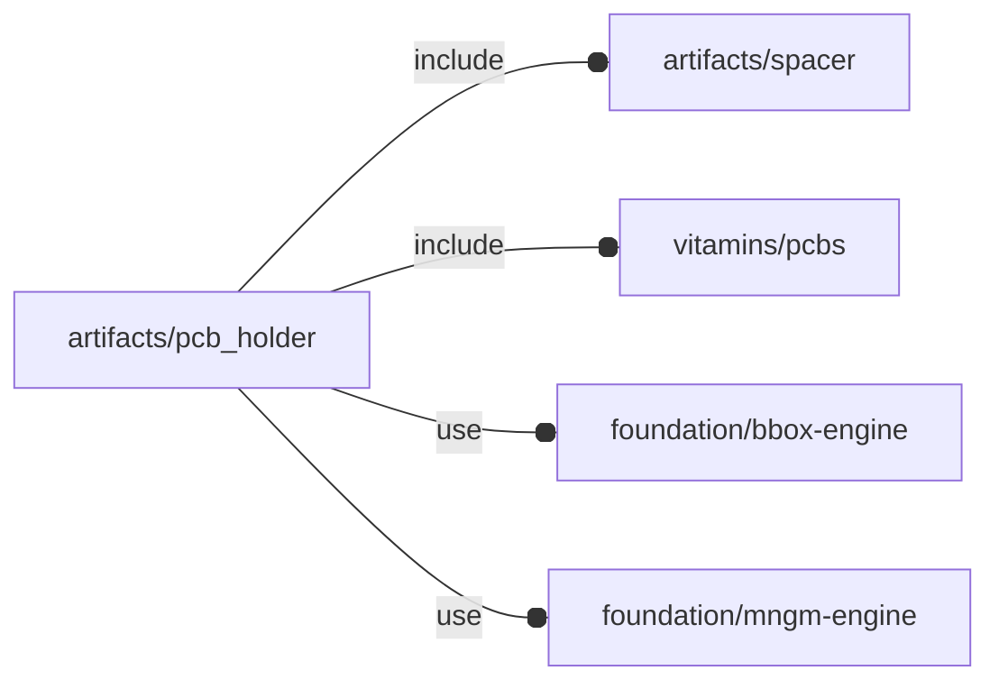

# package artifacts/pcb_holder

## Dependencies



This file is part of the 'OpenSCAD Foundation Library' (OFL) project.

Copyright © 2021, Giampiero Gabbiani <giampiero@gabbiani.org>

SPDX-License-Identifier: [GPL-3.0-or-later](https://spdx.org/licenses/GPL-3.0-or-later.html)


## Functions

---

### function fl_PCBHolder

__Syntax:__

```text
fl_PCBHolder(pcb,h_min=0,wall=1,knut_type)
```

Hole driven PCB holder constructor

TODO: set PCB holder namespace as 'engine' property


__Parameters:__

__pcb__  
PCB to be held

__h_min__  
Minimum spacer height.

__NOTE__: the actual spacer height can be different depending on the knurl
nut constrains


__wall__  
when using spacers without knurl nut, this is the wall thickness around the
spacers' holes


__knut_type__  
Knurl nut thread type: either 'undef', "linear" or "spiral".


---

### function fl_pcbh_spacers

__Syntax:__

```text
fl_pcbh_spacers(type,value)
```

## Modules

---

### module fl_pcbHolder

__Syntax:__

    fl_pcbHolder(verbs,this,fillet=0,asm_all=false,thick,lay_direction=[+Z,-Z],direction,octant)

PCB holder engine.

Context variables:

| Name             | Context   | Description
| ---              | ---       | ---
| $pcb_*           | Children  | [fl_pcb{}](../vitamins/pcbs.md#module-fl_pcb) context
| $spc_*           | Children  | [fl_spacer{}](spacer.md#module-fl_spacer) context
| $pcbh_screw      | Children  | currently processed screw (equal to current $hole_screw)
| $pcbh_spacer     | Children  | currently processed spacer
| $pcbh_upperThick | Children  | overall thickness along +Z semi-axis
| $pcbh_verb       | Children  | currently triggering verb


__Parameters:__

__verbs__  
supported verbs: FL_ADD, FL_ASSEMBLY, FL_AXES, FL_BBOX, FL_LAYOUT,
FL_DRILL, FL_MOUNT


__fillet__  
when >0 a fillet is added to anchors

__asm_all__  
FL_ASSEMBLY modifier: when true also PCB will be shown during FL_ASSEMBLY

__thick__  
List of Z-axis thickness or a scalar value for FL_DRILL and FL_MOUNT
operations.

A positive value represents thickness along +Z semi-axis.
A negative value represents thickness along -Z semi-axis.
A scalar value represents thickness for both Z semi-axes.

Example 1:

    thick = [+3,-1]

is interpreted as thickness of 3mm along +Z and 1mm along -Z

Example 2:

    thick = [-1]

is interpreted as thickness of 1mm along -Z and 0mm along +Z

Example:

    thick = 2

is interpreted as a thickness of 2mm along +Z and -Z axes


__lay_direction__  
FL_DRILL and FL_LAYOUT directions in floating semi-axis list.

FIXME: currently unused, only Z semi-axes will be supported


__direction__  
desired direction [director,rotation], native direction when undef ([+X+Y+Z])

__octant__  
when undef native positioning is used


