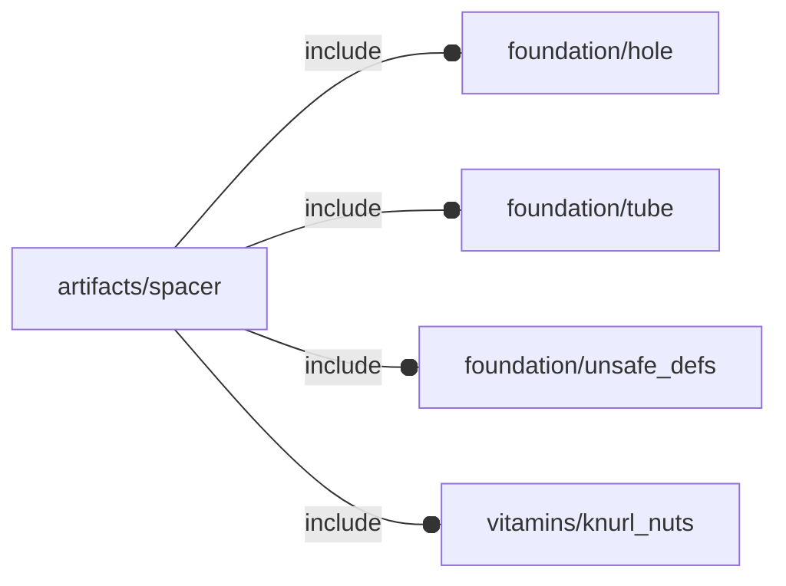

# package artifacts/spacer

## Dependencies



## Variables

---

### variable FL_SPC_NS

__Default:__

    "spc"

## Functions

---

### function fl_bb_spacer

__Syntax:__

```text
fl_bb_spacer(h,r)
```

---

### function fl_spc_holeRadius

__Syntax:__

```text
fl_spc_holeRadius(screw,knut)
```

## Modules

---

### module fl_spacer

__Syntax:__

    fl_spacer(verbs=FL_ADD,h,r,d,thick=0,lay_direction=[+Z,-Z],screw,knut=false,direction,octant)

