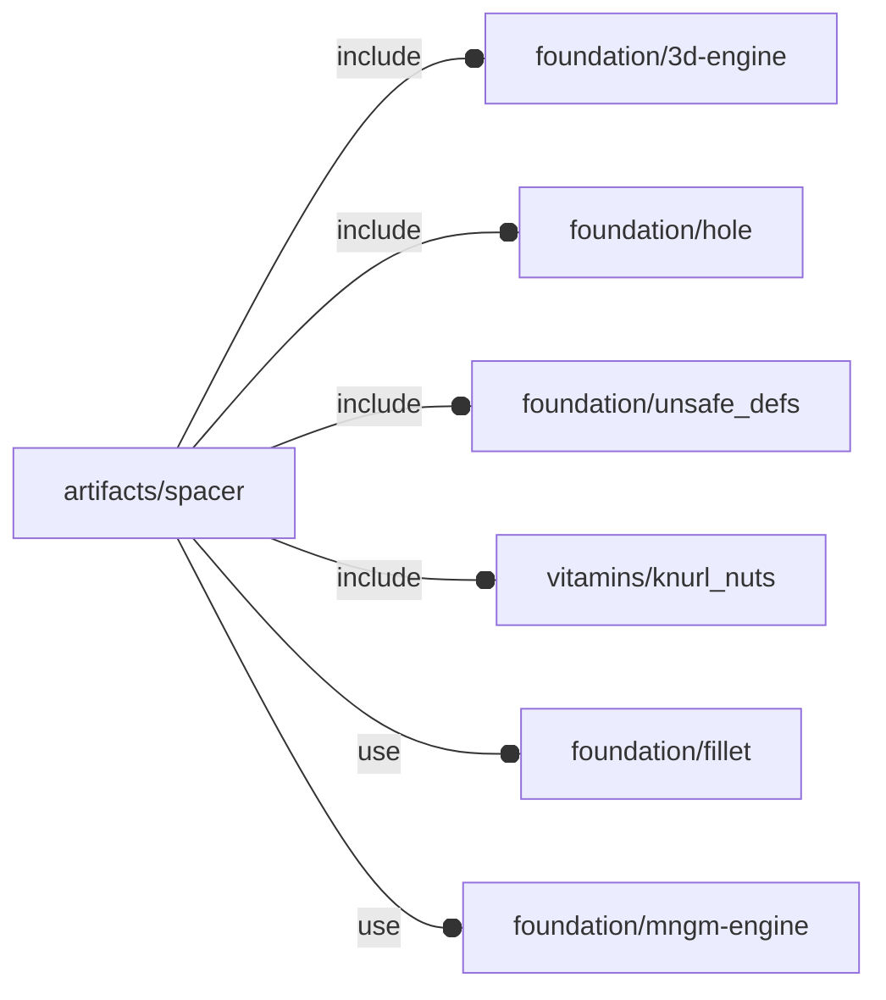

# package artifacts/spacer

## Dependencies



Spacers with optional screw and knurl nuts.

Copyright © 2021, Giampiero Gabbiani (giampiero@gabbiani.org)

SPDX-License-Identifier: [GPL-3.0-or-later](https://spdx.org/licenses/GPL-3.0-or-later.html)


## Variables

---

### variable FL_SPC_NS

__Default:__

    "spc"

namespace

## Functions

---

### function fl_bb_spacer

__Syntax:__

```text
fl_bb_spacer(h,r)
```

---

### function fl_spc_holeRadius

__Syntax:__

```text
fl_spc_holeRadius(screw,knut)
```

calculates the internal spacer radius.


__Parameters:__

__screw__  
optional screw

__knut__  
optional knurl nut instance


## Modules

---

### module fl_spacer

__Syntax:__

    fl_spacer(verbs=FL_ADD,h,r,d,thick=0,lay_direction=[+Z,-Z],screw,knut,anchor,fillet=0,direction,octant)

Children context:

- $spc_director: layout direction
- $spc_screw   : OPTIONAL screw
- $spc_thick   : thickness along $spc_director
- $spc_h       : spacer height
- $spc_holeR   : OPTIONAL internal hole radius


__Parameters:__

__verbs__  
supported verbs: FL_ADD, FL_ASSEMBLY, FL_BBOX, FL_DRILL, FL_FOOTPRINT, FL_LAYOUT

__h__  
height along Z axis

__r__  
external radius

__d__  
external diameter (mutually exclusive with «r»)

__thick__  
List of Z-axis thickness or a scalar value for FL_DRILL and FL_MOUNT
operations.

A positive value represents thickness along +Z semi-axis.
A negative value represents thickness along -Z semi-axis.
A scalar value represents thickness for both Z semi-axes.

Example 1:

    thick = [+3,-1]

is interpreted as thickness of 3mm along +Z and 1mm along -Z

Example 2:

    thick = [-1]

is interpreted as thickness of 1mm along -Z

Example:

    thick = 2

is interpreted as a thickness of 2mm along +Z and -Z axes


__lay_direction__  
FL_DRILL and FL_LAYOUT directions in floating semi-axis list.

__NOTE__: only Z semi-axes are used


__screw__  
optional screw

__knut__  
optional knurl nut: error if no screw is passed

__anchor__  
anchor directions in floating semi-axis list

__fillet__  
when >0 a fillet is added to anchors

__direction__  
desired direction [director,rotation], native direction when undef ([+Z,0])

__octant__  
when undef native positioning is used


