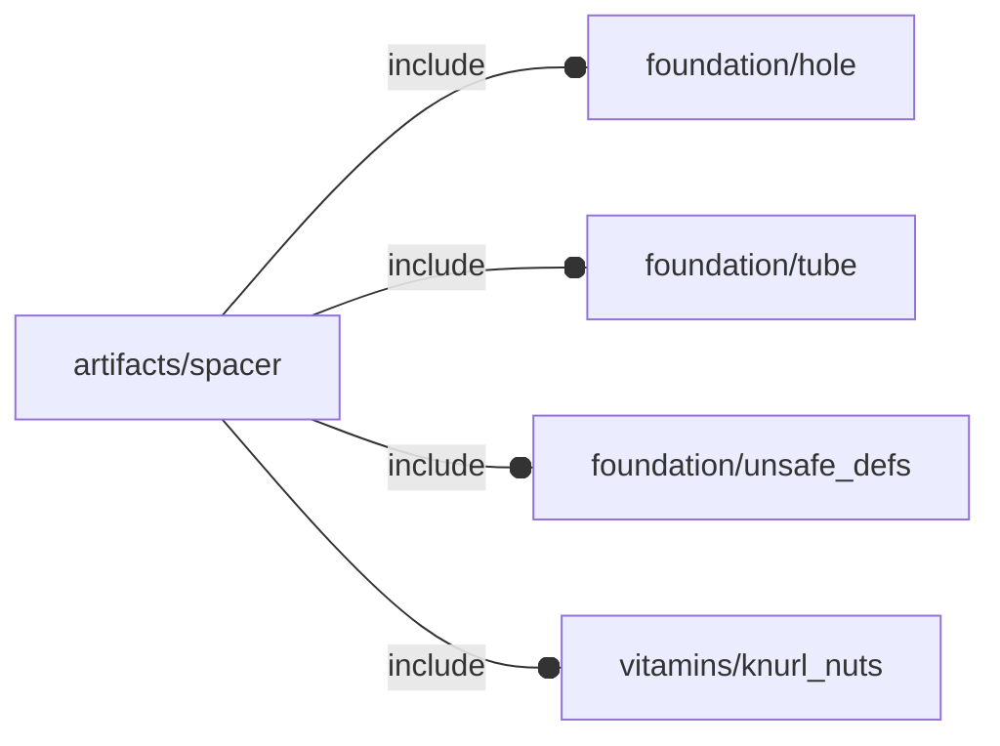

# package artifacts/spacer

## Dependencies



Spacers with optional screw and knurl nuts.


*Published under __GNU General Public License v3__*

## Variables

---

### variable FL_SPC_NS

__Default:__

    "spc"

namespace

## Functions

---

### function fl_bb_spacer

__Syntax:__

```text
fl_bb_spacer(h,r)
```

---

### function fl_spc_holeRadius

__Syntax:__

```text
fl_spc_holeRadius(screw,knut)
```

calculates the internal spacer radius.


__Parameters:__

__screw__  
optional screw

__knut__  
optional knurl nut instance


## Modules

---

### module fl_spacer

__Syntax:__

    fl_spacer(verbs=FL_ADD,h,r,d,thick=0,lay_direction=[+Z,-Z],screw,knut=false,direction,octant)

Children context:

- $spc_director: layout direction
- $spc_screw   : OPTIONAL screw
- $spc_thick   : thickness along $spc_director
- $spc_h       : spacer height
- $spc_holeR   : OPTIONAL internal hole radius


__Parameters:__

__verbs__  
supported verbs: FL_ADD, FL_ASSEMBLY, FL_BBOX, FL_DRILL, FL_FOOTPRINT, FL_LAYOUT

__h__  
height along Z axis

__r__  
external radius

__d__  
external diameter (mutually exclusive with «r»)

__thick__  
thickness in fixed form [[-X,+X],[-Y,+Y],[-Z,+Z]] or scalar shortcut

__lay_direction__  
FL_LAYOUT directions in floating semi-axis list

__screw__  
optional screw

__knut__  
optional knurl nut

__direction__  
desired direction [director,rotation], native direction when undef ([+Z,0])

__octant__  
when undef native positioning is used


