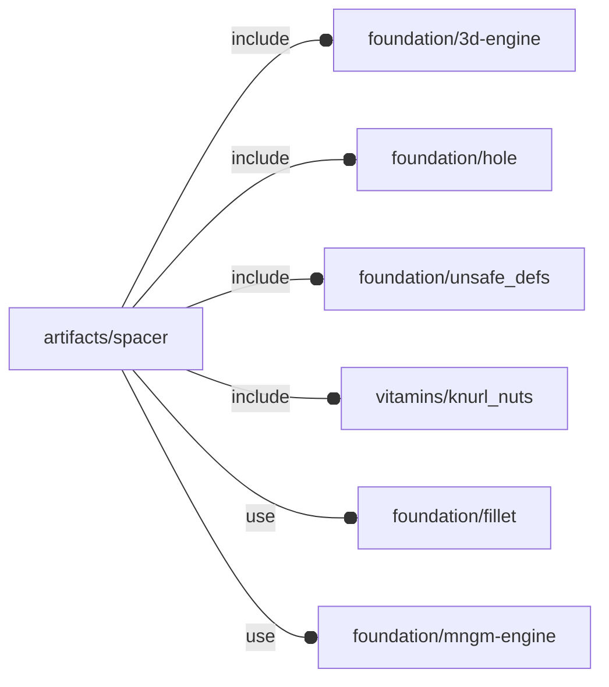

# package artifacts/spacer

## Dependencies



Spacers with optional screw and knurl nuts.

Copyright © 2021, Giampiero Gabbiani (giampiero@gabbiani.org)

SPDX-License-Identifier: [GPL-3.0-or-later](https://spdx.org/licenses/GPL-3.0-or-later.html)


## Variables

---

### variable FL_SPC_NS

__Default:__

    "spc"

namespace for spacer objects

## Functions

---

### function fl_Spacer

__Syntax:__

```text
fl_Spacer(h_min=0,d_min=0,screw_size=0,knut)
```

Spacer constructor.

__Parameters:__

__h_min__  
height along Z axis: knurl nut length constraints may override.
This parameter is mandatory if no knurl nut is passed.

When a knurl nut is required, this parameter is ignored if shorter than the
minimum knurl nut length + 1mm.


__d_min__  
External diameter: knurl nut constraints may override.
This parameter is mandatory if no knurl nut or screw nominal size is passed.

Knurl nuts requires a bigger hole to host screws (namely the knurl nut
physical dimension plus a minimum wall thick around). When a knurl nut is
required, this parameter is ignored if too small.


__screw_size__  
optional screw nominal ⌀, 0 if no screw. This parameter is ignored if a
knut is required.

Passing a screw size constrains the minimum external ⌀.


__knut__  
Knurl nut object.

This parameter constrains both the external ⌀ and the minimum spacer
height.


---

### function fl_spc_d

__Syntax:__

```text
fl_spc_d(type,value)
```

external ⌀ property

---

### function fl_spc_h

__Syntax:__

```text
fl_spc_h(type,value)
```

height along Z axis property

---

### function fl_spc_knut

__Syntax:__

```text
fl_spc_knut(type,value)
```

knurl nut optional property

---

### function fl_spc_nominalScrew

__Syntax:__

```text
fl_spc_nominalScrew(type,value)
```

nominal screw size optional property. TODO: shall this be substituted by [fl_nominal()](../foundation/core.md#function-fl_nominal)?

## Modules

---

### module fl_spacer

__Syntax:__

    fl_spacer(verbs=FL_ADD,spacer,thick=0,anchor,fillet=0,octant,direction)

Context variables:

| Name           | Type      | Description                                     |
| ---            | ---       | ---                                             |
| $spc_director  | Children  | layout direction                                |
| $spc_nominal   | Children  | OPTIONAL screw nominal ⌀                        |
| $spc_thick     | Children  | scalar thickness (always≥0) along $spc_director |
| $spc_thickness | Children  | overall thickness (spacer length + ∑thick[i])   |
| $spc_h         | Children  | spacer height                                   |
| $spc_holeR     | Children  | OPTIONAL internal hole radius                   |
| $spc_verb      | Children  | triggered verb                                  |


__Parameters:__

__verbs__  
supported verbs: FL_ADD, FL_ASSEMBLY, FL_BBOX, FL_DRILL, FL_FOOTPRINT, FL_LAYOUT

__spacer__  
OFL spacer

__thick__  
List of Z-axis thickness or a scalar value for FL_DRILL and FL_MOUNT
operations.

A positive value represents thickness along +Z semi-axis.
A negative value represents thickness along -Z semi-axis.
A scalar value represents thickness for both Z semi-axes.

Example 1:

    thick = [+3,-1]

is interpreted as thickness of 3mm along +Z and 1mm along -Z

Example 2:

    thick = [-1]

is interpreted as thickness of 1mm along -Z 0mm along +Z

Example:

    thick = 2

is interpreted as a thickness of 2mm along ±Z


__anchor__  
anchor directions in floating semi-axis list

__fillet__  
when >0 a fillet is added to anchors

__octant__  
when undef native positioning is used

__direction__  
desired direction [director,rotation], native direction when undef ([+Z,0])


