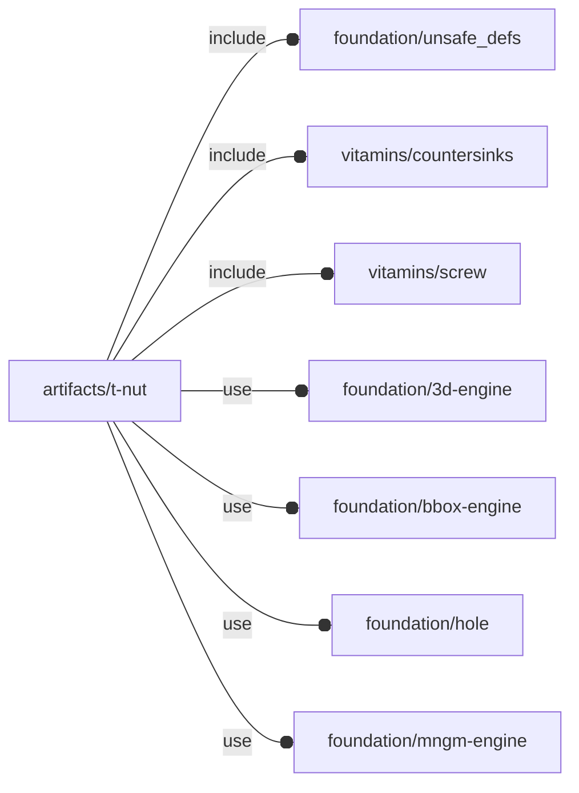

# package artifacts/t-nut

## Dependencies



T-slot nut engine for OpenSCAD Foundation Library.

T-slot nuts are used with
[T-slot structural framing](https://en.wikipedia.org/wiki/T-slot_structural_framing)
to build a variety of industrial structures and machines.

T-slot nut are not to be confused with [T-nuts](https://en.wikipedia.org/wiki/T-nut).

Copyright © 2021, Giampiero Gabbiani <giampiero@gabbiani.org>

SPDX-License-Identifier: [GPL-3.0-or-later](https://spdx.org/licenses/GPL-3.0-or-later.html)


## Variables

---

### variable FL_TNUT_DICT

__Default:__

    []

---

### variable FL_TNUT_NS

__Default:__

    "tnut"

## Functions

---

### function fl_TNut

__Syntax:__

```text
fl_TNut(opening,size,thickness,screw,knut=false,holes)
```

Constructor returning a T-slot nut.

                       screw M
                     ⭰─────────⇥
           ________________________________
         ╱           ░░░░░░░░░░░░           ╲       ⤒         ⤒
       ╱             ░░░░░░░░░░░░             ╲    cone
     ╱               ░░░░░░░░░░░░               ╲   ⤓         h
    │                ░░░░░░░░░░░░                │  ⤒         e
    │                ░░░░░░░░░░░░                │ base       i
    │_________       ░░░░░░░░░░░░       _________│  ⤓         g
              │      ░░░░░░░░░░░░      │            ⤒         t
              │      ░░░░░░░░░░░░      │           wall       h
              │      ░░░░░░░░░░░░      │            ⤓         ⤓
              └────────────────────────┘
                       opening
              ⭰───────────────────────⇥

                        width
    ⭰──────────────────────────────────────────⇥


__Parameters:__

__opening__  
the opening of the T-slot

__size__  
2d size in the form [width,length], the height being calculated from «thickness».
The resulting bounding box is: `[width, ∑ thickness, length]`


__thickness__  
section heights passed as `[wall,base,cone]` thicknesses


__screw__  
an optional screw determining a hole

__knut__  
eventual knurl nut

__holes__  
list of user defined holes usually positioned on the 'opening' side


---

### function fl_tnut_thickness

__Syntax:__

```text
fl_tnut_thickness(type,value)
```

## Modules

---

### module fl_tnut

__Syntax:__

    fl_tnut(verbs=FL_ADD,type,tolerance=0,countersink=false,debug,direction,octant)

__Parameters:__

__verbs__  
supported verbs: `FL_ADD, FL_AXES, FL_ASSEMBLY, FL_BBOX, FL_DRILL, FL_FOOTPRINT, FL_LAYOUT`

__tolerance__  
tolerances added to [nut, hole, countersink] dimensions

tolerance=x means [x,x,x]


__debug__  
see constructor [fl_parm_Debug()](../foundation/core.md#function-fl_parm_debug)

__direction__  
desired direction [director,rotation], native direction when undef ([+Z,0])

__octant__  
when undef native positioning is used


