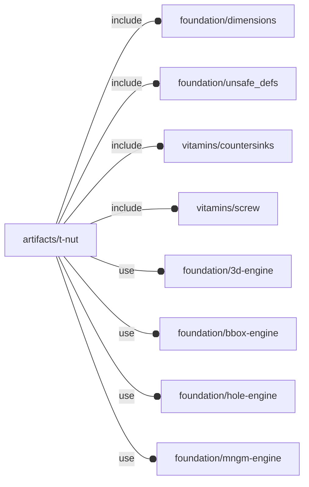
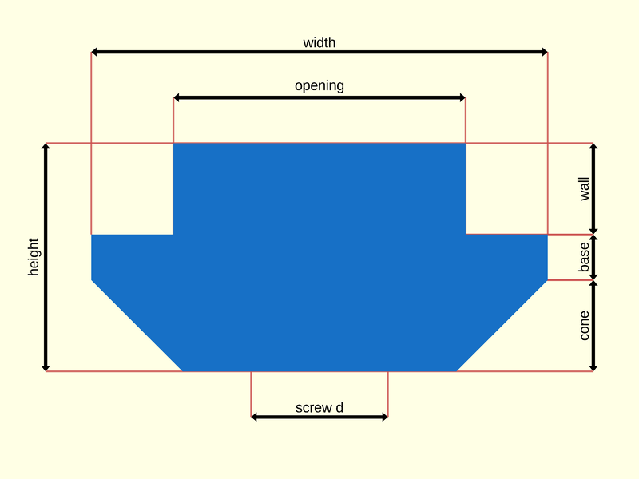
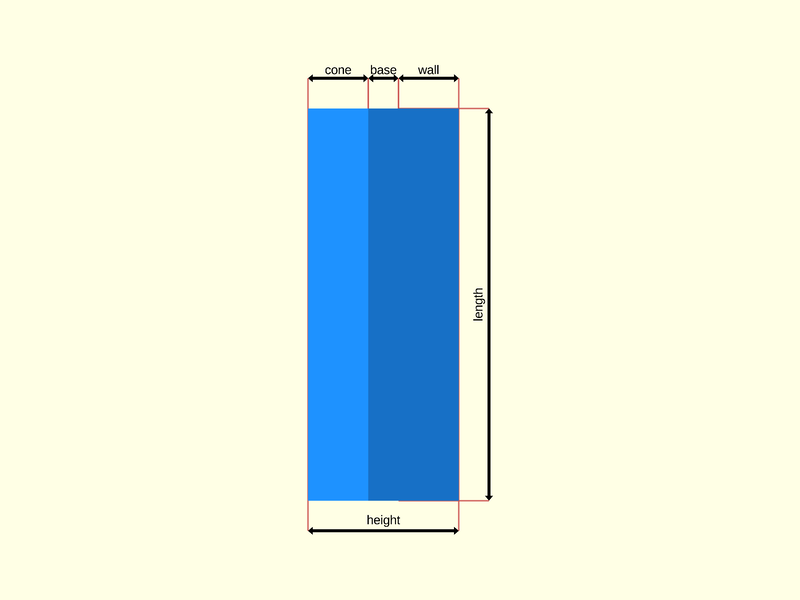

# package artifacts/t-nut

## Dependencies



T-slot nut engine for OpenSCAD Foundation Library.

T-slot nuts are used with
[T-slot structural framing](https://en.wikipedia.org/wiki/T-slot_structural_framing)
to build a variety of industrial structures and machines.

T-slot nut are not to be confused with [T-nuts](https://en.wikipedia.org/wiki/T-nut).

Copyright © 2021, Giampiero Gabbiani <giampiero@gabbiani.org>

SPDX-License-Identifier: [GPL-3.0-or-later](https://spdx.org/licenses/GPL-3.0-or-later.html)


## Variables

---

### variable FL_TNUT_DICT

__Default:__

    [FL_TNUT_M3_CS,FL_TNUT_M4_CS,FL_TNUT_M5_CS,FL_TNUT_M6_CS]

---

### variable FL_TNUT_M3_CS

__Default:__

    fl_TNut(opening=6,size=[10,20],thickness=[1,1,2],nop_screw=M3_cs_cap_screw)

---

### variable FL_TNUT_M3_SM

__Default:__

    fl_TNut(opening=6,size=[10,20],thickness=[2,1,2],nop_screw=M3_cs_cap_screw)

---

### variable FL_TNUT_M4_CS

__Default:__

    fl_TNut(opening=6,size=[10,20],thickness=[1,1.7,2],nop_screw=M4_cs_cap_screw)

---

### variable FL_TNUT_M5_CS

__Default:__

    fl_TNut(opening=6,size=[10,20],thickness=[1,2.2,1.5],nop_screw=M5_cs_cap_screw)

---

### variable FL_TNUT_M6_CS

__Default:__

    fl_TNut(opening=8,size=[18.6,20],thickness=[1.9,1.3,5.3],nop_screw=M6_cs_cap_screw)

---

### variable FL_TNUT_NS

__Default:__

    "tnut"

namespace

## Functions

---

### function fl_TNut

__Syntax:__

```text
fl_TNut(opening,size,thickness,nop_screw,knut=false,holes)
```

Constructor returning a T-slot nut.

__TOP VIEW__:



__RIGHT VIEW__:




__Parameters:__

__opening__  
the opening of the T-slot

__size__  
2d size in the form [width (X size), length (Z size)], the height (Y size)
being calculated from «thickness».

The resulting bounding box is: `[width, ∑ thickness, length]`


__thickness__  
section heights passed as `[wall,base,cone]` thicknesses


__nop_screw__  
an optional screw determining a hole

__knut__  
eventual knurl nut

__holes__  
list of user defined holes usually positioned on the 'opening' side


---

### function fl_tnut_select

__Syntax:__

```text
fl_tnut_select(dictionary=FL_TNUT_DICT,nop_screw,nominal,best=function(matches)matches[0])
```

Selects the T-slot nuts from a dictionary matching the screw or a generic
nominal ⌀. When the «best» function literal is defined, it is applied to the
result for further filtering.


__Parameters:__

__nop_screw__  
screw specs to fit into

__nominal__  
nominal ⌀

__best__  
function literal to select the best match (defaults to the first match)

:memo: **NOTE:** when undefined the result is always a list of all matching T-slot
nuts. Otherwise the result type (list or single nut) depends on the
implementation of the provided function literal.


---

### function fl_tnut_thickness

__Syntax:__

```text
fl_tnut_thickness(type,value)
```

## Modules

---

### module fl_tnut

__Syntax:__

    fl_tnut(verbs=FL_ADD,type,tolerance=0,countersink=false,dri_thick,octant,direction)

T-slot nut engine.

See [fl_hole_Context{}](../foundation/hole-engine.md#module-fl_hole_context) for context variables passed to children() during
FL_LAYOUT.


__Parameters:__

__verbs__  
supported verbs: `FL_ADD, FL_AXES, FL_ASSEMBLY, FL_BBOX, FL_DRILL, FL_FOOTPRINT, FL_LAYOUT, FL_MOUNT`

__tolerance__  
tolerances added to [nut, hole, countersink] dimensions

tolerance=x means [x,x,x]


__dri_thick__  
scalar thickness for FL_DRILL

__octant__  
when undef native positioning is used

__direction__  
desired direction [director,rotation], native direction when undef ([+Z,0])


