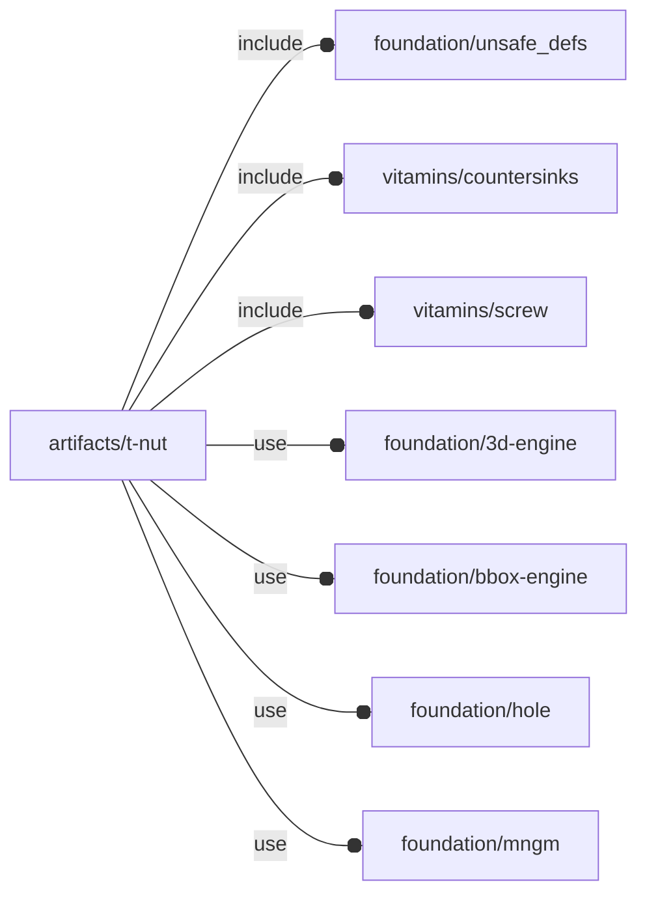

# package artifacts/t-nut

## Dependencies



## Functions

---

### function fl_TNut

__Syntax:__

```text
fl_TNut(opening,size,thickness,screw,knut=false)
```

constructor


   ⤒
   󠁼|
   ⤓


## Modules

---

### module fl_tnut

__Syntax:__

    fl_tnut(verbs=FL_ADD,type,tolerance=0,coutersink=false,debug,direction,octant)

__Parameters:__

__verbs__  
supported verbs: FL_ADD, FL_ASSEMBLY, FL_BBOX, FL_DRILL, FL_FOOTPRINT, FL_LAYOUT

__tolerance__  
tolerances added to [nut, hole, countersink] dimensions

tolerance=x means [x,x,x]


__debug__  
see constructor [fl_parm_Debug()](../foundation/base_parameters.md#function-fl_parm_debug)

__direction__  
desired direction [director,rotation], native direction when undef ([+Z,0])

__octant__  
when undef native positioning is used


