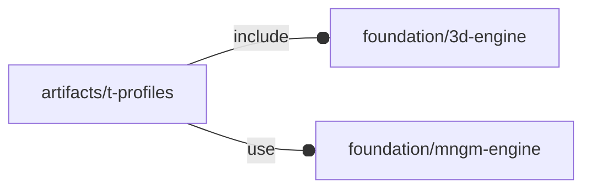
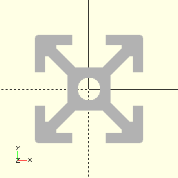
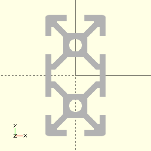
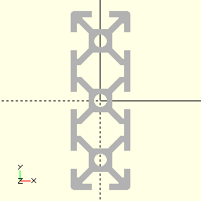
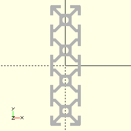
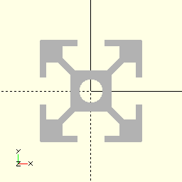
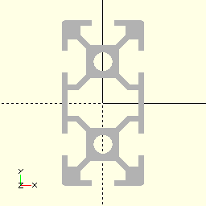
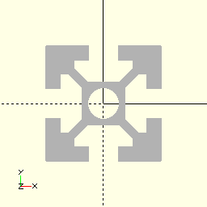
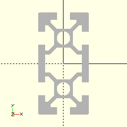

# package artifacts/t-profiles

## Dependencies



Wrapper for NopSCADlib extrusions defining T-slot structural framing as
described [T-slot structural framing](https://en.wikipedia.org/wiki/T-slot_structural_framing)

This file is part of the 'OpenSCAD Foundation Library' (OFL) project.

Copyright © 2021, Giampiero Gabbiani <giampiero@gabbiani.org>

SPDX-License-Identifier: [GPL-3.0-or-later](https://spdx.org/licenses/GPL-3.0-or-later.html)


## Variables

---

### variable FL_E1515

__Default:__

    fl_TProfile("E1515",E1515)



15/15 T-slotted profile with cross-section 15x15mm ⌀3.3mm


---

### variable FL_E2020

__Default:__

    fl_TProfile("E2020",E2020)


20/20 T-slotted profile with cross-section 20x20mm ⌀4.2mm


---

### variable FL_E2020t

__Default:__

    fl_TProfile("E2020t",E2020t)


20/20 T-slotted recessed profile with cross-section 20x20mm ⌀5mm


---

### variable FL_E2040

__Default:__

    fl_TProfile("E2040",E2040)



20/40 T-slotted profile with cross-section 20x40mm ⌀4.2mm


---

### variable FL_E2060

__Default:__

    fl_TProfile("E2060",E2060)



20/60 T-slotted profile with cross-section 20x60mm ⌀4.2mm


---

### variable FL_E2080

__Default:__

    fl_TProfile("E2080",E2080)



20/80 T-slotted profile with cross-section 20x80mm ⌀4.2mm


---

### variable FL_E3030

__Default:__

    fl_TProfile("E3030",E3030)



30/30 T-slotted profile with cross-section 30x30mm ⌀6.8mm


---

### variable FL_E3060

__Default:__

    fl_TProfile("E3060",E3060)



30/60 T-slotted profile with cross-section 30x60mm ⌀6.8mm


---

### variable FL_E4040

__Default:__

    fl_TProfile("E4040",E4040)



40/40 T-slotted profile with cross-section 40x40mm ⌀10.5mm


---

### variable FL_E4040t

__Default:__

    fl_TProfile("E4040t",E4040t)


40/40 T-slotted recessed profile with cross-section 40x40mm ⌀10mm


---

### variable FL_E4080

__Default:__

    fl_TProfile("E4080",E4080)



40/80 T-slotted profile with cross-section 40x80mm ⌀10.5mm


---

### variable FL_XTR_DICT

__Default:__

    [FL_E1515,FL_E2020,FL_E2020t,FL_E2040,FL_E2060,FL_E2080,FL_E3030,FL_E3060,FL_E4040,FL_E4040t,FL_E4080,]

T-slotted profile dictionary

## Functions

---

### function fl_TProfile

__Syntax:__

```text
fl_TProfile(name,nop,description)
```

constructor

__Parameters:__

__nop__  
verbatim NopSCADlib definition


## Modules

---

### module fl_tprofile

__Syntax:__

    fl_tprofile(verbs=FL_ADD,type,length,cornerHole=false,debug,direction,octant)

__Parameters:__

__verbs__  
supported verbs: FL_ADD, FL_AXES, FL_BBOX, FL_FOOTPRINT

__debug__  
see constructor [fl_parm_Debug()](../foundation/core.md#function-fl_parm_debug)

__direction__  
desired direction [director,rotation], native direction when undef ([+X+Y+Z])

__octant__  
when undef native positioning is used


