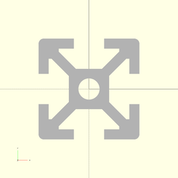
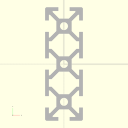
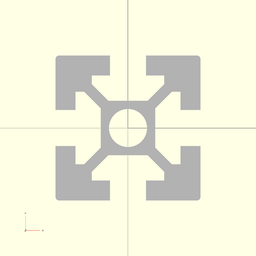
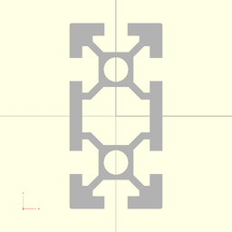

# package artifacts/t-profiles

## Dependencies


Wrapper for NopSCADlib extrusions defining T-slot structural framing as
described [T-slot structural framing](https://en.wikipedia.org/wiki/T-slot_structural_framing)

This file is part of the 'OpenSCAD Foundation Library' (OFL) project.

Copyright © 2021, Giampiero Gabbiani <giampiero@gabbiani.org>

SPDX-License-Identifier: [GPL-3.0-or-later](https://spdx.org/licenses/GPL-3.0-or-later.html)


## Variables

---

### variable FL_TSP_E1515

__Default:__

    fl_tsp_CrossSection(E1515)


15 series T-slotted cross-section size 15mm ⌀3.3mm


---

### variable FL_TSP_E2020

__Default:__

    fl_tsp_CrossSection(E2020)



20 series T-slotted cross-section size 20mm ⌀4.2mm


---

### variable FL_TSP_E2020t

__Default:__

    fl_tsp_CrossSection(E2020t)


20 series T-slotted cross-section size 20mm ⌀5mm


---

### variable FL_TSP_E2040

__Default:__

    fl_tsp_CrossSection(E2040)


20 series T-slotted cross-section size 40mm ⌀4.2mm


---

### variable FL_TSP_E2060

__Default:__

    fl_tsp_CrossSection(E2060)



20 series T-slotted cross-section size 60mm ⌀4.2mm


---

### variable FL_TSP_E2080

__Default:__

    fl_tsp_CrossSection(E2080)


20 series T-slotted cross-section size 80mm ⌀4.2mm


---

### variable FL_TSP_E3030

__Default:__

    fl_tsp_CrossSection(E3030)


30 series T-slotted cross-section size 30mm ⌀6.8mm


---

### variable FL_TSP_E3060

__Default:__

    fl_tsp_CrossSection(E3060)


30 series T-slotted cross-section size 60mm ⌀6.8mm


---

### variable FL_TSP_E4040

__Default:__

    fl_tsp_CrossSection(E4040)



40 series T-slotted cross-section size 40mm ⌀10.5mm


---

### variable FL_TSP_E4040t

__Default:__

    fl_tsp_CrossSection(E4040t)


40 series T-slotted cross-section size 40mm ⌀10mm


---

### variable FL_TSP_E4080

__Default:__

    fl_tsp_CrossSection(E4080)



40 series T-slotted cross-section size 80mm ⌀10.5mm


---

### variable FL_TSP_NS

__Default:__

    "t-slotted profile"

namespace

---

### variable FL_XTR_DICT

__Default:__

    [FL_TSP_E1515,FL_TSP_E2020,FL_TSP_E2020t,FL_TSP_E2040,FL_TSP_E2060,FL_TSP_E2080,FL_TSP_E3030,FL_TSP_E3060,FL_TSP_E4040,FL_TSP_E4040t,FL_TSP_E4080,]

T-slotted cross-section dictionary

## Functions

---

### function fl_tsp_CrossSection

__Syntax:__

```text
fl_tsp_CrossSection(nop)
```

Cross-section constructor

__Parameters:__

__nop__  
verbatim NopSCADlib cross-section definition


---

### function fl_tsp_TProfile

__Syntax:__

```text
fl_tsp_TProfile(xsec,length,corner_hole=false)
```

T-slotted profile constructor

__Parameters:__

__xsec__  
mandatory cross-section

__length__  
mandatory length (width and height come from «xsec»)


---

### function fl_tsp_centerD

__Syntax:__

```text
fl_tsp_centerD(type)
```

return false when profile doesn't have center hole, its ⌀ otherwise

---

### function fl_tsp_chW

__Syntax:__

```text
fl_tsp_chW(type)
```

channel width

---

### function fl_tsp_cornerD

__Syntax:__

```text
fl_tsp_cornerD(type)
```

return false when profile doesn't have corner holes, the ⌀ otherwise

---

### function fl_tsp_filletR

__Syntax:__

```text
fl_tsp_filletR(type)
```

---

### function fl_tsp_h

__Syntax:__

```text
fl_tsp_h(type)
```

height

---

### function fl_tsp_intChW

__Syntax:__

```text
fl_tsp_intChW(type)
```

internal channel width

---

### function fl_tsp_length

__Syntax:__

```text
fl_tsp_length(type,value)
```

---

### function fl_tsp_nominalSize

__Syntax:__

```text
fl_tsp_nominalSize(type)
```

nominal cross-section size

---

### function fl_tsp_tabT

__Syntax:__

```text
fl_tsp_tabT(type)
```

tab thickness

---

### function fl_tsp_w

__Syntax:__

```text
fl_tsp_w(type)
```

width

## Modules

---

### module fl_tProfile

__Syntax:__

    fl_tProfile(verbs=FL_ADD,type,lay_surface,octant,direction)

T-slotted profile engine.

Context variables:

| Name       | Context   | Description
| ---------- | --------- | ---------------------
| $tsp_size  | Children  | t-profile size
| $tsp_tabT  | Children  | tab thickness as reported by extrusion_tab_thickness()

TODO: add dimension lines


__Parameters:__

__verbs__  
supported verbs: FL_ADD, FL_AXES, FL_BBOX, FL_FOOTPRINT, FL_LAYOUT

__lay_surface__  
floating semi-axis list (es. [+X,-Y]) for FL_LAYOUT

NOTE: ±Z is excluded


__octant__  
when undef native positioning is used

__direction__  
desired direction [director,rotation], native direction when undef ([+X+Y+Z])


