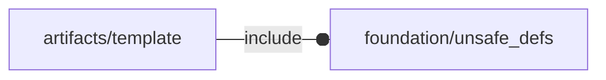

# package artifacts/template

## Dependencies

## Variables

---

### variable FL_ART_DICT

__Default:__

    []

---

### variable FL_ART_NS

__Default:__

    "art"

## Modules

---

### module artifact

__Syntax:__

    artifact(verbs=FL_ADD,type,direction,octant)

