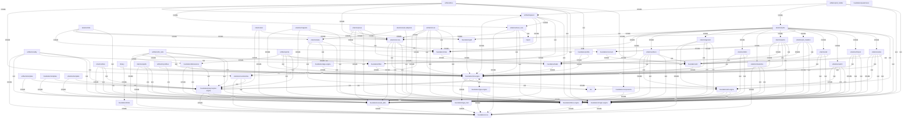

# Dependencies

```mermaid
graph TD
    A1[foundation/2d-engine] --o|include| A2[foundation/unsafe_defs]
    A1 --o|use| A3[foundation/bbox-engine]
    A1 --o|use| A4[foundation/mngm-engine]
    A5[foundation/3d-engine] --o|include| A1
    A5 --o|include| A6[foundation/type_trait]
    A5 --o|use| A7[dxf]
    A5 --o|use| A8[foundation/polymorphic-engine]
    A5 --o|use| A9[foundation/type-engine]
    A10[foundation/algo-engine] --o|include| A5
    A3 --o|include| A11[foundation/core]
    A12[artifacts/box] --o|include| A13[artifacts/spacer]
    A12 --o|include| A14[vitamins/countersinks]
    A12 --o|include| A15[vitamins/knurl_nuts]
    A12 --o|include| A16[vitamins/screw]
    A12 --o|use| A17[foundation/fillet]
    A12 --o|use| A4
    A12 --o|use| A18[foundation/profile]
    A12 --o|use| A19[foundation/util]
    A20[artifacts/caddy] --o|include| A11
    A20 --o|use| A3
    A20 --o|use| A17
    A20 --o|use| A4
    A20 --o|use| A8
    A21[foundation/components] --o|include| A3
    A22[foundation/connect] --o|include| A19
    A11
    A14 --o|include| A11
    A14 --o|use| A3
    A14 --o|use| A8
    A23[foundation/dimensions] --o|include| A2
    A23 --o|use| A5
    A23 --o|use| A3
    A23 --o|use| A8
    A24[artifacts/din_rails] --o|include| A23
    A24 --o|include| A25[foundation/label]
    A24 --o|include| A2
    A24 --o|include| A19
    A24 --o|use| A5
    A24 --o|use| A3
    A24 --o|use| A8
    A7
    A26[vitamins/ethers] --o|include| A2
    A26 --o|use| A1
    A26 --o|use| A5
    A26 --o|use| A3
    A26 --o|use| A4
    A26 --o|use| A19
    A27[vitamins/fans] --o|include| A2
    A27 --o|use| A5
    A27 --o|use| A3
    A27 --o|use| A8
    A17 --o|include| A5
    A28[vitamins/generic] --o|include| A11
    A28 --o|use| A1
    A28 --o|use| A5
    A28 --o|use| A3
    A28 --o|use| A29[foundation/hole]
    A28 --o|use| A4
    A30[foundation/grid] --o|include| A5
    A31[vitamins/hdmi] --o|use| A5
    A31 --o|use| A3
    A31 --o|use| A4
    A31 --o|use| A19
    A32[vitamins/hds] --o|include| A29
    A32 --o|include| A33[vitamins/sata]
    A32 --o|include| A16
    A32 --o|use| A4
    A34[vitamins/heatsinks] --o|include| A11
    A34 --o|use| A5
    A34 --o|use| A3
    A34 --o|use| A4
    A29 --o|include| A25
    A35[vitamins/iec] --o|include| A8
    A35 --o|include| A2
    A35 --o|include| A16
    A36[vitamins/jacks] --o|include| A5
    A36 --o|include| A22
    A36 --o|include| A25
    A36 --o|use| A5
    A36 --o|use| A4
    A36 --o|use| A19
    A37[artifacts/joints] --o|include| A23
    A37 --o|include| A25
    A37 --o|use| A5
    A37 --o|use| A3
    A37 --o|use| A17
    A37 --o|use| A8
    A15 --o|include| A11
    A15 --o|include| A16
    A15 --o|use| A5
    A15 --o|use| A4
    A15 --o|use| A38[import]
    A25 --o|include| A5
    A39[library] --o|include| A5
    A39 --o|include| A40[foundation/limits]
    A40 --o|include| A11
    A41[vitamins/magnets] --o|include| A5
    A41 --o|include| A14
    A41 --o|include| A16
    A41 --o|use| A4
    A4 --o|include| A11
    A42[artifacts/pcb_holder] --o|include| A13
    A42 --o|include| A43[vitamins/pcbs]
    A42 --o|use| A3
    A42 --o|use| A4
    A43 --o|include| A21
    A43 --o|include| A30
    A43 --o|include| A29
    A43 --o|include| A25
    A43 --o|include| A26
    A43 --o|include| A28
    A43 --o|include| A31
    A43 --o|include| A34
    A43 --o|include| A36
    A43 --o|include| A44[vitamins/pin_headers]
    A43 --o|include| A16
    A43 --o|include| A45[vitamins/sd]
    A43 --o|include| A46[vitamins/switch]
    A43 --o|include| A47[vitamins/trimpot]
    A43 --o|include| A48[vitamins/usbs]
    A43 --o|use| A7
    A43 --o|use| A4
    A44 --o|include| A22
    A44 --o|include| A25
    A44 --o|include| A2
    A44 --o|use| A4
    A44 --o|use| A19
    A8 --o|include| A11
    A8 --o|use| A5
    A8 --o|use| A3
    A8 --o|use| A4
    A18 --o|include| A5
    A18 --o|include| A25
    A49[vitamins/psus] --o|include| A30
    A49 --o|include| A29
    A49 --o|include| A2
    A49 --o|include| A16
    A49 --o|use| A4
    A49 --o|use| A19
    A50[foundation/quaternions]
    A33 --o|include| A22
    A33 --o|use| A7
    A33 --o|use| A10
    A33 --o|use| A4
    A51[vitamins/sata-adapters] --o|include| A33
    A51 --o|use| A4
    A16 --o|include| A2
    A16 --o|use| A5
    A16 --o|use| A3
    A16 --o|use| A29
    A16 --o|use| A4
    A45 --o|use| A5
    A45 --o|use| A3
    A45 --o|use| A4
    A45 --o|use| A19
    A13 --o|include| A5
    A13 --o|include| A29
    A13 --o|include| A2
    A13 --o|include| A15
    A13 --o|use| A17
    A13 --o|use| A4
    A52[vitamins/spdts] --o|include| A11
    A52 --o|use| A5
    A52 --o|use| A3
    A52 --o|use| A4
    A46 --o|include| A2
    A46 --o|use| A1
    A46 --o|use| A5
    A46 --o|use| A3
    A46 --o|use| A4
    A53[artifacts/t-nut] --o|include| A2
    A53 --o|include| A14
    A53 --o|include| A16
    A53 --o|use| A5
    A53 --o|use| A3
    A53 --o|use| A29
    A53 --o|use| A4
    A54[artifacts/t-profiles] --o|include| A5
    A54 --o|use| A4
    A55[artifacts/template] --o|include| A2
    A55 --o|use| A8
    A56[foundation/template] --o|include| A2
    A56 --o|use| A8
    A57[vitamins/template] --o|include| A2
    A57 --o|use| A8
    A47 --o|include| A2
    A47 --o|use| A5
    A47 --o|use| A3
    A47 --o|use| A4
    A47 --o|use| A19
    A9 --o|include| A11
    A9 --o|use| A3
    A6 --o|include| A11
    A2 --o|include| A11
    A48 --o|include| A2
    A48 --o|use| A1
    A48 --o|use| A5
    A48 --o|use| A3
    A48 --o|use| A4
    A48 --o|use| A19
    A19 --o|include| A5
```

