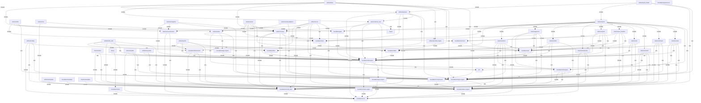

# Dependencies

```mermaid
graph TD
    A1[foundation/2d-engine] --o|include| A2[foundation/unsafe_defs]
    A1 --o|use| A3[foundation/bbox-engine]
    A1 --o|use| A4[foundation/mngm-engine]
    A5[foundation/3d-engine] --o|include| A1
    A5 --o|use| A6[dxf]
    A5 --o|use| A7[foundation/traits-engine]
    A5 --o|use| A8[foundation/type-engine]
    A9[foundation/algo-engine] --o|include| A5
    A3 --o|include| A10[foundation/core]
    A11[artifacts/box] --o|include| A12[artifacts/spacer]
    A11 --o|include| A13[vitamins/countersinks]
    A11 --o|include| A14[vitamins/knurl_nuts]
    A11 --o|include| A15[vitamins/screw]
    A11 --o|use| A16[artifacts/profiles-engine]
    A11 --o|use| A17[foundation/fillet]
    A11 --o|use| A4
    A11 --o|use| A18[foundation/util]
    A19[artifacts/caddy] --o|include| A10
    A19 --o|use| A3
    A19 --o|use| A17
    A19 --o|use| A4
    A20[foundation/components] --o|include| A3
    A21[foundation/connect] --o|include| A18
    A10
    A13 --o|include| A10
    A13 --o|use| A3
    A22[foundation/dimensions] --o|include| A2
    A22 --o|use| A5
    A22 --o|use| A3
    A23[artifacts/din_rails] --o|include| A22
    A23 --o|include| A24[foundation/label]
    A23 --o|include| A2
    A23 --o|include| A18
    A23 --o|use| A5
    A23 --o|use| A3
    A6
    A25[vitamins/ethers] --o|include| A2
    A25 --o|use| A1
    A25 --o|use| A5
    A25 --o|use| A3
    A25 --o|use| A4
    A25 --o|use| A18
    A26[vitamins/fans] --o|include| A2
    A26 --o|use| A5
    A26 --o|use| A3
    A17 --o|include| A5
    A27[vitamins/generic] --o|include| A10
    A27 --o|use| A1
    A27 --o|use| A5
    A27 --o|use| A3
    A27 --o|use| A28[foundation/hole]
    A27 --o|use| A4
    A29[foundation/grid] --o|include| A5
    A30[vitamins/hdmi] --o|include| A18
    A30 --o|use| A5
    A30 --o|use| A3
    A30 --o|use| A4
    A31[vitamins/hds] --o|include| A28
    A31 --o|include| A32[vitamins/sata]
    A31 --o|include| A15
    A31 --o|use| A4
    A33[vitamins/heatsinks] --o|include| A10
    A33 --o|use| A5
    A33 --o|use| A3
    A33 --o|use| A4
    A28 --o|include| A24
    A34[vitamins/iec] --o|include| A2
    A34 --o|include| A15
    A35[vitamins/jacks] --o|include| A5
    A35 --o|include| A21
    A35 --o|include| A24
    A35 --o|use| A5
    A35 --o|use| A4
    A35 --o|use| A18
    A36[artifacts/joints] --o|include| A22
    A36 --o|include| A24
    A36 --o|use| A5
    A36 --o|use| A3
    A36 --o|use| A17
    A14 --o|include| A10
    A14 --o|include| A15
    A14 --o|use| A5
    A14 --o|use| A4
    A14 --o|use| A37[import]
    A24 --o|include| A5
    A38[library] --o|include| A5
    A38 --o|include| A39[foundation/limits]
    A39 --o|include| A10
    A40[vitamins/magnets] --o|include| A5
    A40 --o|include| A13
    A40 --o|include| A15
    A40 --o|use| A4
    A4 --o|include| A2
    A4 --o|use| A3
    A41[artifacts/pcb_holder] --o|include| A12
    A41 --o|include| A42[vitamins/pcbs]
    A41 --o|use| A3
    A41 --o|use| A4
    A42 --o|include| A20
    A42 --o|include| A29
    A42 --o|include| A28
    A42 --o|include| A24
    A42 --o|include| A25
    A42 --o|include| A27
    A42 --o|include| A30
    A42 --o|include| A33
    A42 --o|include| A35
    A42 --o|include| A43[vitamins/pin_headers]
    A42 --o|include| A15
    A42 --o|include| A44[vitamins/sd]
    A42 --o|include| A45[vitamins/switch]
    A42 --o|include| A46[vitamins/trimpot]
    A42 --o|include| A47[vitamins/usbs]
    A42 --o|use| A6
    A42 --o|use| A4
    A43 --o|include| A21
    A43 --o|include| A24
    A43 --o|include| A2
    A43 --o|use| A4
    A43 --o|use| A18
    A16 --o|include| A24
    A48[vitamins/psus] --o|include| A29
    A48 --o|include| A28
    A48 --o|include| A2
    A48 --o|include| A15
    A48 --o|use| A4
    A48 --o|use| A18
    A49[foundation/quaternions]
    A32 --o|include| A21
    A32 --o|use| A6
    A32 --o|use| A9
    A32 --o|use| A4
    A50[vitamins/sata-adapters] --o|include| A32
    A50 --o|use| A4
    A15 --o|include| A2
    A15 --o|use| A5
    A15 --o|use| A3
    A15 --o|use| A28
    A15 --o|use| A4
    A44 --o|use| A5
    A44 --o|use| A3
    A44 --o|use| A4
    A44 --o|use| A18
    A12 --o|include| A5
    A12 --o|include| A28
    A12 --o|include| A2
    A12 --o|include| A14
    A12 --o|use| A17
    A12 --o|use| A4
    A51[vitamins/spdts] --o|include| A10
    A51 --o|use| A5
    A51 --o|use| A3
    A51 --o|use| A4
    A45 --o|include| A2
    A45 --o|use| A1
    A45 --o|use| A5
    A45 --o|use| A3
    A45 --o|use| A4
    A52[artifacts/t-nut] --o|include| A22
    A52 --o|include| A2
    A52 --o|include| A13
    A52 --o|include| A15
    A52 --o|use| A5
    A52 --o|use| A3
    A52 --o|use| A28
    A52 --o|use| A4
    A53[artifacts/t-profiles] --o|include| A5
    A53 --o|use| A4
    A54[artifacts/template] --o|include| A2
    A55[foundation/template] --o|include| A2
    A56[vitamins/template] --o|include| A2
    A7 --o|include| A10
    A46 --o|include| A2
    A46 --o|use| A5
    A46 --o|use| A3
    A46 --o|use| A4
    A46 --o|use| A18
    A8 --o|include| A10
    A8 --o|use| A3
    A2 --o|include| A10
    A47 --o|include| A2
    A47 --o|use| A1
    A47 --o|use| A5
    A47 --o|use| A3
    A47 --o|use| A4
    A47 --o|use| A18
    A18 --o|include| A5
```

