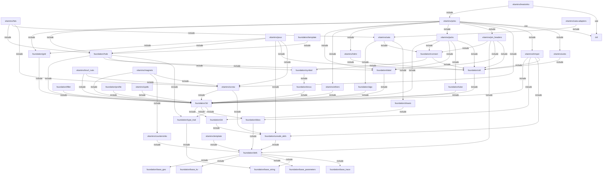

# Dependencies

```mermaid
graph TD
    A1[foundation/2d] -->|include| A2[foundation/unsafe_defs]
    A3[foundation/3d] -->|include| A1
    A3 -->|include| A4[foundation/bbox]
    A3 -->|include| A5[foundation/type_trait]
    A6[foundation/algo] -->|include| A3
    A7[foundation/base_geo]
    A8[foundation/base_kv]
    A9[foundation/base_parameters]
    A10[foundation/base_string]
    A11[foundation/base_trace]
    A4 -->|include| A12[foundation/defs]
    A13[foundation/connect] -->|include| A14[foundation/symbol]
    A13 -->|include| A15[foundation/util]
    A16[vitamins/countersinks] -->|include| A12
    A12 -->|include| A7
    A12 -->|include| A8
    A12 -->|include| A9
    A12 -->|include| A10
    A12 -->|include| A11
    A17[foundation/drawio] -->|include| A1
    A18[dxf]
    A19[vitamins/ethers] -->|include| A3
    A20[foundation/fillet] -->|include| A3
    A21[foundation/grid] -->|include| A3
    A22[vitamins/hdmi] -->|include| A15
    A23[vitamins/hds] -->|include| A24[foundation/hole]
    A23 -->|include| A25[vitamins/sata]
    A23 -->|include| A26[vitamins/screw]
    A27[vitamins/heatsinks] -->|include| A28[vitamins/pcbs]
    A27 -->|use| A18
    A24 -->|include| A3
    A24 -->|include| A29[foundation/label]
    A24 -->|include| A14
    A24 -->|include| A5
    A30[vitamins/jacks] -->|include| A3
    A30 -->|include| A13
    A30 -->|include| A29
    A30 -->|include| A31[foundation/tube]
    A30 -->|include| A15
    A32[vitamins/knurl_nuts] -->|include| A3
    A32 -->|include| A26
    A29 -->|include| A3
    A33[vitamins/magnets] -->|include| A3
    A33 -->|include| A16
    A33 -->|include| A26
    A28 -->|include| A21
    A28 -->|include| A24
    A28 -->|include| A29
    A28 -->|include| A19
    A28 -->|include| A22
    A28 -->|include| A30
    A28 -->|include| A34[vitamins/pin_headers]
    A28 -->|include| A26
    A28 -->|include| A35[vitamins/trimpot]
    A28 -->|include| A36[vitamins/usbs]
    A28 -->|use| A18
    A34 -->|include| A13
    A34 -->|include| A12
    A34 -->|include| A29
    A34 -->|include| A15
    A37[foundation/profile] -->|include| A3
    A38[vitamins/psus] -->|include| A21
    A38 -->|include| A24
    A38 -->|include| A2
    A38 -->|include| A15
    A38 -->|include| A26
    A25 -->|include| A6
    A25 -->|include| A13
    A25 -->|include| A17
    A39[vitamins/sata-adapters] -->|include| A25
    A26 -->|include| A3
    A26 -->|include| A2
    A40[vitamins/spdts] -->|include| A3
    A14 -->|include| A41[foundation/torus]
    A42[foundation/template] -->|include| A24
    A43[vitamins/template] -->|include| A12
    A41 -->|include| A3
    A35 -->|include| A3
    A35 -->|include| A4
    A35 -->|include| A2
    A35 -->|include| A15
    A31 -->|include| A3
    A5 -->|include| A10
    A2 -->|include| A12
    A36 -->|include| A15
    A15 -->|include| A3
```
