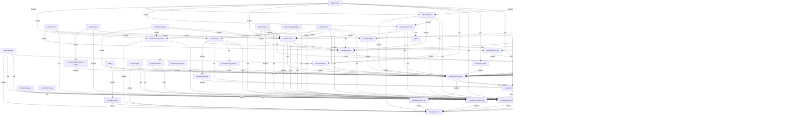

# Dependencies

```mermaid
graph TD
    A1[foundation/2d-engine] --o|include| A2[foundation/unsafe_defs]
    A1 --o|use| A3[foundation/bbox-engine]
    A1 --o|use| A4[foundation/mngm-engine]
    A5[foundation/3d-engine] --o|include| A1
    A5 --o|include| A6[foundation/type_trait]
    A5 --o|use| A7[dxf]
    A8[foundation/algo-engine] --o|include| A5
    A3 --o|include| A9[foundation/core]
    A10[artifacts/box] --o|include| A11[artifacts/spacer]
    A10 --o|include| A12[vitamins/countersinks]
    A10 --o|include| A13[vitamins/knurl_nuts]
    A10 --o|include| A14[vitamins/screw]
    A10 --o|use| A15[foundation/fillet]
    A10 --o|use| A4
    A10 --o|use| A16[foundation/profile]
    A10 --o|use| A17[foundation/util]
    A18[artifacts/caddy] --o|include| A9
    A18 --o|use| A3
    A18 --o|use| A15
    A18 --o|use| A4
    A19[foundation/components] --o|include| A3
    A20[foundation/connect] --o|include| A17
    A9
    A12 --o|include| A9
    A12 --o|use| A3
    A21[foundation/drawio] --o|include| A1
    A7
    A22[vitamins/ethers] --o|include| A2
    A22 --o|use| A1
    A22 --o|use| A5
    A22 --o|use| A3
    A22 --o|use| A4
    A22 --o|use| A17
    A15 --o|include| A5
    A23[vitamins/generic] --o|include| A9
    A23 --o|use| A1
    A23 --o|use| A5
    A23 --o|use| A3
    A23 --o|use| A24[foundation/hole]
    A23 --o|use| A4
    A25[foundation/grid] --o|include| A5
    A26[vitamins/hdmi] --o|use| A5
    A26 --o|use| A3
    A26 --o|use| A4
    A26 --o|use| A17
    A27[vitamins/hds] --o|include| A24
    A27 --o|include| A28[vitamins/sata]
    A27 --o|include| A14
    A27 --o|use| A4
    A29[vitamins/heatsinks] --o|include| A9
    A29 --o|use| A5
    A29 --o|use| A3
    A29 --o|use| A4
    A24 --o|include| A30[foundation/label]
    A31[vitamins/iec] --o|include| A32[foundation/polymorphic-engine]
    A31 --o|include| A2
    A31 --o|include| A14
    A33[vitamins/jacks] --o|include| A5
    A33 --o|include| A20
    A33 --o|include| A30
    A33 --o|use| A5
    A33 --o|use| A4
    A33 --o|use| A17
    A13 --o|include| A9
    A13 --o|include| A14
    A13 --o|use| A5
    A13 --o|use| A4
    A13 --o|use| A34[import]
    A30 --o|include| A5
    A35[library] --o|include| A5
    A35 --o|include| A36[foundation/limits]
    A36 --o|include| A9
    A37[vitamins/magnets] --o|include| A5
    A37 --o|include| A12
    A37 --o|include| A14
    A37 --o|use| A4
    A4 --o|include| A9
    A38[artifacts/pcb_holder] --o|include| A11
    A38 --o|include| A39[vitamins/pcbs]
    A38 --o|use| A3
    A38 --o|use| A4
    A39 --o|include| A19
    A39 --o|include| A25
    A39 --o|include| A24
    A39 --o|include| A30
    A39 --o|include| A22
    A39 --o|include| A23
    A39 --o|include| A26
    A39 --o|include| A29
    A39 --o|include| A33
    A39 --o|include| A40[vitamins/pin_headers]
    A39 --o|include| A14
    A39 --o|include| A41[vitamins/sd]
    A39 --o|include| A42[vitamins/switch]
    A39 --o|include| A43[vitamins/trimpot]
    A39 --o|include| A44[vitamins/usbs]
    A39 --o|use| A7
    A39 --o|use| A4
    A40 --o|include| A20
    A40 --o|include| A30
    A40 --o|include| A2
    A40 --o|use| A4
    A40 --o|use| A17
    A32 --o|include| A5
    A16 --o|include| A5
    A45[vitamins/psus] --o|include| A25
    A45 --o|include| A24
    A45 --o|include| A2
    A45 --o|include| A14
    A45 --o|use| A4
    A45 --o|use| A17
    A28 --o|include| A20
    A28 --o|include| A21
    A28 --o|use| A7
    A28 --o|use| A8
    A28 --o|use| A4
    A46[vitamins/sata-adapters] --o|include| A28
    A46 --o|use| A4
    A14 --o|include| A2
    A14 --o|use| A5
    A14 --o|use| A3
    A14 --o|use| A24
    A14 --o|use| A4
    A41 --o|use| A5
    A41 --o|use| A3
    A41 --o|use| A4
    A41 --o|use| A17
    A11 --o|include| A5
    A11 --o|include| A24
    A11 --o|include| A2
    A11 --o|include| A13
    A11 --o|use| A15
    A11 --o|use| A4
    A47[vitamins/spdts] --o|include| A9
    A47 --o|use| A5
    A47 --o|use| A3
    A47 --o|use| A4
    A42 --o|include| A2
    A42 --o|use| A1
    A42 --o|use| A5
    A42 --o|use| A3
    A42 --o|use| A4
    A48[artifacts/t-nut] --o|include| A2
    A48 --o|include| A12
    A48 --o|include| A14
    A48 --o|use| A5
    A48 --o|use| A3
    A48 --o|use| A24
    A48 --o|use| A4
    A49[artifacts/t-profiles] --o|include| A5
    A49 --o|use| A4
    A50[artifacts/template] --o|include| A2
    A50 --o|use| A4
    A51[foundation/template] --o|include| A5
    A52[vitamins/template] --o|use| A4
    A43 --o|include| A2
    A43 --o|use| A5
    A43 --o|use| A3
    A43 --o|use| A4
    A43 --o|use| A17
    A6 --o|include| A9
    A2 --o|include| A9
    A44 --o|include| A2
    A44 --o|use| A1
    A44 --o|use| A5
    A44 --o|use| A3
    A44 --o|use| A4
    A44 --o|use| A17
    A17 --o|include| A5
```

