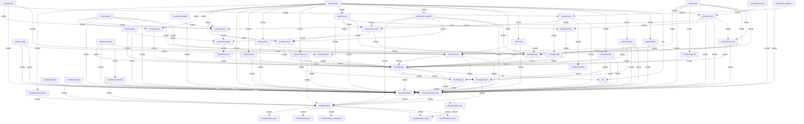

# Dependencies

```mermaid
graph TD
    A1[foundation/2d] --o|include| A2[foundation/mngm]
    A1 --o|include| A3[foundation/unsafe_defs]
    A4[foundation/3d] --o|include| A1
    A4 --o|include| A5[foundation/bbox]
    A4 --o|include| A2
    A4 --o|include| A6[foundation/type_trait]
    A4 --o|use| A7[dxf]
    A8[foundation/algo] --o|include| A4
    A9[foundation/base_geo]
    A10[foundation/base_kv]
    A11[foundation/base_parameters]
    A12[foundation/base_string]
    A13[foundation/base_trace]
    A5 --o|include| A14[foundation/defs]
    A15[artifacts/box] --o|include| A16[artifacts/spacer]
    A15 --o|include| A17[foundation/fillet]
    A15 --o|include| A2
    A15 --o|include| A18[foundation/profile]
    A15 --o|include| A19[foundation/util]
    A15 --o|include| A20[vitamins/knurl_nuts]
    A15 --o|include| A21[vitamins/screw]
    A22[artifacts/caddy] --o|include| A17
    A22 --o|include| A2
    A22 --o|include| A3
    A23[foundation/components] --o|include| A14
    A24[foundation/connect] --o|include| A25[foundation/symbol]
    A24 --o|include| A19
    A26[vitamins/countersinks] --o|include| A14
    A26 --o|include| A2
    A14 --o|include| A9
    A14 --o|include| A10
    A14 --o|include| A11
    A14 --o|include| A12
    A14 --o|include| A13
    A27[foundation/drawio] --o|include| A1
    A7
    A28[vitamins/ethers] --o|include| A4
    A28 --o|include| A2
    A17 --o|include| A4
    A29[foundation/grid] --o|include| A4
    A30[vitamins/hdmi] --o|include| A2
    A30 --o|include| A19
    A31[vitamins/hds] --o|include| A32[foundation/hole]
    A31 --o|include| A2
    A31 --o|include| A33[vitamins/sata]
    A31 --o|include| A21
    A34[vitamins/heatsinks] --o|include| A4
    A34 --o|include| A5
    A34 --o|include| A14
    A34 --o|include| A2
    A32 --o|include| A35[foundation/label]
    A32 --o|include| A25
    A36[vitamins/jacks] --o|include| A4
    A36 --o|include| A24
    A36 --o|include| A35
    A36 --o|include| A2
    A36 --o|include| A37[foundation/tube]
    A36 --o|include| A19
    A20 --o|include| A4
    A20 --o|include| A2
    A20 --o|include| A21
    A35 --o|include| A4
    A38[vitamins/magnets] --o|include| A4
    A38 --o|include| A2
    A38 --o|include| A26
    A38 --o|include| A21
    A2 --o|include| A14
    A39[artifacts/pcb_holder] --o|include| A16
    A39 --o|include| A2
    A40[vitamins/pcbs] --o|include| A23
    A40 --o|include| A29
    A40 --o|include| A32
    A40 --o|include| A35
    A40 --o|include| A2
    A40 --o|include| A28
    A40 --o|include| A30
    A40 --o|include| A34
    A40 --o|include| A36
    A40 --o|include| A41[vitamins/pin_headers]
    A40 --o|include| A21
    A40 --o|include| A42[vitamins/sd]
    A40 --o|include| A43[vitamins/switch]
    A40 --o|include| A44[vitamins/trimpot]
    A40 --o|include| A45[vitamins/usbs]
    A40 --o|use| A7
    A41 --o|include| A24
    A41 --o|include| A14
    A41 --o|include| A35
    A41 --o|include| A2
    A41 --o|include| A19
    A18 --o|include| A4
    A46[vitamins/psus] --o|include| A29
    A46 --o|include| A32
    A46 --o|include| A2
    A46 --o|include| A3
    A46 --o|include| A19
    A46 --o|include| A21
    A33 --o|include| A8
    A33 --o|include| A24
    A33 --o|include| A27
    A33 --o|include| A2
    A47[vitamins/sata-adapters] --o|include| A2
    A47 --o|include| A33
    A21 --o|include| A4
    A21 --o|include| A2
    A21 --o|include| A3
    A42 --o|include| A4
    A42 --o|include| A2
    A42 --o|include| A19
    A16 --o|include| A32
    A16 --o|include| A2
    A16 --o|include| A37
    A16 --o|include| A3
    A16 --o|include| A20
    A48[vitamins/spdts] --o|include| A4
    A48 --o|include| A2
    A48 --o|include| A25
    A43 --o|include| A4
    A43 --o|include| A5
    A43 --o|include| A2
    A43 --o|include| A3
    A25 --o|include| A49[foundation/torus]
    A50[artifacts/template] --o|include| A2
    A50 --o|include| A3
    A51[foundation/template] --o|include| A32
    A51 --o|include| A2
    A52[vitamins/template] --o|include| A14
    A52 --o|include| A2
    A49 --o|include| A4
    A44 --o|include| A4
    A44 --o|include| A5
    A44 --o|include| A2
    A44 --o|include| A3
    A44 --o|include| A19
    A37 --o|include| A4
    A6 --o|include| A12
    A3 --o|include| A14
    A45 --o|include| A2
    A45 --o|include| A19
    A19 --o|include| A4
```

