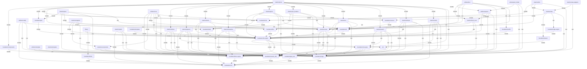

# Dependencies

```mermaid
graph TD
    A1[foundation/2d-engine] --o|include| A2[foundation/mngm]
    A1 --o|include| A3[foundation/unsafe_defs]
    A1 --o|use| A4[foundation/bbox-engine]
    A5[foundation/3d-engine] --o|include| A1
    A5 --o|include| A6[foundation/type_trait]
    A5 --o|use| A7[dxf]
    A5 --o|use| A4
    A8[foundation/algo-engine] --o|include| A5
    A4 --o|include| A9[foundation/core]
    A10[artifacts/box] --o|include| A11[artifacts/spacer]
    A10 --o|include| A12[vitamins/knurl_nuts]
    A10 --o|include| A13[vitamins/screw]
    A10 --o|use| A14[foundation/fillet]
    A10 --o|use| A2
    A10 --o|use| A15[foundation/profile]
    A10 --o|use| A16[foundation/util]
    A17[artifacts/caddy] --o|include| A9
    A17 --o|use| A4
    A17 --o|use| A14
    A17 --o|use| A2
    A18[foundation/components] --o|include| A4
    A19[foundation/connect] --o|include| A16
    A9
    A20[vitamins/countersinks] --o|use| A4
    A20 --o|use| A2
    A21[foundation/drawio] --o|include| A1
    A7
    A22[vitamins/ethers] --o|include| A3
    A22 --o|use| A5
    A22 --o|use| A4
    A22 --o|use| A2
    A14 --o|include| A5
    A23[vitamins/generic] --o|include| A9
    A23 --o|use| A1
    A23 --o|use| A5
    A23 --o|use| A4
    A23 --o|use| A2
    A24[foundation/grid] --o|include| A5
    A25[vitamins/hdmi] --o|use| A5
    A25 --o|use| A4
    A25 --o|use| A2
    A25 --o|use| A16
    A26[vitamins/hds] --o|include| A27[foundation/hole]
    A26 --o|include| A28[vitamins/sata]
    A26 --o|include| A13
    A26 --o|use| A2
    A29[vitamins/heatsinks] --o|include| A9
    A29 --o|use| A5
    A29 --o|use| A4
    A29 --o|use| A2
    A27 --o|include| A30[foundation/label]
    A31[vitamins/jacks] --o|include| A5
    A31 --o|include| A19
    A31 --o|include| A30
    A31 --o|use| A5
    A31 --o|use| A2
    A31 --o|use| A16
    A12 --o|include| A13
    A12 --o|use| A5
    A12 --o|use| A2
    A30 --o|include| A5
    A32[library] --o|include| A5
    A32 --o|include| A33[foundation/limits]
    A33 --o|include| A9
    A34[vitamins/magnets] --o|include| A5
    A34 --o|include| A20
    A34 --o|include| A13
    A34 --o|use| A2
    A2 --o|include| A9
    A35[artifacts/pcb_holder] --o|include| A11
    A35 --o|use| A4
    A35 --o|use| A2
    A36[vitamins/pcbs] --o|include| A18
    A36 --o|include| A24
    A36 --o|include| A27
    A36 --o|include| A30
    A36 --o|include| A22
    A36 --o|include| A23
    A36 --o|include| A25
    A36 --o|include| A29
    A36 --o|include| A31
    A36 --o|include| A37[vitamins/pin_headers]
    A36 --o|include| A13
    A36 --o|include| A38[vitamins/sd]
    A36 --o|include| A39[vitamins/switch]
    A36 --o|include| A40[vitamins/trimpot]
    A36 --o|include| A41[vitamins/usbs]
    A36 --o|use| A7
    A36 --o|use| A2
    A37 --o|include| A19
    A37 --o|include| A30
    A37 --o|include| A3
    A37 --o|use| A2
    A37 --o|use| A16
    A15 --o|include| A5
    A42[vitamins/psus] --o|include| A24
    A42 --o|include| A27
    A42 --o|include| A3
    A42 --o|include| A13
    A42 --o|use| A2
    A42 --o|use| A16
    A28 --o|include| A19
    A28 --o|include| A21
    A28 --o|use| A8
    A28 --o|use| A2
    A43[vitamins/sata-adapters] --o|include| A28
    A43 --o|use| A2
    A13 --o|include| A3
    A13 --o|use| A5
    A13 --o|use| A4
    A13 --o|use| A2
    A38 --o|use| A5
    A38 --o|use| A4
    A38 --o|use| A2
    A38 --o|use| A16
    A11 --o|include| A5
    A11 --o|include| A27
    A11 --o|include| A3
    A11 --o|include| A12
    A11 --o|use| A2
    A44[vitamins/spdts] --o|include| A9
    A44 --o|use| A5
    A44 --o|use| A4
    A44 --o|use| A2
    A39 --o|include| A3
    A39 --o|use| A1
    A39 --o|use| A5
    A39 --o|use| A4
    A39 --o|use| A2
    A45[artifacts/t-nut] --o|include| A3
    A45 --o|include| A20
    A45 --o|include| A13
    A45 --o|use| A5
    A45 --o|use| A4
    A45 --o|use| A27
    A45 --o|use| A2
    A46[artifacts/template] --o|include| A3
    A46 --o|use| A2
    A47[foundation/template] --o|include| A5
    A48[vitamins/template] --o|use| A2
    A40 --o|include| A3
    A40 --o|use| A5
    A40 --o|use| A4
    A40 --o|use| A2
    A40 --o|use| A16
    A6 --o|include| A9
    A3 --o|include| A9
    A41 --o|include| A9
    A41 --o|use| A1
    A41 --o|use| A5
    A41 --o|use| A4
    A41 --o|use| A2
    A41 --o|use| A16
    A16 --o|include| A5
```

