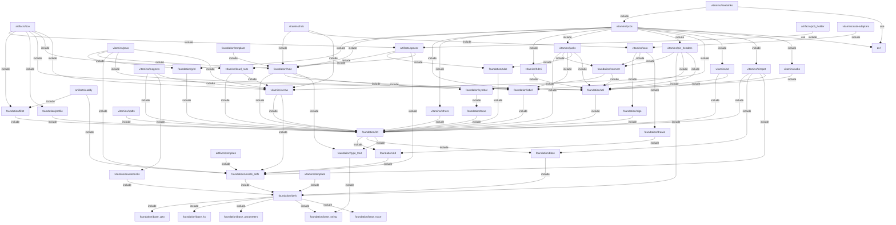

# Dependencies

```mermaid
graph TD
    A1[foundation/2d] --o|include| A2[foundation/unsafe_defs]
    A3[foundation/3d] --o|include| A1
    A3 --o|include| A4[foundation/bbox]
    A3 --o|include| A5[foundation/type_trait]
    A6[foundation/algo] --o|include| A3
    A7[foundation/base_geo]
    A8[foundation/base_kv]
    A9[foundation/base_parameters]
    A10[foundation/base_string]
    A11[foundation/base_trace]
    A4 --o|include| A12[foundation/defs]
    A13[artifacts/box] --o|include| A14[artifacts/spacer]
    A13 --o|include| A15[foundation/fillet]
    A13 --o|include| A16[foundation/profile]
    A13 --o|include| A17[foundation/util]
    A13 --o|include| A18[vitamins/knurl_nuts]
    A13 --o|include| A19[vitamins/screw]
    A20[artifacts/caddy] --o|include| A15
    A20 --o|include| A2
    A21[foundation/connect] --o|include| A22[foundation/symbol]
    A21 --o|include| A17
    A23[vitamins/countersinks] --o|include| A12
    A12 --o|include| A7
    A12 --o|include| A8
    A12 --o|include| A9
    A12 --o|include| A10
    A12 --o|include| A11
    A24[foundation/drawio] --o|include| A1
    A25[dxf]
    A26[vitamins/ethers] --o|include| A3
    A15 --o|include| A3
    A27[foundation/grid] --o|include| A3
    A28[vitamins/hdmi] --o|include| A17
    A29[vitamins/hds] --o|include| A30[foundation/hole]
    A29 --o|include| A31[vitamins/sata]
    A29 --o|include| A19
    A32[vitamins/heatsinks] --o|include| A33[vitamins/pcbs]
    A32 --o|use| A25
    A30 --o|include| A3
    A30 --o|include| A34[foundation/label]
    A30 --o|include| A22
    A30 --o|include| A5
    A35[vitamins/jacks] --o|include| A3
    A35 --o|include| A21
    A35 --o|include| A34
    A35 --o|include| A36[foundation/tube]
    A35 --o|include| A17
    A18 --o|include| A3
    A18 --o|include| A19
    A34 --o|include| A3
    A37[vitamins/magnets] --o|include| A3
    A37 --o|include| A23
    A37 --o|include| A19
    A38[artifacts/pcb_holder] --o|include| A14
    A33 --o|include| A27
    A33 --o|include| A30
    A33 --o|include| A34
    A33 --o|include| A26
    A33 --o|include| A28
    A33 --o|include| A35
    A33 --o|include| A39[vitamins/pin_headers]
    A33 --o|include| A19
    A33 --o|include| A40[vitamins/sd]
    A33 --o|include| A41[vitamins/trimpot]
    A33 --o|include| A42[vitamins/usbs]
    A33 --o|use| A25
    A39 --o|include| A21
    A39 --o|include| A12
    A39 --o|include| A34
    A39 --o|include| A17
    A16 --o|include| A3
    A43[vitamins/psus] --o|include| A27
    A43 --o|include| A30
    A43 --o|include| A2
    A43 --o|include| A17
    A43 --o|include| A19
    A31 --o|include| A6
    A31 --o|include| A21
    A31 --o|include| A24
    A44[vitamins/sata-adapters] --o|include| A31
    A19 --o|include| A3
    A19 --o|include| A2
    A40 --o|include| A3
    A40 --o|include| A17
    A14 --o|include| A30
    A14 --o|include| A36
    A14 --o|include| A2
    A14 --o|include| A18
    A45[vitamins/spdts] --o|include| A3
    A22 --o|include| A46[foundation/torus]
    A47[artifacts/template] --o|include| A2
    A48[foundation/template] --o|include| A30
    A49[vitamins/template] --o|include| A12
    A46 --o|include| A3
    A41 --o|include| A3
    A41 --o|include| A4
    A41 --o|include| A2
    A41 --o|include| A17
    A36 --o|include| A3
    A5 --o|include| A10
    A2 --o|include| A12
    A42 --o|include| A17
    A17 --o|include| A3
```

