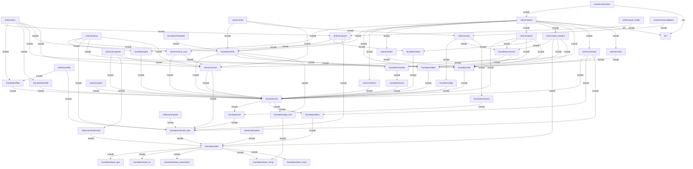

# Dependencies

```mermaid
graph TD
    A1[foundation/2d] -->|include| A2[foundation/unsafe_defs]
    A3[foundation/3d] -->|include| A1
    A3 -->|include| A4[foundation/bbox]
    A3 -->|include| A5[foundation/type_trait]
    A6[foundation/algo] -->|include| A3
    A7[foundation/base_geo]
    A8[foundation/base_kv]
    A9[foundation/base_parameters]
    A10[foundation/base_string]
    A11[foundation/base_trace]
    A4 -->|include| A12[foundation/defs]
    A13[artifacts/box] -->|include| A14[artifacts/spacer]
    A13 -->|include| A15[foundation/fillet]
    A13 -->|include| A16[foundation/profile]
    A13 -->|include| A17[foundation/util]
    A13 -->|include| A18[vitamins/knurl_nuts]
    A13 -->|include| A19[vitamins/screw]
    A20[artifacts/caddy] -->|include| A15
    A20 -->|include| A2
    A21[foundation/connect] -->|include| A22[foundation/symbol]
    A21 -->|include| A17
    A23[vitamins/countersinks] -->|include| A12
    A12 -->|include| A7
    A12 -->|include| A8
    A12 -->|include| A9
    A12 -->|include| A10
    A12 -->|include| A11
    A24[foundation/drawio] -->|include| A1
    A25[dxf]
    A26[vitamins/ethers] -->|include| A3
    A15 -->|include| A3
    A27[foundation/grid] -->|include| A3
    A28[vitamins/hdmi] -->|include| A17
    A29[vitamins/hds] -->|include| A30[foundation/hole]
    A29 -->|include| A31[vitamins/sata]
    A29 -->|include| A19
    A32[vitamins/heatsinks] -->|include| A33[vitamins/pcbs]
    A32 -->|use| A25
    A30 -->|include| A3
    A30 -->|include| A34[foundation/label]
    A30 -->|include| A22
    A30 -->|include| A5
    A35[vitamins/jacks] -->|include| A3
    A35 -->|include| A21
    A35 -->|include| A34
    A35 -->|include| A36[foundation/tube]
    A35 -->|include| A17
    A18 -->|include| A3
    A18 -->|include| A19
    A34 -->|include| A3
    A37[vitamins/magnets] -->|include| A3
    A37 -->|include| A23
    A37 -->|include| A19
    A38[artifacts/pcb_holder] -->|include| A14
    A33 -->|include| A27
    A33 -->|include| A30
    A33 -->|include| A34
    A33 -->|include| A26
    A33 -->|include| A28
    A33 -->|include| A35
    A33 -->|include| A39[vitamins/pin_headers]
    A33 -->|include| A19
    A33 -->|include| A40[vitamins/trimpot]
    A33 -->|include| A41[vitamins/usbs]
    A33 -->|use| A25
    A39 -->|include| A21
    A39 -->|include| A12
    A39 -->|include| A34
    A39 -->|include| A17
    A16 -->|include| A3
    A42[vitamins/psus] -->|include| A27
    A42 -->|include| A30
    A42 -->|include| A2
    A42 -->|include| A17
    A42 -->|include| A19
    A31 -->|include| A6
    A31 -->|include| A21
    A31 -->|include| A24
    A43[vitamins/sata-adapters] -->|include| A31
    A19 -->|include| A3
    A19 -->|include| A2
    A14 -->|include| A30
    A14 -->|include| A36
    A14 -->|include| A2
    A14 -->|include| A18
    A44[vitamins/spdts] -->|include| A3
    A22 -->|include| A45[foundation/torus]
    A46[artifacts/template] -->|include| A2
    A47[foundation/template] -->|include| A30
    A48[vitamins/template] -->|include| A12
    A45 -->|include| A3
    A40 -->|include| A3
    A40 -->|include| A4
    A40 -->|include| A2
    A40 -->|include| A17
    A36 -->|include| A3
    A5 -->|include| A10
    A2 -->|include| A12
    A41 -->|include| A17
    A17 -->|include| A3
```
