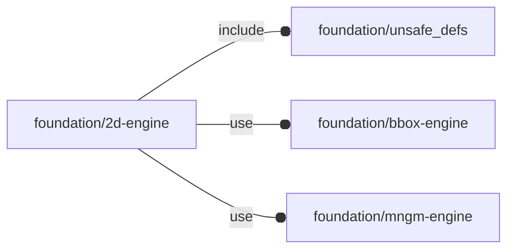

# package foundation/2d-engine

## Dependencies



2D primitives.

Copyright © 2021, Giampiero Gabbiani (giampiero@gabbiani.org)

SPDX-License-Identifier: [GPL-3.0-or-later](https://spdx.org/licenses/GPL-3.0-or-later.html)


## Functions

---

### function fl_2d_angleBetween

__Syntax:__

```text
fl_2d_angleBetween(a,b)
```

returns the angle between vector «a» and «b»

---

### function fl_2d_frame_intCorners

__Syntax:__

```text
fl_2d_frame_intCorners(size=[1,1],corners=[0,0,0,0],thick)
```

__Parameters:__

__size__  
outer size

__corners__  
List of four radiuses, one for each quadrant's corners.
Each zero means that the corresponding corner is squared.
Defaults to a 'perfect' rectangle with four squared corners.
One scalar value R means corners=[R,R,R,R]


__thick__  
subtracted to size defines the internal size


---

### function fl_bb_arc

__Syntax:__

```text
fl_bb_arc(r=1,d,angles,thick)
```

exact arc bounding box

---

### function fl_bb_circle

__Syntax:__

```text
fl_bb_circle(r=1,d)
```

exact circle bounding box

---

### function fl_bb_ellipse

__Syntax:__

```text
fl_bb_ellipse(e)
```

Exact ellipse bounding box

__Parameters:__

__e__  
ellipse in [a,b] form with

- a: length of the X semi-axis
- b: length of the Y semi-axis


---

### function fl_bb_ellipticArc

__Syntax:__

```text
fl_bb_ellipticArc(e,angles,thick)
```

Exact elliptic arc bounding box

__Parameters:__

__e__  
outer ellipse in [a,b] form with

- a: length of the X semi-axis
- b: length of the Y semi-axis


__angles__  
list containing the start and ending angles for the sector.

:memo: __NOTE:__ the provided angles are always reduced in the form [inf,sup] with:

    sup ≥ inf
    distance = sup - inf
      0° ≤ distance ≤ +360°
      0° ≤   inf    < +360°
      0° ≤   sup    < +720°


__thick__  
subtracted to «e» semi-axes defines the inner ellipse ones


---

### function fl_bb_ellipticSector

__Syntax:__

```text
fl_bb_ellipticSector(e,angles)
```

Exact elliptic sector bounding box

__Parameters:__

__e__  
ellipse in [a,b] form

__angles__  
list containing the start and ending angles for the sector.

:memo: __NOTE:__ the provided angles are always reduced in the form [inf,sup] with:

    sup ≥ inf
    distance = sup - inf
      0° ≤ distance ≤ +360°
      0° ≤   inf    < +360°
      0° ≤   sup    < +720°


---

### function fl_bb_ipoly

__Syntax:__

```text
fl_bb_ipoly(r,d,n)
```

Calculates the exact bounding box of a polygon inscribed in a circumference.
See also [fl_bb_polygon()](#function-fl_bb_polygon).

:memo: __NOTE:__ «r» and «d» are mutually exclusive.


__Parameters:__

__r__  
radius of the circumference

__d__  
diameter of the circumference

__n__  
number of edges for the inscribed polygon


---

### function fl_bb_polygon

__Syntax:__

```text
fl_bb_polygon(points)
```

Returns the bounding box of a 2d polygon.
See also 3d counter-part function [fl_bb_polyhedron()](bbox-engine.md#function-fl_bb_polyhedron).


__Parameters:__

__points__  
list of x,y points of the polygon to be used with
[polygon](https://en.wikibooks.org/wiki/OpenSCAD_User_Manual/Using_the_2D_Subsystem#polygon)

**NOTE**: even if safe to be used for 3d points, the result will be
a 2d bounding box.


---

### function fl_bb_sector

__Syntax:__

```text
fl_bb_sector(r=1,d,angles)
```

Returns the exact bounding box of a sector.

__Parameters:__

__r__  
radius of the sector

__d__  
diameter of the sector

__angles__  
list containing the start and ending angles for the sector.

:memo: __NOTE:__ the provided angles are always reduced in the form [inf,sup] with:

    sup ≥ inf
    distance = sup - inf
      0° ≤ distance ≤ +360°
      0° ≤   inf    < +360°
      0° ≤   sup    < +720°


---

### function fl_circle

__Syntax:__

```text
fl_circle(r=1,center=[0,0])
```

---

### function fl_circleXY

__Syntax:__

```text
fl_circleXY(r,t)
```

Rectangular value [x,y] of circle of ray «r» by «t» (parametric/polar)

__Parameters:__

__r__  
radius of the circle

__t__  
0≤t<360, angle that the ray from (0,0) to (x,y) makes with +X


---

### function fl_ellipse

__Syntax:__

```text
fl_ellipse(e)
```

__Parameters:__

__e__  
ellipse in [a,b] form with

- a: length of the X semi-axis
- b: length of the Y semi-axis


---

### function fl_ellipseP

__Syntax:__

```text
fl_ellipseP(e)
```

APPROXIMATED ellipse perimeter

---

### function fl_ellipseR

__Syntax:__

```text
fl_ellipseR(e,theta)
```

r(θ): polar equation of ellipse «e» by «θ»

__Parameters:__

__e__  
ellipse in [a,b] form with

- a: length of the X semi-axis
- b: length of the Y semi-axis


---

### function fl_ellipseT

__Syntax:__

```text
fl_ellipseT(e,angle)
```

Converts «θ» value to the corresponding ellipse «t» parameter

:memo: __NOTE:__ we need to extend the theoretical function beyond ±π/2 codomain,
for that we use __ramp__() and __step__() function accordingly.


---

### function fl_ellipseXY

__Syntax:__

```text
fl_ellipseXY(e,t,angle)
```

__Parameters:__

__e__  
ellipse in [a,b] form with

- a: length of the X semi-axis
- b: length of the Y semi-axis


__t__  
parametric input 0≤t<360

__angle__  
polar input 0≤angle<360


---

### function fl_ellipticSector

__Syntax:__

```text
fl_ellipticSector(e,angles)
```

Calculates the point of an elliptic sectors.


__Parameters:__

__e__  
ellipses in [a,b] form

__angles__  
list containing the start and ending angles for the sector.

:memo: __NOTE:__ the provided angles are always reduced in the form [inf,sup] with:

    sup ≥ inf
    distance = sup - inf
      0° ≤ distance ≤ +360°
      0° ≤   inf    < +360°
      0° ≤   sup    < +720°


---

### function fl_intersection

__Syntax:__

```text
fl_intersection(line1,line2,in1=true,in2=true)
```

line to line intersection as from [Line–line intersection](https://en.wikipedia.org/wiki/Line-line_intersection)


__Parameters:__

__line1__  
first line in [P0,P1] format

__line2__  
second line in [P0,P1] format

__in1__  
solution valid if inside segment 1

__in2__  
solution valid if inside segment 2


---

### function fl_parm_Quadrant

__Syntax:__

```text
fl_parm_Quadrant(x,y)
```

Constructor for the quadrant parameter from values as passed by customizer
(see [fl_quadrant()](#function-fl_quadrant) for the semantic behind).

Each dimension can assume one out of four values:

- "undef": mapped to undef
- -1,0,+1: untouched


---

### function fl_quadrant

__Syntax:__

```text
fl_quadrant(quadrant,type,bbox,default=I)
```

Calculates the translation matrix needed for moving a shape in the provided
2d quadrant.


__Parameters:__

__quadrant__  
2d quadrant vector, each component can assume one out of four values
modifying the corresponding x or y position in the following manner:

- undef: translation invariant (no translation)
- -1: object on negative semi-axis
- 0: object midpoint on origin
- +1: object on positive semi-axis

Example 1:

    quadrant=[undef,undef]

no translation in any dimension

Example 2:

    quadrant=[0,0]

object center [midpoint x, midpoint y] on origin

Example 3:

    quadrant=[+1,undef]

 object on X positive semi-space, no Y translated


__type__  
type with "bounding corners" property

__bbox__  
bounding box corners, overrides «type» settings

__default__  
returned matrix if «quadrant» is undef


---

### function fl_sector

__Syntax:__

```text
fl_sector(r=1,d,angles)
```

__Parameters:__

__angles__  
list containing the start and ending angles for the sector.

:memo: __NOTE:__ the provided angles are always reduced in the form [inf,sup] with:

    sup ≥ inf
    distance = sup - inf
      0° ≤ distance ≤ +360°
      0° ≤   inf    < +360°
      0° ≤   sup    < +720°


---

### function fl_square

__Syntax:__

```text
fl_square(size=1,corners=[0,0,0,0])
```

__Parameters:__

__size__  
square size as 2d list or scalar


__corners__  
List of four values (one for each quadrant). Each of them can be passed in
one of the following formats:

    [a,b]    ⇒ ellipse with semi-axis a and b
    scalar r ⇒ circle of radius r (or ellipse with a==b==r)

It is also possible to use some shortcuts like the following:

    corners=R      ⇒ corners=[R,R,R,R] == corners=[[R,R],[R,R],[R,R],[R,R]] == rounded rectangle with FOUR CIRCULAR ARCS with radius=R
    corners=[a,b]  ⇒ corners=[[a,b],[a,b],[a,b],[a,b]] == rounded rectangle with FOUR ELLIPTICAL ARCS with e=[a,b]

Default

    corners=0      ⇒ corners=[0,0,0,0] == corners=[[0,0],[0,0],[0,0],[0,0]]) == squared rectangle

Any combination is allowed i.e.

    corners=[r,[a,b],0,0] ⇒ corners=[[r,r],[a,b],[0,0],[0,0]] == rectangle with circular arc on quadrant I, elliptical arc on quadrant II and squared on quadrants III,IV


## Modules

---

### module fl_2d_doAxes

__Syntax:__

    fl_2d_doAxes(size)

---

### module fl_2d_frame

__Syntax:__

    fl_2d_frame(verbs=FL_ADD,size=[1,1],corners=[0,0,0,0],thick,quadrant)

__Parameters:__

__size__  
outer size

__corners__  
List of four radiuses, one for each quadrant's corners.
Each zero means that the corresponding corner is squared.
Defaults to a 'perfect' rectangle with four squared corners.
One scalar value R means corners=[R,R,R,R]


__thick__  
subtracted to size defines the internal size


---

### module fl_2d_place

__Syntax:__

    fl_2d_place(type,quadrant,bbox)

__Parameters:__

__quadrant__  
2d quadrant

__bbox__  
bounding box corners


---

### module fl_2d_placeIf

__Syntax:__

    fl_2d_placeIf(condition,type,quadrant,bbox)

__Parameters:__

__condition__  
when false, placement is ignored

__quadrant__  
2d quadrant

__bbox__  
bounding box corners


---

### module fl_annulus

__Syntax:__

    fl_annulus(verbs=FL_ADD,r,d,thick,quadrant)

__Parameters:__

__r__  
outer radius

__d__  
outer diameter

__thick__  
subtracted to outer radius defines the internal one


---

### module fl_arc

__Syntax:__

    fl_arc(verbs=FL_ADD,r,d,angles,thick,quadrant)

__Parameters:__

__r__  
outer radius

__d__  
outer diameter

__angles__  
list containing the start and ending angles for the sector.

:memo: __NOTE:__ the provided angles are always reduced in the form [inf,sup] with:

    sup ≥ inf
    distance = sup - inf
      0° ≤ distance ≤ +360°
      0° ≤   inf    < +360°
      0° ≤   sup    < +720°


__thick__  
subtracted to radius defines the inner one


---

### module fl_circle

__Syntax:__

    fl_circle(verbs=FL_ADD,r,d,quadrant)

---

### module fl_ellipse

__Syntax:__

    fl_ellipse(verbs=FL_ADD,e,quadrant)

__Parameters:__

__verbs__  
supported verbs: FL_ADD, FL_AXES, FL_BBOX

__e__  
ellipse in [a,b] form with

- a: length of the X semi-axis
- b: length of the Y semi-axis


---

### module fl_ellipticAnnulus

__Syntax:__

    fl_ellipticAnnulus(verbs=FL_ADD,e,thick,quadrant)

__Parameters:__

__verbs__  
supported verbs: FL_ADD, FL_AXES, FL_BBOX

__e__  
outer ellipse in [a,b] form with

- a: length of the X semi-axis
- b: length of the Y semi-axis


__thick__  
subtracted to outer ellipses axes defines the internal one


---

### module fl_ellipticArc

__Syntax:__

    fl_ellipticArc(verbs=FL_ADD,e,angles,thick,quadrant)

__Parameters:__

__verbs__  
supported verbs: FL_ADD, FL_AXES, FL_BBOX

__e__  
outer ellipse in [a,b] form with

- a: length of the X semi-axis
- b: length of the Y semi-axis


__angles__  
list containing the start and ending angles for the sector.

:memo: __NOTE:__ the provided angles are always reduced in the form [inf,sup] with:

    sup ≥ inf
    distance = sup - inf
      0° ≤ distance ≤ +360°
      0° ≤   inf    < +360°
      0° ≤   sup    < +720°


__thick__  
subtracted to «e» semi-axes defines the inner ellipse ones


---

### module fl_ellipticSector

__Syntax:__

    fl_ellipticSector(verbs=FL_ADD,e,angles,quadrant)

__Parameters:__

__verbs__  
supported verbs: FL_ADD, FL_AXES, FL_BBOX

__e__  
ellipse in [a,b] form with

- a: length of the X semi-axis
- b: length of the Y semi-axis


__angles__  
list containing the start and ending angles for the sector.

:memo: __NOTE:__ the provided angles are always reduced in the form [inf,sup] with:

    sup ≥ inf
    distance = sup - inf
      0° ≤ distance ≤ +360°
      0° ≤   inf    < +360°
      0° ≤   sup    < +720°


---

### module fl_ipoly

__Syntax:__

    fl_ipoly(verbs=FL_ADD,r,d,n,quadrant)

Regular polygon inscribed a circumference

__Parameters:__

__r__  
circumscribed circle radius

__d__  
circumscribed circle diameter

__n__  
number of edges


---

### module fl_sector

__Syntax:__

    fl_sector(verbs=FL_ADD,r=1,d,angles,quadrant)

__Parameters:__

__angles__  
list containing the start and ending angles for the sector.

:memo: __NOTE:__ the provided angles are always reduced in the form [inf,sup] with:

    sup ≥ inf
    distance = sup - inf
      0° ≤ distance ≤ +360°
      0° ≤   inf    < +360°
      0° ≤   sup    < +720°


---

### module fl_square

__Syntax:__

    fl_square(verbs=FL_ADD,size=1,corners=[0,0,0,0],quadrant)

Draw a 2d square centered at the origin.


__Parameters:__

__size__  
square size as 2d list or scalar


__corners__  
List of four radiuses, one for each quadrant's corners.
Each zero means that the corresponding corner is squared.
Defaults to a 'perfect' rectangle with four squared corners.
Scalar value R for «corners» means corners=[R,R,R,R]

See also function [fl_square()](#function-fl_square) for more complete examples.


