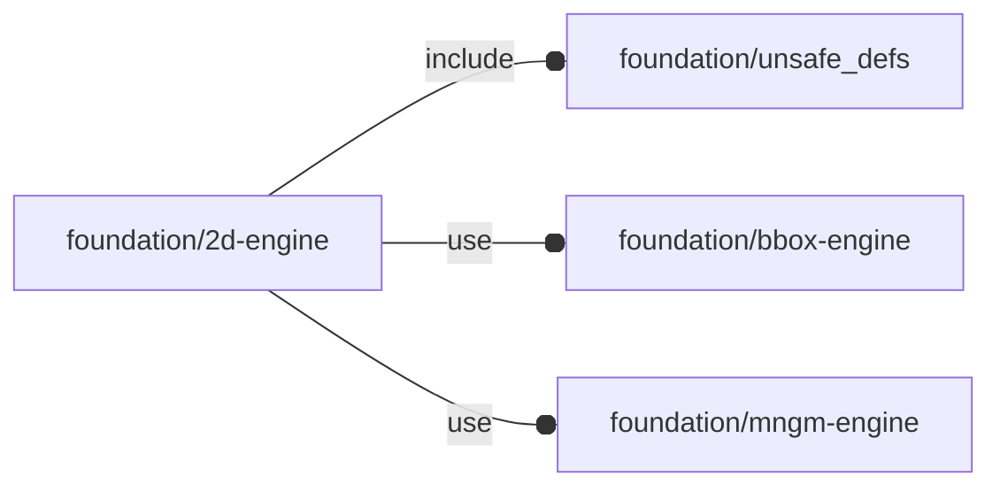

# package foundation/2d-engine

## Dependencies



2D primitives.

Copyright © 2021, Giampiero Gabbiani (giampiero@gabbiani.org)

SPDX-License-Identifier: [GPL-3.0-or-later](https://spdx.org/licenses/GPL-3.0-or-later.html)


## Functions

---

### function fl_2d_Circo

__Syntax:__

```text
fl_2d_Circo(C,r)
```

Circle constructor, result in canonical form x^2+y^2+ax+by+c=0 ⇒[1,1,a,b,c].

Example: circle with center in point C and radius r

    circle = fl_2d_Circle(C,B);


---

### function fl_2d_Line

__Syntax:__

```text
fl_2d_Line(A,B,m,x,y)
```

line constructor, result in standard form ax+by+c=0.

Example 1: line from two points A and B

    line = fl_2d_Line(A,B);

Example 2: line from one point P and slope m

    line = fl_2d_Line(P,m=m);

Example 3: vertical line x=k

    line = fl_2d_Line(x=k);

Example 4: horizontal line y=q

    line = fl_2d_Line(y=q);


---

### function fl_2d_angleBetween

__Syntax:__

```text
fl_2d_angleBetween(a,b)
```

returns the angle between vector «a» and «b»

---

### function fl_2d_bisector

__Syntax:__

```text
fl_2d_bisector(line1,line2)
```

Returns the bisector of the angle formed by lines «line1» and «line2».

The resulting line is in standard form ax+by+c=0 ⇒[a,b,c]


---

### function fl_2d_closest

__Syntax:__

```text
fl_2d_closest(pts,pre_ordered=false)
```

Calculate the smallest distance in O(n*Log(n)) time using Divide and Conquer
strategy.

See also:

[Closest Pair of Points using Divide and Conquer algorithm - GeeksforGeeks](https://www.geeksforgeeks.org/closest-pair-of-points-using-divide-and-conquer-algorithm/)

[Closest Pair of Points | O(nlogn) Implementation - GeeksforGeeks](https://www.geeksforgeeks.org/closest-pair-of-points-onlogn-implementation/?source=post_page-----49ba679ce3c7--------------------------------)

[Algorithms StudyNote-4: Divide and Conquer — Closest Pair | by Fiona Wu | Medium](https://itzsyboo.medium.com/algorithms-studynote-4-divide-and-conquer-closest-pair-49ba679ce3c7)

Usage example:

    pts  = [[x1,y1],[x2,y2],...,[xn,yn]];
    d    = fl_2d_closest(pts);


__Parameters:__

__pts__  
list of 2d points

__pre_ordered__  
when true «points» are in ASCENDING X order


---

### function fl_2d_dist

__Syntax:__

```text
fl_2d_dist(p1,p2)
```

---

### function fl_2d_intersection

__Syntax:__

```text
fl_2d_intersection(line,line2,circle)
```

Intersection point between «line» and «line2» or between «line» and «circle».

NOTE: in case of intersection between a first grade equation (line1) and a
quadratic one (circle) the result can be a single 2d point or a list of two
points depending if line is tangential or not to the circle.


__Parameters:__

__line__  
line in standard form ax+by+c=0 ⇒[a,b,c]

__line2__  
line in standard form ax+by+c=0 ⇒[a,b,c]

__circle__  
circumference in canonical form X^2+y^2+ax+by+c=0 ⇒[1,1,a,b,c]


---

### function fl_2d_polyRound

__Syntax:__

```text
fl_2d_polyRound(radiipoints,fn=5,mode=0)
```

polyRound() wrapper.

Context variables:

| Name             | Context   | Description                                         |
| ---------------- | --------- | --------------------------------------------------- |
| $fl_polyround    | Parameter | when true polyRound() is called, otherwise radiipoints are transformed in normal 2d points ready for polygon() |


---

### function fl_2d_slope

__Syntax:__

```text
fl_2d_slope(A,B,line)
```

Returns the line slope.

Example 1: slope of a line in standard form

    slope = fl_2d_slope(line=[a,b,c]);

Example 2: slope angle of the line crossing two points A and B

    slope = fl_2d_slope(A,B);


__Parameters:__

__A__  
two points crossed by the line

__line__  
line in standard form ax+by+c=0


---

### function fl_2d_slopeAngle

__Syntax:__

```text
fl_2d_slopeAngle(A,B,line)
```

Returns the angle formed by the positive X semi-axis and the part of
«line» lying in the upper half-plane.

Example 1: slope angle of a line in standard form

    angle = fl_2d_slopeAngle(line=[a,b,c]);

Example 2: slope angle of the line crossing two points A and B

    angle = fl_2d_slopeAngle(A,B);


__Parameters:__

__A__  
two points crossed by the line

__line__  
line in standard form


---

### function fl_bb_arc

__Syntax:__

```text
fl_bb_arc(r=1,d,angles,thick)
```

exact arc bounding box

---

### function fl_bb_circle

__Syntax:__

```text
fl_bb_circle(r=1,d)
```

exact circle bounding box

---

### function fl_bb_ellipse

__Syntax:__

```text
fl_bb_ellipse(e)
```

Exact ellipse bounding box

__Parameters:__

__e__  
ellipse in [a,b] form with

- a: length of the X semi-axis
- b: length of the Y semi-axis


---

### function fl_bb_ellipticArc

__Syntax:__

```text
fl_bb_ellipticArc(e,angles,thick)
```

Exact elliptic arc bounding box

__Parameters:__

__e__  
outer ellipse in [a,b] form with

- a: length of the X semi-axis
- b: length of the Y semi-axis


__angles__  
list containing the start and ending angles for the sector.

:memo: **NOTE:** the provided angles are always reduced in the form [inf,sup] with:

    sup ≥ inf
    distance = sup - inf
      0° ≤ distance ≤ +360°
      0° ≤   inf    < +360°
      0° ≤   sup    < +720°


__thick__  
subtracted to «e» semi-axes defines the inner ellipse ones


---

### function fl_bb_ellipticSector

__Syntax:__

```text
fl_bb_ellipticSector(e,angles)
```

Exact elliptic sector bounding box

__Parameters:__

__e__  
ellipse in [a,b] form

__angles__  
list containing the start and ending angles for the sector.

:memo: **NOTE:** the provided angles are always reduced in the form [inf,sup] with:

    sup ≥ inf
    distance = sup - inf
      0° ≤ distance ≤ +360°
      0° ≤   inf    < +360°
      0° ≤   sup    < +720°


---

### function fl_bb_ipoly

__Syntax:__

```text
fl_bb_ipoly(r,d,n)
```

Calculates the exact bounding box of a polygon inscribed in a circumference.
See also [fl_bb_polygon()](#function-fl_bb_polygon).

:memo: **NOTE:** «r» and «d» are mutually exclusive.


__Parameters:__

__r__  
radius of the circumference

__d__  
diameter of the circumference

__n__  
number of edges for the inscribed polygon


---

### function fl_bb_polygon

__Syntax:__

```text
fl_bb_polygon(points)
```

Returns the bounding box of a 2d polygon.
See also 3d counter-part function [fl_bb_polyhedron()](bbox-engine.md#function-fl_bb_polyhedron).


__Parameters:__

__points__  
list of x,y points of the polygon to be used with
[polygon](https://en.wikibooks.org/wiki/OpenSCAD_User_Manual/Using_the_2D_Subsystem#polygon)

:memo: **NOTE:** even if safe to be used for 3d points, the result will be
a 2d bounding box.


---

### function fl_bb_sector

__Syntax:__

```text
fl_bb_sector(r=1,d,angles)
```

Returns the exact bounding box of a sector.

__Parameters:__

__r__  
radius of the sector

__d__  
diameter of the sector

__angles__  
list containing the start and ending angles for the sector.

:memo: **NOTE:** the provided angles are always reduced in the form [inf,sup] with:

    sup ≥ inf
    distance = sup - inf
      0° ≤ distance ≤ +360°
      0° ≤   inf    < +360°
      0° ≤   sup    < +720°


---

### function fl_circle

__Syntax:__

```text
fl_circle(r=1,center=[0,0])
```

---

### function fl_circleXY

__Syntax:__

```text
fl_circleXY(r,t)
```

Rectangular value [x,y] of circle of ray «r» by «t» (parametric/polar)

__Parameters:__

__r__  
radius of the circle

__t__  
0≤t<360, angle that the ray from (0,0) to (x,y) makes with +X


---

### function fl_ellipse

__Syntax:__

```text
fl_ellipse(e)
```

__Parameters:__

__e__  
ellipse in [a,b] form with

- a: length of the X semi-axis
- b: length of the Y semi-axis


---

### function fl_ellipseP

__Syntax:__

```text
fl_ellipseP(e)
```

APPROXIMATED ellipse perimeter

---

### function fl_ellipseR

__Syntax:__

```text
fl_ellipseR(e,theta)
```

r(θ): polar equation of ellipse «e» by «θ»

__Parameters:__

__e__  
ellipse in [a,b] form with

- a: length of the X semi-axis
- b: length of the Y semi-axis


---

### function fl_ellipseT

__Syntax:__

```text
fl_ellipseT(e,angle)
```

Converts «θ» value to the corresponding ellipse «t» parameter

:memo: **NOTE:** we need to extend the theoretical function beyond ±π/2 codomain,
for that we use __ramp__() and __step__() function accordingly.


---

### function fl_ellipseXY

__Syntax:__

```text
fl_ellipseXY(e,t,angle)
```

__Parameters:__

__e__  
ellipse in [a,b] form with

- a: length of the X semi-axis
- b: length of the Y semi-axis


__t__  
parametric input 0≤t<360

__angle__  
polar input 0≤angle<360


---

### function fl_ellipticSector

__Syntax:__

```text
fl_ellipticSector(e,angles)
```

Calculates the point of an elliptic sectors.


__Parameters:__

__e__  
ellipses in [a,b] form

__angles__  
list containing the start and ending angles for the sector.

:memo: **NOTE:** the provided angles are always reduced in the form [inf,sup] with:

    sup ≥ inf
    distance = sup - inf
      0° ≤ distance ≤ +360°
      0° ≤   inf    < +360°
      0° ≤   sup    < +720°


---

### function fl_intersection

__Syntax:__

```text
fl_intersection(line1,line2,in1=true,in2=true)
```

line to line intersection as from [Line–line intersection](https://en.wikipedia.org/wiki/Line-line_intersection)


__Parameters:__

__line1__  
first line in [P0,P1] format

__line2__  
second line in [P0,P1] format

__in1__  
solution valid if inside segment 1

__in2__  
solution valid if inside segment 2


---

### function fl_parm_Quadrant

__Syntax:__

```text
fl_parm_Quadrant(x,y)
```

Constructor for the quadrant parameter from values as passed by customizer
(see [fl_quadrant()](#function-fl_quadrant) for the semantic behind).

Each dimension can assume one out of the following values:

- "undef": mapped to undef
- "-1","0","+1": mapped to -1,0,+1 respectively
- -1,0,+1: untouched


---

### function fl_quadrant

__Syntax:__

```text
fl_quadrant(quadrant,type,bbox,default=I)
```

Calculates the translation matrix needed for moving a shape in the provided
2d quadrant.


__Parameters:__

__quadrant__  
2d quadrant vector, each component can assume one out of four values
modifying the corresponding x or y position in the following manner:

- undef: translation invariant (no translation)
- -1: object on negative semi-axis
- 0: object midpoint on origin
- +1: object on positive semi-axis

Example 1:

    quadrant=[undef,undef]

no translation in any dimension

Example 2:

    quadrant=[0,0]

object center [midpoint x, midpoint y] on origin

Example 3:

    quadrant=[+1,undef]

 object on X positive semi-space, no Y translated


__type__  
type with "bounding corners" property

__bbox__  
bounding box corners, overrides «type» settings

__default__  
returned matrix if «quadrant» is undef


---

### function fl_sector

__Syntax:__

```text
fl_sector(r=1,d,angles)
```

__Parameters:__

__angles__  
list containing the start and ending angles for the sector.

:memo: **NOTE:** the provided angles are always reduced in the form [inf,sup] with:

    sup ≥ inf
    distance = sup - inf
      0° ≤ distance ≤ +360°
      0° ≤   inf    < +360°
      0° ≤   sup    < +720°


---

### function fl_square

__Syntax:__

```text
fl_square(size=1,corners=[0,0,0,0])
```

__Parameters:__

__size__  
square size as 2d list or scalar


__corners__  
List of four values (one for each quadrant). Each of them can be passed in
one of the following formats:

    [a,b]    ⇒ ellipse with semi-axis a and b
    scalar r ⇒ circle of radius r (or ellipse with a==b==r)

It is also possible to use some shortcuts like the following:

    corners=R      ⇒ corners=[R,R,R,R] == corners=[[R,R],[R,R],[R,R],[R,R]] == rounded rectangle with FOUR CIRCULAR ARCS with radius=R
    corners=[a,b]  ⇒ corners=[[a,b],[a,b],[a,b],[a,b]] == rounded rectangle with FOUR ELLIPTICAL ARCS with e=[a,b]

Default

    corners=0      ⇒ corners=[0,0,0,0] == corners=[[0,0],[0,0],[0,0],[0,0]]) == squared rectangle

Any combination is allowed i.e.

    corners=[r,[a,b],0,0] ⇒ corners=[[r,r],[a,b],[0,0],[0,0]] == rectangle with circular arc on quadrant I, elliptical arc on quadrant II and squared on quadrants III,IV


## Modules

---

### module fl_2d_frame

__Syntax:__

    fl_2d_frame(verbs=FL_ADD,size=[1,1],corners=[0,0,0,0],thick,quadrant)

Add a 2d square frame according to corners and thick specifications.

Example:

A frame with the following corners:

| Quadrant | r
| ---      | ---
| I        | 3
| II       | 2
| III      | 4
| IV       | 0 (no roundness)

is produced by the following code

    use <OFL/foundation/2d-engine.scad>
    ...
    fl_2d_frame(size=[15,10],corners=[3,2,4,0],thick=2,$fn=50);

and will result as in the following picture:


__Parameters:__

__size__  
outer size

__corners__  
List of four radiuses, one for each quadrant's corners.
Each zero means that the corresponding corner is squared.
Defaults to a 'perfect' rectangle with four squared corners.
One scalar value R means corners=[R,R,R,R]
One ellipses value e=[a,b] means corners=[e,e,e,e]


__thick__  
subtracted to size defines the internal size


---

### module fl_2d_place

__Syntax:__

    fl_2d_place(type,quadrant,bbox)

__Parameters:__

__quadrant__  
2d quadrant

__bbox__  
bounding box corners


---

### module fl_2d_placeIf

__Syntax:__

    fl_2d_placeIf(condition,type,quadrant,bbox)

__Parameters:__

__condition__  
when false, placement is ignored

__quadrant__  
2d quadrant

__bbox__  
bounding box corners


---

### module fl_2d_polygonLabels

__Syntax:__

    fl_2d_polygonLabels(poly,size,label="P")

---

### module fl_2d_polygonSymbols

__Syntax:__

    fl_2d_polygonSymbols(poly,size)

---

### module fl_2d_vloop

__Syntax:__

    fl_2d_vloop(verbs,bbox,quadrant)

Low-level verb-driven OFL API management.

Two-dimensional steps:

1. verb looping
2. quadrant translation

**1. Verb looping:**

Each passed verb triggers in turn the children modules with an execution
context describing:

- the verb actually triggered;
- the OpenSCAD character modifier descriptor (see also [OpenSCAD User Manual/Modifier
  Characters](https://en.wikibooks.org/wiki/OpenSCAD_User_Manual/Modifier_Characters))

Verb list like `[FL_ADD, FL_DRILL]` will loop children modules two times,
once for the FL_ADD implementation and once for the FL_DRILL.

The only exception to this is the FL_AXES verb, that needs to be executed
outside the canonical transformation pipeline (without applying «quadrant» translations).
FL_AXES implementation - when passed in the verb list - is provided
automatically by the library.

So a verb list like `[FL_ADD, FL_AXES, FL_DRILL]` will trigger the children
modules twice: once for FL_ADD and once for FL_DRILL. OFL will trigger an
internal FL_AXES 2d implementation.

**2. Quadrant translation**

A coordinate system divides two-dimensional spaces in four
[quadrants](https://en.wikipedia.org/wiki/Quadrant_(plane_geometry)).

Using the bounding-box information provided by the 2d «bbox» parameter, we
can fit the shapes defined by children modules exactly in one quadrant.

Context variables:

| Name       | Context   | Description
| ---------- | --------- | ---------------------
|            | Children  | see [fl_generic_vloop{}](mngm-engine.md#module-fl_generic_vloop) context variables


__Parameters:__

__verbs__  
verb list

__bbox__  
mandatory bounding box

__quadrant__  
when undef native positioning is used


---

### module fl_2d_vmanage

__Syntax:__

    fl_2d_vmanage(verbs,this,quadrant)

High-level (OFL 'objects' only) verb-driven OFL API management for
two-dimension spaces.

It does pretty much the same things like [fl_2d_vloop{}](#module-fl_2d_vloop) but with a different
interface and enriching the children context with new context variables.

**Usage:**

    // An OFL object is a list of [key,values] items
    object = fl_Object(...);

    ...

    // this engine is called once for every verb passed to module fl_vmanage
    module engine() let(
      ...
    ) if ($this_verb==FL_ADD)
      ...;

      else if ($this_verb==FL_BBOX)
      ...;

      else if ($this_verb==FL_CUTOUT)
      ...;

      else if ($this_verb==FL_DRILL)
      ...;

      else if ($this_verb==FL_LAYOUT)
      ...;

      else if ($this_verb==FL_MOUNT)
      ...;

      else
        fl_error(["unimplemented verb",$this_verb]);

    ...

    fl_2d_vmanage(verbs,object,octant=octant,direction=direction)
      engine(thick=T)
        // child passed to engine for further manipulation (ex. during FL_LAYOUT)
        fl_circle(...);

Context variables:

| Name             | Context   | Description                                         |
| ---------------- | --------- | --------------------------------------------------- |
|                  | Children  | see [fl_generic_vmanage{}](mngm-engine.md#module-fl_generic_vmanage) Children context                     |


__Parameters:__

__quadrant__  
when undef native positioning is used


---

### module fl_annulus

__Syntax:__

    fl_annulus(verbs=FL_ADD,r,d,thick,quadrant)

__Parameters:__

__r__  
outer radius

__d__  
outer diameter

__thick__  
subtracted to outer radius defines the internal one


---

### module fl_arc

__Syntax:__

    fl_arc(verbs=FL_ADD,r,d,angles,thick,quadrant)

__Parameters:__

__r__  
outer radius

__d__  
outer diameter

__angles__  
list containing the start and ending angles for the sector.

:memo: **NOTE:** the provided angles are always reduced in the form [inf,sup] with:

    sup ≥ inf
    distance = sup - inf
      0° ≤ distance ≤ +360°
      0° ≤   inf    < +360°
      0° ≤   sup    < +720°


__thick__  
subtracted to radius defines the inner one


---

### module fl_circle

__Syntax:__

    fl_circle(verbs=FL_ADD,r,d,quadrant)

---

### module fl_ellipse

__Syntax:__

    fl_ellipse(verbs=FL_ADD,e,quadrant)

__Parameters:__

__verbs__  
supported verbs: FL_ADD, FL_AXES, FL_BBOX

__e__  
ellipse in [a,b] form with

- a: length of the X semi-axis
- b: length of the Y semi-axis


---

### module fl_ellipticAnnulus

__Syntax:__

    fl_ellipticAnnulus(verbs=FL_ADD,e,thick,quadrant)

__Parameters:__

__verbs__  
supported verbs: FL_ADD, FL_AXES, FL_BBOX

__e__  
outer ellipse in [a,b] form with

- a: length of the X semi-axis
- b: length of the Y semi-axis


__thick__  
subtracted to outer ellipses axes defines the internal one


---

### module fl_ellipticArc

__Syntax:__

    fl_ellipticArc(verbs=FL_ADD,e,angles,thick,quadrant)

__Parameters:__

__verbs__  
supported verbs: FL_ADD, FL_AXES, FL_BBOX

__e__  
outer ellipse in [a,b] form with

- a: length of the X semi-axis
- b: length of the Y semi-axis


__angles__  
list containing the start and ending angles for the sector.

:memo: **NOTE:** the provided angles are always reduced in the form [inf,sup] with:

    sup ≥ inf
    distance = sup - inf
      0° ≤ distance ≤ +360°
      0° ≤   inf    < +360°
      0° ≤   sup    < +720°


__thick__  
subtracted to «e» semi-axes defines the inner ellipse ones


---

### module fl_ellipticSector

__Syntax:__

    fl_ellipticSector(verbs=FL_ADD,e,angles,quadrant)

__Parameters:__

__verbs__  
supported verbs: FL_ADD, FL_AXES, FL_BBOX

__e__  
ellipse in [a,b] form with

- a: length of the X semi-axis
- b: length of the Y semi-axis


__angles__  
list containing the start and ending angles for the sector.

:memo: **NOTE:** the provided angles are always reduced in the form [inf,sup] with:

    sup ≥ inf
    distance = sup - inf
      0° ≤ distance ≤ +360°
      0° ≤   inf    < +360°
      0° ≤   sup    < +720°


---

### module fl_ipoly

__Syntax:__

    fl_ipoly(verbs=FL_ADD,r,d,n,quadrant)

Regular polygon inscribed a circumference

__Parameters:__

__r__  
circumscribed circle radius

__d__  
circumscribed circle diameter

__n__  
number of edges


---

### module fl_sector

__Syntax:__

    fl_sector(verbs=FL_ADD,r=1,d,angles,quadrant)

__Parameters:__

__angles__  
list containing the start and ending angles for the sector.

:memo: **NOTE:** the provided angles are always reduced in the form [inf,sup] with:

    sup ≥ inf
    distance = sup - inf
      0° ≤ distance ≤ +360°
      0° ≤   inf    < +360°
      0° ≤   sup    < +720°


---

### module fl_square

__Syntax:__

    fl_square(verbs=FL_ADD,size=1,corners=[0,0,0,0],quadrant)

Draw a 2d square centered at the origin.


__Parameters:__

__size__  
square size as 2d list or scalar


__corners__  
List of four radiuses, one for each quadrant's corners.
Each zero means that the corresponding corner is squared.
Defaults to a 'right' rectangle with four squared corners.
Scalar value R for «corners» means corners=[R,R,R,R]

See also function [fl_square()](#function-fl_square) for more complete examples.


