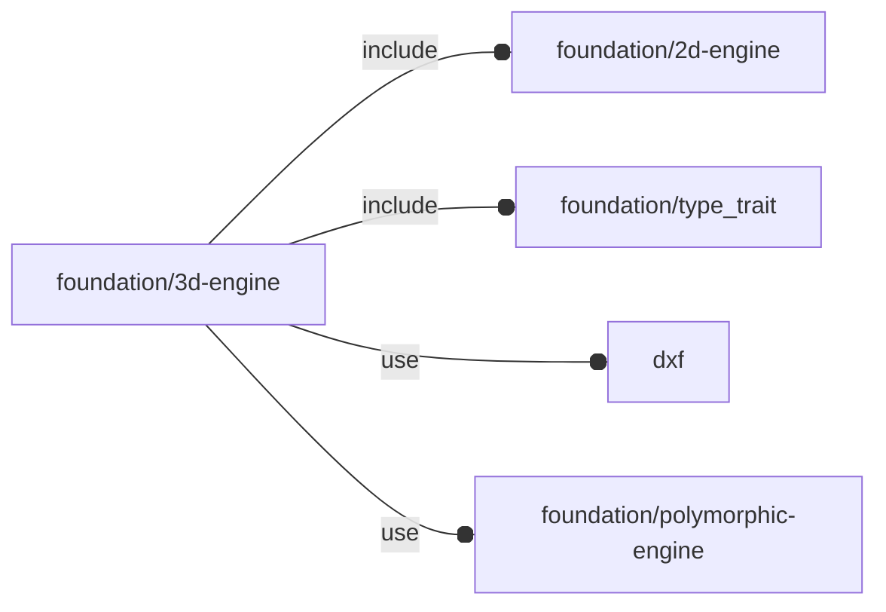

# package foundation/3d-engine

## Dependencies



3d primitives

Copyright © 2021, Giampiero Gabbiani (giampiero@gabbiani.org)

SPDX-License-Identifier: [GPL-3.0-or-later](https://spdx.org/licenses/GPL-3.0-or-later.html)


## Functions

---

### function fl_3d_AxisList

__Syntax:__

```text
fl_3d_AxisList(axes)
```

Build a floating semi-axis list from literal semi-axis list.

example:

    list = fl_3d_AxisList(axes=["-x","±Z"]);

is equivalent to:

    list =
    [
     [-1, 0,  0],  // -X semi-axis
     [ 0, 0, -1],  // -Z semi-axis
     [ 0, 0, +1],  // +Z semi-axis
    ];

:memo: **NOTE:** the negative ('-') or positive ('+') sign must always be set.


__Parameters:__

__axes__  
semi-axis literals list (es.["-x","±Z"])


---

### function fl_3d_AxisVList

__Syntax:__

```text
fl_3d_AxisVList(kvs,axes)
```

Constructor for a full semi-axis value list. The returned value can be built
from a list of pairs ("string", value) or from a list of semi-axes name
strings

| parameter | result                                                                     |
| --------- | ------                                                                     |
| kvs       | full semi-axis value list initialized from the passed axis/value pair list |
| values    | full boolean semi-axis value list from semi-axis literal                   |

See also function [fl_tt_isAxisVList()](type_trait.md#function-fl_tt_isaxisvlist)

example 1:

    thick = fl_3d_AxisVList(kvs=[["-x",3],["±Z",4]]);

is equivalent to:

    thick =
    [
     [3,0],  // -x and +x value pair
     [0,0],  // -y and +y value pair
     [4,4]   // -z and +z value pair
    ];

example 2:

    values = fl_3d_AxisVList(axes=["-x","±Z"]);

is equivalent to:

    values =
    [
     [true,  false], // -x and +x boolean
     [false, false], // -y and +y boolean
     [true,  true]   // -z and +z boolean
    ];


__Parameters:__

__kvs__  
semi-axis key/value list (es. [["-x",3],["±Z",4]])

__axes__  
semi-axis list (es.["-x","±Z"])


---

### function fl_3d_abs

__Syntax:__

```text
fl_3d_abs(a)
```

Transforms a vector inside the +X+Y+Z octant


---

### function fl_3d_axisIsSet

__Syntax:__

```text
fl_3d_axisIsSet(axis,list)
```

Wether «axis» is present in floating semi-axis «list».

TODO: this is a recursive solution that could be more quickly solved by a
mere call to the OpenSCAD builtin search() function like in the example
below:

    function fl_3d_axisIsSet(axis,list) = search([axis],list)!=[[]]

TODO: eventually replace it with [fl_isInAxisList()](#function-fl_isinaxislist)


---

### function fl_3d_axisValue

__Syntax:__

```text
fl_3d_axisValue(axis,values)
```

returns the «axis» value from a full semi-axis value list

__Parameters:__

__axis__  
axis to retrieve corresponding value

__values__  
full semi-axis value list (see also function [fl_tt_isAxisVList()](type_trait.md#function-fl_tt_isaxisvlist))


---

### function fl_3d_max

__Syntax:__

```text
fl_3d_max(a,b)
```

Builds a max vector


---

### function fl_3d_medianValue

__Syntax:__

```text
fl_3d_medianValue(list,axis,pre_ordered=false)
```

calculates the median VALUE of a 2d/3d point list


---

### function fl_3d_min

__Syntax:__

```text
fl_3d_min(a,b)
```

Builds a minor vector


---

### function fl_3d_orthoPlane

__Syntax:__

```text
fl_3d_orthoPlane(axis)
```

Cartesian plane from axis


---

### function fl_3d_planarProjection

__Syntax:__

```text
fl_3d_planarProjection(vector,plane)
```

Projection of «vector» onto a cartesian «plane»


__Parameters:__

__vector__  
3D vector

__plane__  
cartesian plane by vector with ([-1,+1,0]==[1,1,0]==XY)


---

### function fl_3d_sign

__Syntax:__

```text
fl_3d_sign(axis)
```

returns the sign of a semi-axis (-1,+1)

---

### function fl_3d_vectorialProjection

__Syntax:__

```text
fl_3d_vectorialProjection(vector,axis)
```

Projection of «vector» onto a cartesian «axis»


__Parameters:__

__vector__  
3D vector

__axis__  
cartesian axis ([-1,0,0]==[1,0,0]==X)


---

### function fl_bb_accum

__Syntax:__

```text
fl_bb_accum(axis,gap=0,bbcs)
```

Accumulates a list of bounding boxes along a direction.

Recursive algorithm, at each call a bounding box is extracted from «bbcs»
and decomposed into axial and planar components. The last bounding box in
the list ended up the recursion and is returned as result.
If there are still bounding boxes left, a new call is made and its
result, decomposed into the axial and planar components, used to produce a
new bounding box as follows:

- for planar component, the new negative and positive corners are calculated
  with the minimum dimensions between the current one and the result of the
  recursive call;
- for the axial component when «axis» is positive:
  - negative corner is equal to the current corner;
  - positive corner is equal to the current positive corner PLUS the gap and
    the axial dimension of the result;
  - when «axis» is negative:
    - negative corner is equal to the current one MINUS the gap and the
      axial dimension of the result
    - the positive corner is equal to the current corner.


__Parameters:__

__axis__  
layout direction

__gap__  
gap to be inserted between bounding boxes along axis

__bbcs__  
bounding box corners


---

### function fl_bb_cylinder

__Syntax:__

```text
fl_bb_cylinder(h,r,r1,r2,d,d1,d2)
```

__Parameters:__

__h__  
height of the cylinder or cone

__r__  
radius of cylinder. r1 = r2 = r.

__r1__  
radius, bottom of cone.

__r2__  
radius, top of cone.

__d__  
diameter of cylinder. r1 = r2 = d / 2.

__d1__  
diameter, bottom of cone. r1 = d1 / 2.

__d2__  
diameter, top of cone. r2 = d2 / 2.


---

### function fl_bb_prism

__Syntax:__

```text
fl_bb_prism(n,l,l1,l2,h)
```

__Parameters:__

__n__  
edge number

__l__  
edge length

__l1__  
edge length, bottom

__l2__  
edge length, top

__h__  
height of the prism


---

### function fl_bb_pyramid

__Syntax:__

```text
fl_bb_pyramid(points)
```

---

### function fl_bb_torus

__Syntax:__

```text
fl_bb_torus(r,d,e,R)
```

__Parameters:__

__r__  
radius of the circular tube.

__d__  
diameter of the circular tube.

__e__  
elliptic tube [a,b] form

__R__  
distance from the center of the tube to the center of the torus


---

### function fl_centroid

__Syntax:__

```text
fl_centroid(pts)
```

Calculates the [geometric center](https://en.wikipedia.org/wiki/Centroid) of
the passed points.


__Parameters:__

__pts__  
Point list defining a polygon/polyhedron with each element p | p∈ℝ^n^


---

### function fl_cylinder_defaults

__Syntax:__

```text
fl_cylinder_defaults(h,r,r1,r2,d,d1,d2)
```

cylinder defaults for positioning (fl_bb_cornersKV).


__Parameters:__

__h__  
height of the cylinder or cone

__r__  
radius of cylinder. r1 = r2 = r.

__r1__  
radius, bottom of cone.

__r2__  
radius, top of cone.

__d__  
diameter of cylinder. r1 = r2 = d / 2.

__d1__  
diameter, bottom of cone. r1 = d1 / 2.

__d2__  
diameter, top of cone. r2 = d2 / 2.


---

### function fl_direction

__Syntax:__

```text
fl_direction(direction)
```

Return the direction matrix transforming native coordinates along new
direction.

Native coordinate system is represented by two vectors: +Z and +X. +Y axis
is the cross product between +Z and +X. So with two vector (+Z,+X) we can
represent the native coordinate system +X,+Y,+Z.

New direction is expected in [Axis–angle representation](https://en.wikipedia.org/wiki/Axis%E2%80%93angle_representation)
in the format

    [axis,rotation angle]


__Parameters:__

__direction__  
desired direction in axis-angle representation [axis,rotation about]


---

### function fl_isInAxisList

__Syntax:__

```text
fl_isInAxisList(axis,list)
```

---

### function fl_octant

__Syntax:__

```text
fl_octant(octant,type,bbox,default=FL_I)
```

Calculates the translation matrix needed for moving a shape in the provided
3d octant.


__Parameters:__

__octant__  
3d octant vector, each component can assume one out of four values
modifying the corresponding x,y or z position in the following manner:

- undef: translation invariant (no translation)
- -1: object on negative semi-axis
- 0: object midpoint on origin
- +1: object on positive semi-axis

Example 1:

    octant=[undef,undef,undef]

no translation in any dimension

Example 2:

    octant=[0,0,0]

object center [midpoint x, midpoint y, midpoint z] on origin

Example 3:

    octant=[+1,undef,-1]

 object on X positive semi-space, no Y translated, on negative Z semi-space


__type__  
type with embedded "bounding corners" property (see [fl_bb_corners()](bbox-engine.md#function-fl_bb_corners))

__bbox__  
explicit bounding box corners: overrides «type» settings

__default__  
returned matrix if «octant» is undef


---

### function fl_planeAlign

__Syntax:__

```text
fl_planeAlign(ax,ay,bx,by,a,b)
```

From [Rotation matrix from plane A to B](https://math.stackexchange.com/questions/1876615/rotation-matrix-from-plane-a-to-b)

Returns the rotation matrix R aligning the plane A(ax,ay),to plane B(bx,by)
When ax and bx are orthogonal to ay and by respectively calculation are simplified.


---

### function fl_prism_defaults

__Syntax:__

```text
fl_prism_defaults(n,l,l1,l2,h)
```

prism defaults for positioning (fl_bb_cornersKV).


__Parameters:__

__n__  
edge number

__l__  
edge length

__l1__  
edge length, bottom

__l2__  
edge length, top

__h__  
height of the prism


---

### function fl_pyramid

__Syntax:__

```text
fl_pyramid(base,apex)
```

return pyramid

- native positioning: +Z


---

### function fl_sphere_defaults

__Syntax:__

```text
fl_sphere_defaults(r=[1,1,1],d)
```

sphere defaults for positioning (fl_bb_cornersKV).


---

### function lay_bb_corners

__Syntax:__

```text
lay_bb_corners(axis,gap=0,types)
```

returns the bounding box corners of a layout.

See also [fl_bb_accum()](#function-fl_bb_accum).


__Parameters:__

__axis__  
layout direction

__gap__  
gap to be inserted between bounding boxes along axis

__types__  
list of types


---

### function lay_bb_size

__Syntax:__

```text
lay_bb_size(axis,gap,types)
```

calculates the overall bounding box size of a layout


---

### function lay_group

__Syntax:__

```text
lay_group(axis,gap,types)
```

creates a group with the resulting bounding box corners of a layout


## Modules

---

### module fl_bb_add

__Syntax:__

    fl_bb_add(corners,2d=false,auto=false)

add a bounding box shape to the scene


__Parameters:__

__corners__  
Bounding box corners in [Low,High] format.
see also [fl_tt_isBoundingBox()](type_trait.md#function-fl_tt_isboundingbox)


---

### module fl_cube

__Syntax:__

    fl_cube(verbs=FL_ADD,size=[1,1,1],debug,octant,direction)

cube replacement: if not specified otherwise, the cube has its midpoint centered at origin O


__Parameters:__

__verbs__  
FL_ADD,FL_AXES,FL_BBOX

__debug__  
debug parameter as returned from [fl_parm_Debug()](core.md#function-fl_parm_debug)

__octant__  
when undef, native positioning is used with cube midpoint centered at origin O

__direction__  
desired direction [director,rotation] or native direction if undef


---

### module fl_cylinder

__Syntax:__

    fl_cylinder(verbs=FL_ADD,h,r,r1,r2,d,d1,d2,debug,octant,direction)

cylinder replacement


__Parameters:__

__verbs__  
FL_ADD,FL_AXES,FL_BBOX

__h__  
height of the cylinder or cone

__r__  
radius of cylinder. r1 = r2 = r.

__r1__  
radius, bottom of cone.

__r2__  
radius, top of cone.

__d__  
diameter of cylinder. r1 = r2 = d / 2.

__d1__  
diameter, bottom of cone. r1 = d1 / 2.

__d2__  
diameter, top of cone. r2 = d2 / 2.

__debug__  
debug parameter as returned from [fl_parm_Debug()](core.md#function-fl_parm_debug)

__octant__  
when undef native positioning is used

__direction__  
desired direction [director,rotation], native direction when undef ([+X+Y+Z])


---

### module fl_direct

__Syntax:__

    fl_direct(direction)

Applies a direction matrix to its children.
See also [fl_direction()](#function-fl_direction) function comments.


__Parameters:__

__direction__  
desired direction in axis-angle representation [axis,rotation about]


---

### module fl_doAxes

__Syntax:__

    fl_doAxes(size,direction,debug)

---

### module fl_fillet_extrude

__Syntax:__

    fl_fillet_extrude(height=100,r1=0,r2=0)

linear_extrude{} with optional fillet radius on each end.

Positive radii will expand outward towards their end, negative will shrink
inward towards their end

Limitations:

- individual children of fillet_extrude should be convex
- only straight extrudes with no twist or scaling supported
- fillets only for 90 degrees between Z axis and top/bottom surface


__Parameters:__

__height__  
total extrusion length including radii

__r1__  
bottom radius

__r2__  
top radius


---

### module fl_frame

__Syntax:__

    fl_frame(verbs=FL_ADD,size=[1,1,1],corners=[0,0,0,0],thick,debug,octant,direction)

3d extension of [fl_2d_frame{}](2d-engine.md#module-fl_2d_frame).


__Parameters:__

__verbs__  
supported verbs: FL_ADD, FL_AXES, FL_BBOX

__size__  
outer size

__corners__  
List of four radiuses, one for each base quadrant's corners.
Each zero means that the corresponding corner is squared.
Defaults to a 'perfect' rectangle with four squared corners.
One scalar value R means corners=[R,R,R,R]


__thick__  
subtracted to size defines the internal size

__debug__  
debug parameter as returned from [fl_parm_Debug()](core.md#function-fl_parm_debug)

__octant__  
when undef, native positioning is used with cube midpoint centered at origin O

__direction__  
desired direction [director,rotation] or native direction if undef


---

### module fl_importDxf

__Syntax:__

    fl_importDxf(file,layer,direction)

DXF files import with direction and rotation. By default DXF files are
imported in the XY plane with no rotation. The «direction» parameter
specifies a normal to the actual import plane and a rotation about it.


__Parameters:__

__direction__  
direction in axis-angle representation


---

### module fl_layout

__Syntax:__

    fl_layout(verbs=FL_LAYOUT,axis,gap=0,types,align=0,direction,octant)

Layout of types along a direction.

There are basically two methods of invocation call:

- with as many children as the length of types: in this case each children will
  be called explicitly in turn with children($i)
- with one child only called repetitively through children(0) with $i equal to the
  current execution number.

Called children can use the following special variables:

    $i      - current item index
    $first  - true when $i==0
    $last   - true when $i==len(types)-1
    $item   - equal to types[$i]
    $len    - equal to len(types)
    $size   - equal to bounding box size of $item

TODO: add namespace to children context variables.


__Parameters:__

__verbs__  
supported verbs: FL_AXES, FL_BBOX, FL_LAYOUT

__axis__  
layout direction vector

__gap__  
gap inserted along «axis»

__types__  
list of types to be arranged

__align__  
Internal type alignment into the resulting bounding box surfaces.

Is managed through a vector whose x,y,z components can assume -1,0 or +1 values.

[-1,0,+1] means aligned to the -X and +Z surfaces, centered on y axis.

Passing a scalar means [scalar,scalar,scalar]


__direction__  
desired direction in [vector,rotation] form, native direction when undef ([+X+Y+Z])

__octant__  
when undef native positioning is used


---

### module fl_linear_extrude

__Syntax:__

    fl_linear_extrude(direction,length,convexity=10)

Extrusion along arbitrary axis with eventual rotation


__Parameters:__

__direction__  
direction in [axis,angle] representation


---

### module fl_lookAtMe

__Syntax:__

    fl_lookAtMe()

rotates children to face camera

---

### module fl_place

__Syntax:__

    fl_place(type,octant,quadrant,bbox)

__Parameters:__

__octant__  
3d octant

__quadrant__  
2d quadrant

__bbox__  
bounding box corners


---

### module fl_placeIf

__Syntax:__

    fl_placeIf(condition,type,octant,quadrant,bbox)

__Parameters:__

__condition__  
when true placement is ignored

__octant__  
3d octant

__quadrant__  
2d quadrant

__bbox__  
bounding box corners


---

### module fl_planeAlign

__Syntax:__

    fl_planeAlign(ax,ay,bx,by,ech=false)

---

### module fl_prism

__Syntax:__

    fl_prism(verbs=FL_ADD,n,l,l1,l2,h,debug,octant,direction)

prism

   native positioning : +Z


__Parameters:__

__verbs__  
FL_ADD,FL_AXES,FL_BBOX

__n__  
edge number

__l__  
edge length

__l1__  
edge length, bottom

__l2__  
edge length, top

__h__  
height

__debug__  
debug parameter as returned from [fl_parm_Debug()](core.md#function-fl_parm_debug)

__octant__  
when undef native positioning is used

__direction__  
desired direction [director,rotation], native direction when undef ([+X+Y+Z])


---

### module fl_pyramid

__Syntax:__

    fl_pyramid(verbs=FL_ADD,base,apex,debug,octant,direction)

pyramid

- native positioning: +Z


__Parameters:__

__verbs__  
FL_ADD,FL_AXES,FL_BBOX

__debug__  
debug parameter as returned from [fl_parm_Debug()](core.md#function-fl_parm_debug)

__octant__  
when undef native positioning is used

__direction__  
desired direction [director,rotation], native direction when undef ([+X+Y+Z])


---

### module fl_sphere

__Syntax:__

    fl_sphere(verbs=FL_ADD,r=[1,1,1],d,debug,octant,direction)

sphere replacement.


__Parameters:__

__verbs__  
FL_ADD,FL_AXES,FL_BBOX

__debug__  
debug parameter as returned from [fl_parm_Debug()](core.md#function-fl_parm_debug)

__octant__  
when undef default positioning is used

__direction__  
desired direction [director,rotation], default direction if undef


---

### module fl_sym_direction

__Syntax:__

    fl_sym_direction(verbs=FL_ADD,direction,size=0.5)

display the direction change from a native coordinate system and a new
direction specification in [direction,rotation] format.

:memo: **NOTE:** the native coordinate system (ncs) is now meant to be the standard
+X+Y+Z (with direction set by +Z)


__Parameters:__

__verbs__  
supported verbs: FL_ADD

__direction__  
direction in [Axis–angle representation](https://en.wikipedia.org/wiki/Axis%E2%80%93angle_representation)
in the format

    [axis,rotation angle]


__size__  
default size given as a scalar


---

### module fl_sym_hole

__Syntax:__

    fl_sym_hole(verbs=FL_ADD)

this symbol uses as input a complete node context.

The symbol is oriented according to the hole normal.


__Parameters:__

__verbs__  
supported verbs: FL_ADD


---

### module fl_sym_plug

__Syntax:__

    fl_sym_plug(verbs=[FL_ADD,FL_AXES],type=undef,size=0.5)

---

### module fl_sym_point

__Syntax:__

    fl_sym_point(verbs=FL_ADD,point=FL_O,size)

Point symbol.


__Parameters:__

__verbs__  
supported verbs: FL_ADD

__size__  
synonymous of point diameter


---

### module fl_sym_socket

__Syntax:__

    fl_sym_socket(verbs=[FL_ADD,FL_AXES],type=undef,size=0.5)

---

### module fl_symbol

__Syntax:__

    fl_symbol(verbs=FL_ADD,type=undef,size=0.5,symbol)

provides the symbol required in its 'canonical' form:
- "plug": 'a piece that fits into a hole in order to close it'
         Its canonical form implies an orientation of the piece coherent
         with its insertion movement along +Z axis.
- "socket": 'a part of the body into which another part fits'
         Its canonical form implies an orientation of the piece coherent
         with its fitting movement along -Z axis.

[variable FL_LAYOUT](core.md#variable-fl_layout) is used for proper label orientation

Children context:

- $sym_ldir: [axis,angle]
- $sym_size: size in 3d format


__Parameters:__

__verbs__  
supported verbs: FL_ADD, FL_LAYOUT

__size__  
default size given as a scalar

__symbol__  
currently "plug" or "socket"


---

### module fl_torus

__Syntax:__

    fl_torus(verbs=FL_ADD,r,d,e,R,direction,octant)

«e» and «R» are mutually exclusive parameters


__Parameters:__

__verbs__  
supported verbs: FL_ADD, FL_AXES, FL_BBOX

__r__  
radius of the circular tube.

__d__  
diameter of the circular tube.

__e__  
elliptic tube [a,b] form

__R__  
distance from the center of the tube to the center of the torus

__direction__  
desired direction [director,rotation], native direction when undef ([+X+Y+Z])

__octant__  
when undef native positioning is used


---

### module fl_tube

__Syntax:__

    fl_tube(verbs=FL_ADD,base,r,d,h,thick,direction,octant)

__Parameters:__

__verbs__  
supported verbs: FL_ADD, FL_ASSEMBLY, FL_BBOX, FL_DRILL, FL_FOOTPRINT, FL_LAYOUT

__base__  
base ellipse in [a,b] form

__r__  
«base» alternative radius for circular tubes

__d__  
«base» alternative diameter for circular tubes

__h__  
pipe height

__thick__  
tube thickness

__direction__  
desired direction [director,rotation], native direction when undef ([+X+Y+Z])

__octant__  
when undef native positioning is used


