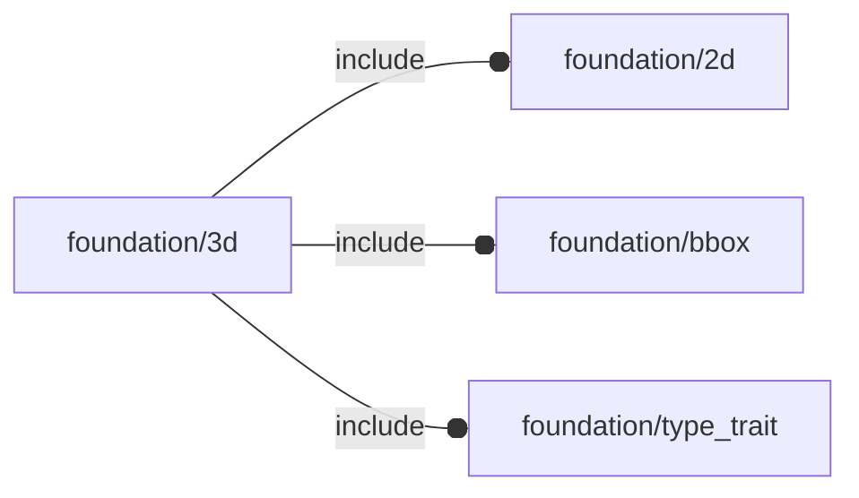

# package foundation/3d

## Dependencies



3d primitives

Copyright © 2021, Giampiero Gabbiani (giampiero@gabbiani.org)

SPDX-License-Identifier: [GPL-3.0-or-later](https://spdx.org/licenses/GPL-3.0-or-later.html)


## Functions

---

### function fl_3d_AxisList

__Syntax:__

```text
fl_3d_AxisList(axes)
```

Build a floating semi-axis list from literal semi-axis list.

example:

    list = fl_3d_AxisList(axes=["-x","±Z"]);

is equivalent to:

    list =
    [
     [-1, 0,  0],
     [ 0, 0, -1],
     [ 0, 0, +1],
    ];


__Parameters:__

__axes__  
semi-axis list (es.["-x","±Z"])


---

### function fl_3d_AxisVList

__Syntax:__

```text
fl_3d_AxisVList(kvs,axes)
```

Build an full semi-axis value list from the key/value list «kvs».
Build a full boolean semi-axis value list from literal semi-axis list «axes»

example 1:

    values = fl_3d_AxisVList(kvs=[["-x",3],["±Z",4]]);

is equivalent to:

    values =
    [
     [3,0],
     [0,0],
     [4,4]
    ];

example 2:

    values = fl_3d_AxisVList(axes=["-x","±Z"]);

is equivalent to:

    values =
    [
     [true,  false],
     [false, false],
     [true,  true]
    ];


__Parameters:__

__kvs__  
semi-axis key/value list (es. [["-x",3],["±Z",4]])

__axes__  
semi-axis list (es.["-x","±Z"])


---

### function fl_3d_abs

__Syntax:__

```text
fl_3d_abs(a)
```

Transforms a vector inside the +X+Y+Z octant


---

### function fl_3d_axisIsSet

__Syntax:__

```text
fl_3d_axisIsSet(axis,list)
```

wether «axis» is present in floating semi-axis list

---

### function fl_3d_axisValue

__Syntax:__

```text
fl_3d_axisValue(axis,values)
```

returns the «axis» value from a full semi-axis value list

---

### function fl_3d_max

__Syntax:__

```text
fl_3d_max(a,b)
```

Builds a max vector


---

### function fl_3d_min

__Syntax:__

```text
fl_3d_min(a,b)
```

Builds a minor vector


---

### function fl_3d_orthoPlane

__Syntax:__

```text
fl_3d_orthoPlane(axis)
```

Cartesian plane from axis


---

### function fl_3d_planarProjection

__Syntax:__

```text
fl_3d_planarProjection(vector,plane)
```

Projection of «vector» onto a cartesian «plane»


__Parameters:__

__vector__  
3D vector

__plane__  
cartesian plane by vector with ([-1,+1,0]==[1,1,0]==XY)


---

### function fl_3d_sign

__Syntax:__

```text
fl_3d_sign(axis)
```

returns the sign of a semi-axis (-1,+1)

---

### function fl_3d_vectorialProjection

__Syntax:__

```text
fl_3d_vectorialProjection(vector,axis)
```

Projection of «vector» onto a cartesian «axis»


__Parameters:__

__vector__  
3D vector

__axis__  
cartesian axis ([-1,0,0]==[1,0,0]==X)


---

### function fl_bb_accum

__Syntax:__

```text
fl_bb_accum(axis,gap=0,bbcs)
```

Accumulates a list of bounding boxes along a direction.

Recursive algorithm, at each call a bounding box is extracted from «bbcs»
and decomposed into axial and planar components. The last bunding box in
the list ended up the recursion and is returned as result.
If there are still bounding boxes left, a new call is made and its
result, decomposed into the axial and planar components, used to produce a
new bounding box as follows:

- for planar component, the new negative and positive corners are calculated
  with the minimum dimensions between the current one and the result of the
  recursive call;
- for the axial component when axis is positive:
  - negative corner is equal to the current corner;
  - positive corner is equal to the current positive corner PLUS the gap and
    the axial dimension of the result;
  - when axis is negative:
    - negative corner is equal to the current one MINUS the gap and the
      axial dimension of the result
    - the positive corner is equal to the current corner.


__Parameters:__

__axis__  
cartesian axis ([-1,0,0]==[1,0,0]==X)

__gap__  
gap to be inserted between bounding boxes along axis

__bbcs__  
bounding box corners


---

### function fl_bb_cylinder

__Syntax:__

```text
fl_bb_cylinder(h,r,r1,r2,d,d1,d2)
```

__Parameters:__

__h__  
height of the cylinder or cone

__r__  
radius of cylinder. r1 = r2 = r.

__r1__  
radius, bottom of cone.

__r2__  
radius, top of cone.

__d__  
diameter of cylinder. r1 = r2 = d / 2.

__d1__  
diameter, bottom of cone. r1 = d1 / 2.

__d2__  
diameter, top of cone. r2 = d2 / 2.


---

### function fl_bb_prism

__Syntax:__

```text
fl_bb_prism(n,l,l1,l2,h)
```

__Parameters:__

__n__  
edge number

__l__  
edge length

__l1__  
edge length, bottom

__l2__  
edge length, top

__h__  
height of the prism


---

### function fl_cube_defaults

__Syntax:__

```text
fl_cube_defaults(size=[1,1,1])
```

cube defaults for positioning (fl_bb_cornersKV)
and direction (fl_directorKV, fl_rotorKV).


---

### function fl_cylinder_defaults

__Syntax:__

```text
fl_cylinder_defaults(h,r,r1,r2,d,d1,d2)
```

cylinder defaults for positioning (fl_bb_cornersKV)
and direction (fl_directorKV, fl_rotorKV).


__Parameters:__

__h__  
height of the cylinder or cone

__r__  
radius of cylinder. r1 = r2 = r.

__r1__  
radius, bottom of cone.

__r2__  
radius, top of cone.

__d__  
diameter of cylinder. r1 = r2 = d / 2.

__d1__  
diameter, bottom of cone. r1 = d1 / 2.

__d2__  
diameter, top of cone. r2 = d2 / 2.


---

### function fl_direction

__Syntax:__

```text
fl_direction(proto,direction,default)
```

Direction matrix transforming native coordinates along new direction.

Native coordinate system is represented by two vectors either retrieved
from «proto» or passed explicitly through «default» in the format

    [direction axis (director),orthonormal vector (rotor)]

New direction is expected in [Axis–angle representation](https://en.wikipedia.org/wiki/Axis%E2%80%93angle_representation)
in the format

    [axis,rotation angle]


__Parameters:__

__proto__  
prototype with fl_director and fl_rotor properties

__direction__  
desired direction in axis-angle representation [axis,rotation about]

__default__  
default coordinate system by [director,rotor], overrides «proto» settings


---

### function fl_octant

__Syntax:__

```text
fl_octant(octant,type,bbox,default=I)
```

__Parameters:__

__octant__  
3d octant

__type__  
type with "bounding corners" property

__bbox__  
bounding box corners, overrides «type» settings

__default__  
returned matrix if «octant» is undef


---

### function fl_planeAlign

__Syntax:__

```text
fl_planeAlign(ax,ay,bx,by,a,b)
```

From [Rotation matrix from plane A to B](https://math.stackexchange.com/questions/1876615/rotation-matrix-from-plane-a-to-b)

Returns the rotation matrix R aligning the plane A(ax,ay),to plane B(bx,by)
When ax and bx are orthogonal to ay and by respectively calculation are simplified.


---

### function fl_prism_defaults

__Syntax:__

```text
fl_prism_defaults(n,l,l1,l2,h)
```

prism defaults for positioning (fl_bb_cornersKV)
and direction (fl_directorKV, fl_rotorKV).


__Parameters:__

__n__  
edge number

__l__  
edge length

__l1__  
edge length, bottom

__l2__  
edge length, top

__h__  
height of the prism


---

### function fl_sphere_defaults

__Syntax:__

```text
fl_sphere_defaults(r=[1,1,1],d)
```

sphere defaults for positioning (fl_bb_cornersKV)
and direction (fl_directorKV, fl_rotorKV).


---

### function lay_bb_corners

__Syntax:__

```text
lay_bb_corners(axis,gap=0,types)
```

returns the bounding box corners of a layout


__Parameters:__

__axis__  
cartesian axis ([-1,0,0]==[1,0,0]==X)

__gap__  
gap to be inserted between bounding boxes along axis

__types__  
list of types


---

### function lay_bb_size

__Syntax:__

```text
lay_bb_size(axis,gap,types)
```

calculates the overall bounding box size of a layout


---

### function lay_group

__Syntax:__

```text
lay_group(axis,gap,types)
```

creates a group with the resulting bounding box corners of a layout


## Modules

---

### module fl_bb_add

__Syntax:__

    fl_bb_add(corners,2d=false)

add a bounding box shape


__Parameters:__

__corners__  
bounding box corners


---

### module fl_cube

__Syntax:__

    fl_cube(verbs=FL_ADD,size=[1,1,1],octant,direction)

cube replacement


__Parameters:__

__verbs__  
FL_ADD,FL_AXES,FL_BBOX

__octant__  
when undef native positioning is used

__direction__  
desired direction [director,rotation] or native direction if undef


---

### module fl_cylinder

__Syntax:__

    fl_cylinder(verbs=FL_ADD,h,r,r1,r2,d,d1,d2,octant,direction)

cylinder replacement


__Parameters:__

__verbs__  
FL_ADD,FL_AXES,FL_BBOX

__h__  
height of the cylinder or cone

__r__  
radius of cylinder. r1 = r2 = r.

__r1__  
radius, bottom of cone.

__r2__  
radius, top of cone.

__d__  
diameter of cylinder. r1 = r2 = d / 2.

__d1__  
diameter, bottom of cone. r1 = d1 / 2.

__d2__  
diameter, top of cone. r2 = d2 / 2.

__octant__  
when undef native positioning is used

__direction__  
desired direction [director,rotation], native direction when undef ([+X+Y+Z])


---

### module fl_direct

__Syntax:__

    fl_direct(proto,direction,default)

Applies a direction matrix to its children.
See also [fl_direction()](#function-fl_direction) function comments.


__Parameters:__

__proto__  
prototype for native coordinate system

__direction__  
desired direction in axis-angle representation [axis,rotation about]

__default__  
default coordinate system by [director,rotor], overrides «proto» settings


---

### module fl_layout

__Syntax:__

    fl_layout(verbs=FL_LAYOUT,axis,gap=0,types,align=0,direction,octant)

Layout of types along a direction.

There are basically two methods of invokation call:

- with as many children as the length of types: in this case each children will
  be called explicitly in turn with children($i)
- with one child only called repetitely through children(0) with $i equal to the
  current execution number.

Called children can use the following special variables:

    $i      - current item index
    $first  - true when $i==0
    $last   - true when $i==len(types)-1
    $item   - equal to types[$i]
    $len    - equal to len(types)
    $size   - equal to bounding box size of $item

TODO: add namespace to children context variables.


__Parameters:__

__verbs__  
supported verbs: FL_AXES, FL_BBOX, FL_LAYOUT

__axis__  
layout direction vector

__gap__  
gap inserted along «axis»

__types__  
list of types to be arranged

__align__  
Internal type alignment into the resulting bounding box surfaces.

Is managed through a vector whose x,y,z components can assume -1,0 or +1 values.

[-1,0,+1] means aligned to the -X and +Z surfaces, centered on y axis.

Passing a scalar means [scalar,scalar,scalar]


__direction__  
desired direction in [vector,rotation] form, native direction when undef ([+X+Y+Z])

__octant__  
when undef native positioning is used


---

### module fl_place

__Syntax:__

    fl_place(type,octant,quadrant,bbox)

__Parameters:__

__octant__  
3d octant

__quadrant__  
2d quadrant

__bbox__  
bounding box corners


---

### module fl_placeIf

__Syntax:__

    fl_placeIf(condition,type,octant,quadrant,bbox)

__Parameters:__

__condition__  
when true placement is ignored

__octant__  
3d octant

__quadrant__  
2d quadrant

__bbox__  
bounding box corners


---

### module fl_planeAlign

__Syntax:__

    fl_planeAlign(ax,ay,bx,by,ech=false)

---

### module fl_prism

__Syntax:__

    fl_prism(verbs=FL_ADD,n,l,l1,l2,h,octant,direction)

prism

   native positioning : +Z
   native direction   : [+Z,+X]


---

### module fl_sphere

__Syntax:__

    fl_sphere(verbs=FL_ADD,r=[1,1,1],d,octant,direction)

sphere replacement.


__Parameters:__

__verbs__  
FL_ADD,FL_AXES,FL_BBOX

__octant__  
when undef default positioning is used

__direction__  
desired direction [director,rotation], default direction if undef


