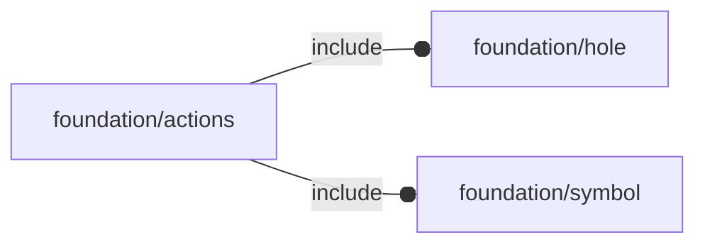

# package foundation/actions

## Dependencies

Predefined high-level action modules.

This file is part of the 'OpenSCAD Foundation Library' (OFL) project.

Copyright © 2021, Giampiero Gabbiani (giampiero@gabbiani.org)

SPDX-License-Identifier: [GPL-3.0-or-later](https://spdx.org/licenses/GPL-3.0-or-later.html)

## Modules

---

### module fl_doAxes

__Syntax:__

    fl_doAxes(size,direction,debug)

'standard' axes management

---

### module fl_doSymbols

__Syntax:__

    fl_doSymbols(debug,connectors,holes)

symbols management

