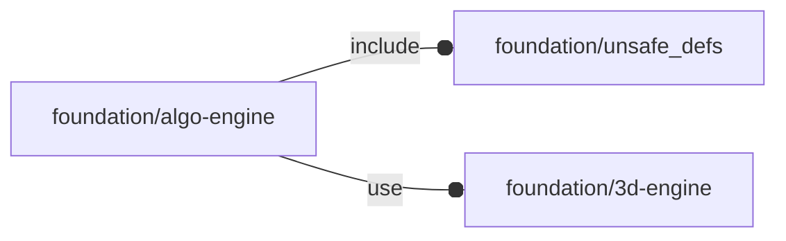

# package foundation/algo-engine

## Dependencies



General algorithm package.

__TODO:__

1. better example (SATA plug?)
2. orientation?

Copyright © 2021, Giampiero Gabbiani (giampiero@gabbiani.org)

SPDX-License-Identifier: [GPL-3.0-or-later](https://spdx.org/licenses/GPL-3.0-or-later.html)


## Functions

---

### function fl_algo_pattern

__Syntax:__

```text
fl_algo_pattern(n,pattern,data)
```

build a 2d/3d pattern from data


__Parameters:__

__n__  
number of items to be taken from data

__pattern__  
data index pattern

__data__  
list of item containing 2d/3d data in their 2nd element


## Modules

---

### module fl_algo_pattern

__Syntax:__

    fl_algo_pattern(n,pattern,data,deployment,align=O,octant=O)

add a 2d/3d pattern from data


__Parameters:__

__n__  
number of items to be taken from data

__pattern__  
data index pattern

__data__  
data

__deployment__  
spatial drift between centers

__align__  
internal alignment


---

### module fl_planes

__Syntax:__

    fl_planes(size=1,alpha=0.2)

draws the three orthogonal planes dividing space into octants


__Parameters:__

__alpha__  
alpha channel for transparency


