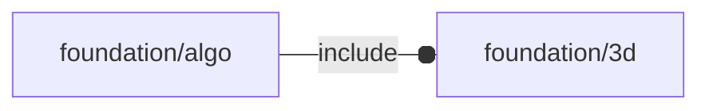

# package foundation/algo

## Dependencies

## Functions

---

### function fl_algo_pattern

__Syntax:__

    fl_algo_pattern(n,pattern,data)

__Parameters:__

__n__  
number of items to be taken from data

__pattern__  
data index pattern

---

### function sz

__Syntax:__

    sz(step,items,prev_steps=[0,0,0])

## Modules

---

### module fl_algo_pattern

__Syntax:__

    fl_algo_pattern(n,pattern,data,deployment,align=O,octant=O)

__Parameters:__

__n__  
number of items to be taken from data

__pattern__  
data index pattern

__data__  
data

__deployment__  
spatial drift between centers

__align__  
internal alignment

---

### module fl_planes

__Syntax:__

    fl_planes(size=1,alpha=0.2)

