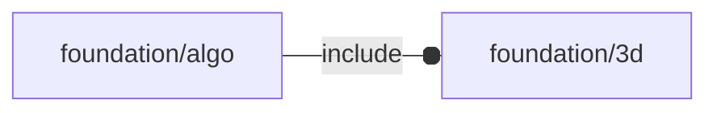

# package foundation/algo

## Dependencies



General algorithm package.

__TODO:__

1) better example (SATA plug?)
2) orientation?

Copyright © 2021-2022 Giampiero Gabbiani (giampiero@gabbiani.org)

This file is part of the 'OpenSCAD Foundation Library' (OFL).

OFL is free software: you can redistribute it and/or modify
it under the terms of the GNU General Public License as published by
the Free Software Foundation, either version 3 of the License, or
(at your option) any later version.

OFL is distributed in the hope that it will be useful,
but WITHOUT ANY WARRANTY; without even the implied warranty of
MERCHANTABILITY or FITNESS FOR A PARTICULAR PURPOSE.  See the
GNU General Public License for more details.

You should have received a copy of the GNU General Public License
along with OFL.  If not, see <http: //www.gnu.org/licenses/>.


## Functions

---

### function fl_algo_pattern

__Syntax:__

```text
fl_algo_pattern(n,pattern,data)
```

build a 2d/3d pattern from data 


__Parameters:__

__n__  
number of items to be taken from data

__pattern__  
data index pattern

__data__  
list of item containing 2d/3d data in their 2nd element


---

### function sz

__Syntax:__

```text
sz(step,items,prev_steps=[0,0,0])
```

## Modules


---

### module fl_algo_pattern

__Syntax:__

    fl_algo_pattern(n,pattern,data,deployment,align=O,octant=O)

add a 2d/3d pattern from data 


__Parameters:__

__n__  
number of items to be taken from data

__pattern__  
data index pattern

__data__  
data

__deployment__  
spatial drift between centers

__align__  
internal alignment


---

### module fl_planes

__Syntax:__

    fl_planes(size=1,alpha=0.2)

draws the three orthogonal planes dividing space into octants


__Parameters:__

__alpha__  
alpha channel for transparency


