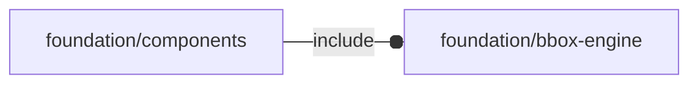

# package foundation/components

## Dependencies



Component package for OpenSCAD Foundation Library.

Copyright © 2021, Giampiero Gabbiani (giampiero@gabbiani.org)

SPDX-License-Identifier: [GPL-3.0-or-later](https://spdx.org/licenses/GPL-3.0-or-later.html)


## Variables

---

### variable FL_COMP_COLOR

__Default:__

    str(FL_COMP_NS,"/color")

[OPTIONAL] color attribute passed to component.

__NOTE__: the semantic is component specific.


---

### variable FL_COMP_DRIFT

__Default:__

    str(FL_COMP_NS,"/drift")

[OPTIONAL] additional delta during component FL_CUTOUT


---

### variable FL_COMP_NS

__Default:__

    "comp"

namespace for component package

---

### variable FL_COMP_OCTANT

__Default:__

    str(FL_COMP_NS,"/octant")

[OPTIONAL] component octant


---

### variable FL_COMP_SUB

__Default:__

    str(FL_COMP_NS,"/sub")

[OPTIONAL] tolerance used during component FL_FOOTPRINT difference from
parent shape


## Functions

---

### function fl_Component

__Syntax:__

```text
fl_Component(engine,position,direction,cutdirs,type,parameters)
```

__Parameters:__

__engine__  
engine to be triggered during component rendering

__direction__  
new coordinate system in [[direction], rotation] format

__cutdirs__  
List of floating semi-axes in the host's reference system. Defines the
cutout directions that the host object would like the component to
handle.


__parameters__  
list of optional component properties:

- FL_COMP_SUB - see [variable FL_COMP_SUB](#variable-fl_comp_sub)
- FL_COMP_DRIFT - see [variable FL_COMP_DRIFT](#variable-fl_comp_drift)
- FL_COMP_COLOR - see variable FL_COMP_COLOR
- FL_COMP_OCTANT - see variable FL_COMP_OCTANT


---

### function fl_comp_BBox

__Syntax:__

```text
fl_comp_BBox(spec_list)
```

exact calculation of the resulting bounding box out of a list of component specifications

---

### function fl_comp_actualCuts

__Syntax:__

```text
fl_comp_actualCuts(directions)
```

Returns the floating semi-axes list in the component's reference system,
defining all the cutout directions a component is called to manage.
Concretely filters the requested __host__ cut directions to a subset of the
__component__ configured ones


__Parameters:__

__directions__  
floating semi-axes list in host's reference system. «undef» stands for 'all
the configured component directions'


---

### function fl_comp_connectors

__Syntax:__

```text
fl_comp_connectors(component)
```

---

### function fl_comp_search

__Syntax:__

```text
fl_comp_search(type,label,comps)
```

returns the component with «label»

:memo: **NOTE:** error when label is not unique


## Modules

---

### module fl_comp_Context

__Syntax:__

    fl_comp_Context(component)

Component context:

 - $comp_engine    : engine to be triggered during component rendering
 - $comp_position  : component position
 - $comp_direction : new coordinate system in [[direction], rotation] format
 - $comp_director  : new coordinate system direction vector
 - $comp_rotation  : new coordinate system rotation value around new direction
 - $comp_type
 - $comp_subtract  : the tolerance to be used during component FL_FOOTPRINT
   difference from parent shape
 - $comp_drift     : additional delta during component FL_CUTOUT
 - $comp_color
 - $comp_octant
 - $host_cutdirs   : List of floating semi-axes in the host's reference
   system. Defines all the cutout directions a component should be able to
   manage. This value is needed by the host object layout engine.
 - $comp_cutdirs   : List of floating semi-axes in the component's reference
   system. Defines all the cutout directions a component should be able to
   manage.


__Parameters:__

__component__  
component definition:


---

### module fl_comp_Specs

__Syntax:__

    fl_comp_Specs(specs)

Component specifications context:

 - $comp_label
 - $comp_component

plus component context (see [fl_comp_Context{}](#module-fl_comp_context))


__Parameters:__

__specs__  
component specification: ["label",component]


