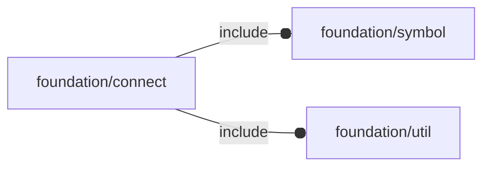

# package foundation/connect

## Dependencies



## Functions

---

### function conn_Plug

__Syntax:__

```text
conn_Plug(id,ox,oy,pos,size=2.54,octant,direction=[+Z,0])
```

---

### function conn_Socket

__Syntax:__

```text
conn_Socket(id,ox,oy,pos,size=2.54,octant,direction=[+Z,0])
```

---

### function fl_conn_clone

__Syntax:__

```text
fl_conn_clone(original,type,id,ox,oy,pos,size,octant,direction,M=I)
```

---

### function fl_conn_id

__Syntax:__

```text
fl_conn_id(type,value)
```

---

### function fl_conn_import

__Syntax:__

```text
fl_conn_import(conns,M)
```

---

### function fl_conn_ldir

__Syntax:__

```text
fl_conn_ldir(type,value)
```

---

### function fl_conn_loct

__Syntax:__

```text
fl_conn_loct(type,value)
```

---

### function fl_conn_ox

__Syntax:__

```text
fl_conn_ox(type,value)
```

---

### function fl_conn_oy

__Syntax:__

```text
fl_conn_oy(type,value)
```

---

### function fl_conn_pos

__Syntax:__

```text
fl_conn_pos(type,value)
```

---

### function fl_conn_size

__Syntax:__

```text
fl_conn_size(type,value)
```

---

### function fl_conn_type

__Syntax:__

```text
fl_conn_type(type,value)
```

---

### function fl_connect

__Syntax:__

```text
fl_connect(son,parent)
```

## Modules


---

### module fl_conn_Context

__Syntax:__

    fl_conn_Context(connector,ordinal)

---

### module fl_conn_add

__Syntax:__

    fl_conn_add(connector,size,label)

---

### module fl_conn_debug

__Syntax:__

    fl_conn_debug(conns,debug)

---

### module fl_connect

__Syntax:__

    fl_connect(son,parent)

---

### module fl_lay_connectors

__Syntax:__

    fl_lay_connectors(conns)

